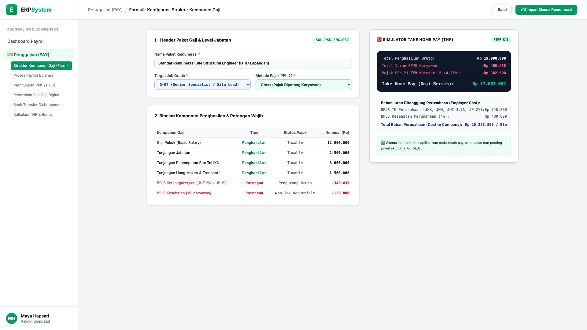
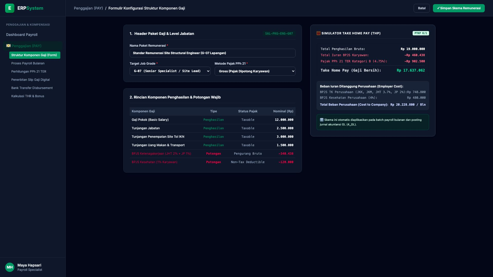

# 🎨 Design UI — Formulir Struktur Komponen Gaji (Data Entry Screen)

> Mockup antarmuka **Formulir Konfigurasi Struktur Komponen Gaji (Salary Component Structure Data Entry)**: desain *Split-Screen Form* dengan formulir konfigurasi remunerasi di sebelah kiri (Kode Paket `SAL-PKG-ENG-G07`, nama Standar Remunerasi Site Structural Engineer G-07, metode Gross, komponen penghasilan: Gaji Pokok Rp 12 Jt, Tunjangan Jabatan Rp 2,5 Jt, Tunjangan Site Tol IKN Rp 3 Jt, Uang Makan/Transport Rp 1,5 Jt = Bruto Rp 19 Jt, potongan wajib: BPJS Ketenagakerjaan Rp 340.438, BPJS Kesehatan Rp 120.000) dan *Live Simulator Take Home Pay (THP Bersih Rp 17.637.062/Bulan) & Total Beban Perusahaan (Cost to Company CTC Rp 20.228.800/Bulan)* di sebelah kanan pada modul `PAY` (Penggajian) dalam ERP System.

---

## Light Mode

---

## Dark Mode

---

## 📝 Komponen & Fitur Formulir Input

1. **Panel Kiri — Formulir Parameter Paket Gaji & Rincian Komponen**:
   - Kode Skema: `SAL-PKG-ENG-G07` &bull; Target Grade: **G-07 (Senior Specialist)**.
   - Metode Pajak: **Gross (Pajak PPh 21 Dipotong Karyawan)**.
   - Rincian Penghasilan:
     - Gaji Pokok: **Rp 12.000.000**
     - Tunjangan Jabatan: **Rp 2.500.000**
     - Tunjangan Remote Site IKN: **Rp 3.000.000**
     - Tunjangan Uang Makan & Transport: **Rp 1.500.000**
     - **Total Penghasilan Bruto: Rp 19.000.000**
   - Rincian Potongan Karyawan:
     - BPJS TK (JHT 2% + JP 1%): **-Rp 340.438**
     - BPJS Kesehatan (1%): **-Rp 120.000**

2. **Panel Kanan — Simulator Take Home Pay & Employer Cost**:
   - Penghasilan Bruto: **Rp 19.000.000**
   - Total Iuran BPJS Karyawan: **-Rp 460.438**
   - PPh 21 TER Kategori B (4.75%): **-Rp 902.500**
   - **Gaji Bersih Karyawan (THP): Rp 17.637.062 / Bulan**
   - **Total Beban Perusahaan (Cost to Company): Rp 20.228.800 / Bulan**
