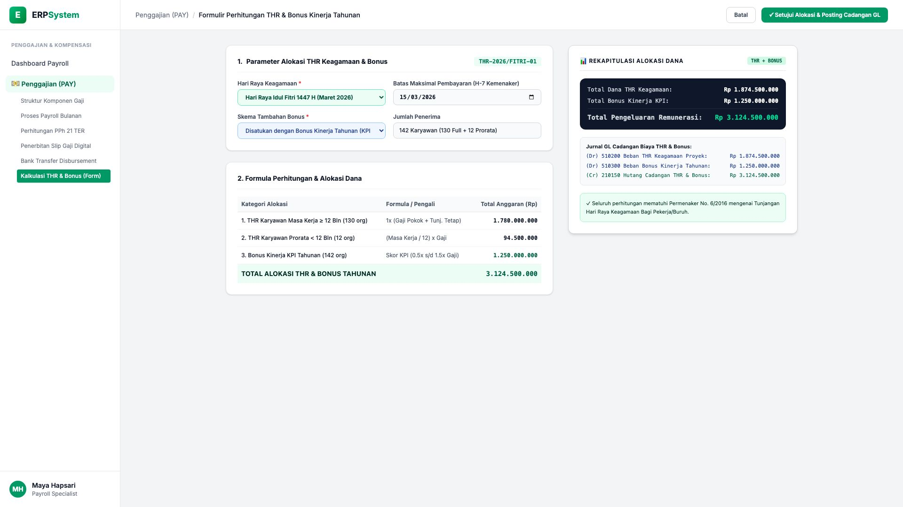
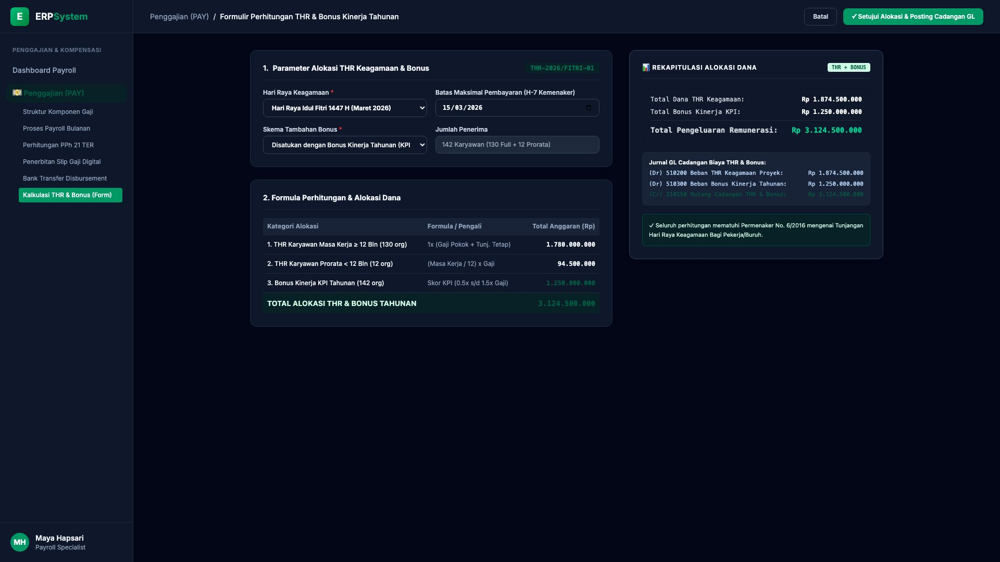

# 🎨 Design UI — Formulir Perhitungan THR & Bonus Kinerja Tahunan (Data Entry Screen)

> Mockup antarmuka **Formulir Perhitungan THR Keagamaan & Bonus Kinerja Tahunan (Religious Allowance & Bonus Calculation Data Entry)**: desain *Split-Screen Form* dengan formulir input alokasi THR di sebelah kiri (Nomor Batch `THR-2026/FITRI-01`, Idul Fitri 1447H, jatuh tempo H-7 Kemenaker 15/03/2026, 142 karyawan penerima: 130 Full 1x Gaji Rp 1,78 Miliar, 12 Prorata Masa Kerja Rp 94,5 Jt, Bonus Kinerja KPI 0.5x s/d 1.5x Gaji Rp 1,25 Miliar &rarr; Total Dana THR & Bonus Rp 3.124.500.000) dan *Live Rekapitulasi Alokasi Dana Remunerasi, Jurnal Akrual Cadangan GL Biaya THR/Bonus (Dr Beban THR & Bonus Rp 3,124 Miliar vs Cr Hutang Cadangan)* di sebelah kanan pada modul `PAY` (Penggajian) dalam ERP System.

---

## Light Mode

---

## Dark Mode

---

## 📝 Komponen & Fitur Formulir Input

1. **Panel Kiri — Formulir Parameter THR Keagamaan & Formula KPI**:
   - Nomor Batch: `THR-2026/FITRI-01` &bull; Event: **Hari Raya Idul Fitri 1447 H**.
   - Batas Waktu Bayar: **15 Maret 2026 (H-7 Sesuai Permenaker 6/2016)**.
   - Penerima & Formula:
     - Masa Kerja &ge; 12 Bulan (130 org): **1x Gaji Pokok + Tunjangan Tetap (Rp 1.780.000.000)**
     - Masa Kerja &lt; 12 Bulan (12 org): **Prorata n/12 x Gaji (Rp 94.500.000)**
     - Bonus Kinerja Tahunan (142 org): **Skor KPI x Basic Salary (Rp 1.250.000.000)**
     - **Total Kebutuhan Anggaran: Rp 3.124.500.000**

2. **Panel Kanan — Rekapitulasi & Jurnal Akrual Cadangan GL**:
   - Alokasi Total: **Rp 3.124.500.000** (THR Rp 1,87 M + Bonus Rp 1,25 M).
   - Jurnal GL Cadangan (Modul `4_GL`):
     - `(Dr) 510200 Beban THR Keagamaan Proyek`: **Rp 1.874.500.000**
     - `(Dr) 510300 Beban Bonus Kinerja Tahunan`: **Rp 1.250.000.000**
     - `(Cr) 210150 Hutang Cadangan THR & Bonus`: **Rp 3.124.500.000**
