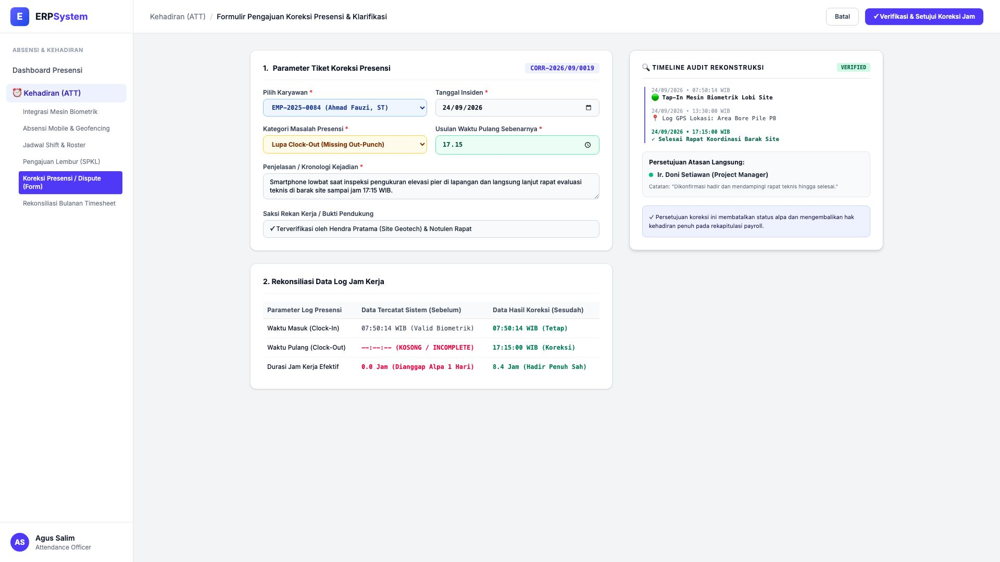
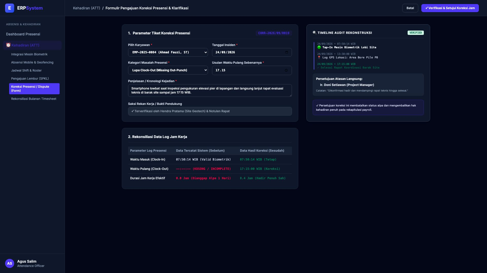

# 🎨 Design UI — Formulir Koreksi Presensi & Klarifikasi (Data Entry Screen)

> Mockup antarmuka **Formulir Pengajuan Koreksi Presensi & Dispute Kehadiran (Attendance Correction & Dispute Data Entry)**: desain *Split-Screen Form* dengan formulir input klaim koreksi jam di sebelah kiri (Nomor Tiket `CORR-2026/09/0019`, karyawan Ahmad Fauzi ST `EMP-2025-0084`, insiden 24/09/2026, masalah Lupa Clock-Out karena baterai lowbat saat inspeksi & lanjut rapat barak, usulan Clock-Out 17:15 WIB, saksi Hendra Pratama ST, perbandingan: tercatat awal In 07:50 / Out Kosong dihitung alpa &rarr; setelah koreksi In 07:50 / Out 17:15 dihitung hadir 8.4 jam) dan *Live Rekonstruksi Audit Trail Timeline Presensi & Persetujuan Form Approval Project Manager* di sebelah kanan pada modul `ATT` (Kehadiran & Absensi) dalam ERP System.

---

## Light Mode

---

## Dark Mode

---

## 📝 Komponen & Fitur Formulir Input

1. **Panel Kiri — Formulir Parameter Koreksi & Rekonsiliasi Log**:
   - Nomor Tiket: `CORR-2026/09/0019` &bull; Karyawan: `Ahmad Fauzi, ST`.
   - Tanggal Kejadian: **24 September 2026**.
   - Kategori Masalah: **Lupa Clock-Out (Missing Out-Punch)**.
   - Usulan Waktu Pulang: **17:15:00 WIB**.
   - Dampak Koreksi:
     - Sebelum: Durasi 0.0 Jam (Dianggap Alpa / Potong Gaji)
     - Sesudah: **Durasi 8.4 Jam (Hadir Penuh Sah & Terbayar)**.

2. **Panel Kanan — Timeline Audit Rekonstruksi & Approval**:
   - Rekonstruksi Audit Trail (Tap-In Biometrik 07:50 &rarr; GPS Bore Pile 13:30 &rarr; Rapat Site 17:15).
   - Otorisasi Persetujuan: *Ir. Doni Setiawan (Project Manager) ✓*.
