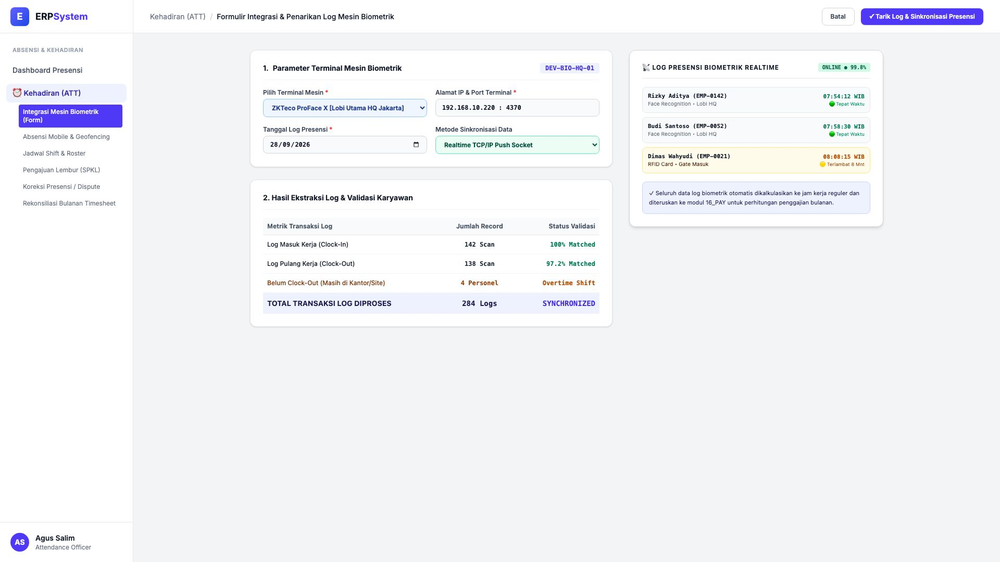
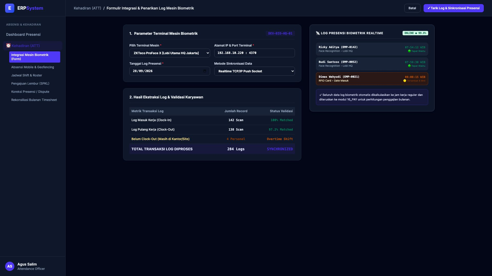

# 🎨 Design UI — Formulir Integrasi Mesin Biometrik & Log Presensi (Data Entry Screen)

> Mockup antarmuka **Formulir Integrasi & Penarikan Log Mesin Biometrik (Biometric Attendance Sync Data Entry)**: desain *Split-Screen Form* dengan formulir konfigurasi penarikan log mesin di sebelah kiri (Terminal ID `DEV-BIO-HQ-01` ZKTeco ProFace X Lobi Utama HQ, IP `192.168.10.220:4370`, tanggal 28/09/2026, metode Realtime TCP/IP Socket, hasil: 142 Clock-In scan 100% matched, 138 Clock-Out scan, 4 personel shift lembur &rarr; Total 284 Log diproses) dan *Live Status Kesehatan Mesin Terminal Online 99.8% serta Live Feed Transaksi Presensi Karyawan Terkini (Rizky Aditya 07:54 Tepat Waktu, Budi Santoso 07:58, Dimas Wahyudi 08:08 Terlambat 8 Mnt)* di sebelah kanan pada modul `ATT` (Kehadiran & Absensi) dalam ERP System.

---

## Light Mode

---

## Dark Mode

---

## 📝 Komponen & Fitur Formulir Input

1. **Panel Kiri — Formulir Parameter Terminal & Ekstraksi Log**:
   - Terminal: `ZKTeco ProFace X [Lobi Utama HQ Jakarta]`.
   - IP Address: `192.168.10.220 : 4370` &bull; Protokol: **Realtime TCP/IP Push**.
   - Tanggal: **28 September 2026**.
   - Hasil Ekstraksi:
     - Clock-In (Masuk): **142 Scan (100% Matched)**
     - Clock-Out (Pulang): **138 Scan (97.2% Matched)**
     - Overtime Standby: **4 Personel**
     - **Total Transaksi Log: 284 Logs**.

2. **Panel Kanan — Live Feed Presensi & Status Perangkat**:
   - Status Koneksi Mesin: **ONLINE (Uptime 99.8%)**.
   - Feed Presensi Karyawan Terkini (*Live Punch Stream*).
   - Integrasi Otomatis: Jam kerja efektif ditransfer ke kalkulasi payroll modul `16_PAY`.
