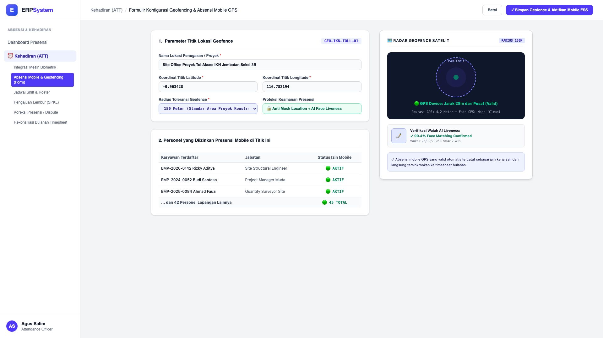
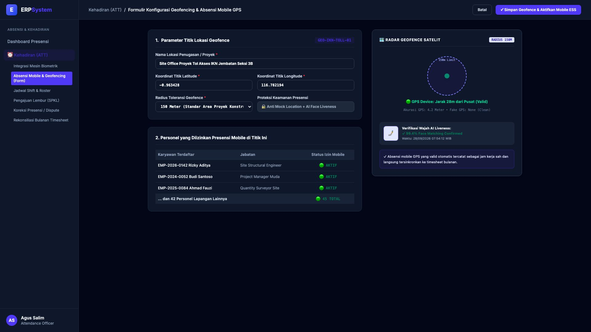

# 🎨 Design UI — Formulir Geofencing & Absensi Mobile GPS (Data Entry Screen)

> Mockup antarmuka **Formulir Konfigurasi Geofencing & Absensi Mobile GPS (Mobile GPS Geofencing Data Entry)**: desain *Split-Screen Form* dengan formulir konfigurasi titik radius di sebelah kiri (Kode Lokasi `GEO-IKN-TOLL-01`, nama Site Office Proyek Tol Akses IKN Jembatan Seksi 3B, koordinat Latitude `-0.963428`, Longitude `116.782194`, radius toleransi 150 Meter, proteksi Anti-Mock Fake GPS & AI Face Liveness, daftar 45 staf lapangan diizinkan mobile ESS) dan *Live Radar Geofence Satelit (150M Limit Circle, deteksi jarak GPS 28m Valid Inside Radius) & Verifikasi Wajah AI Liveness 99.4% Match* di sebelah kanan pada modul `ATT` (Kehadiran & Absensi) dalam ERP System.

---

## Light Mode

---

## Dark Mode

---

## 📝 Komponen & Fitur Formulir Input

1. **Panel Kiri — Formulir Parameter Titik Geofence & Hak Akses Mobile**:
   - Kode Lokasi: `GEO-IKN-TOLL-01` &bull; Lokasi: *Site Office Proyek Tol Akses IKN*.
   - Koordinat: `Lat: -0.963428, Long: 116.782194`.
   - Radius Toleransi: **150 Meter**.
   - Keamanan: *Anti Fake GPS & AI Face Liveness Detection*.
   - Total Karyawan Diizinkan: **45 Personel Site Lapangan**.

2. **Panel Kanan — Visualisasi Radar Satelit & Verifikasi Biometrik**:
   - Radar Peta Satelit Interaktif (*150m Dynamic Boundary Zone*).
   - Indikator Jarak Presensi GPS: **28 Meter dari Pusat (🟢 Valid Inside)**.
   - AI Face Liveness Verification (Skor Kecocokan 99.4%).
