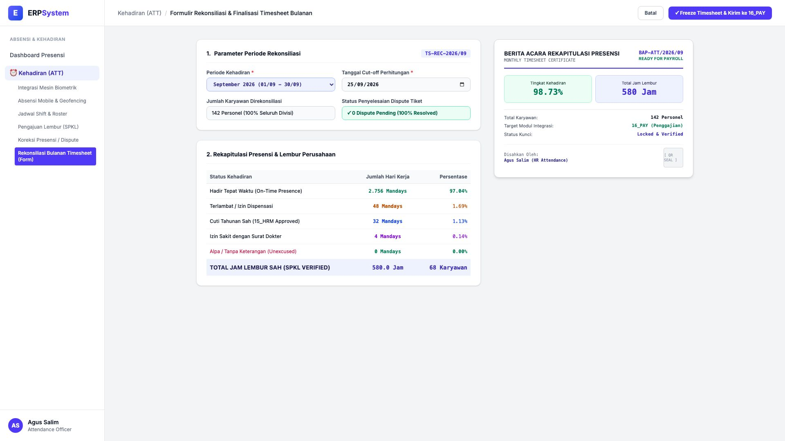
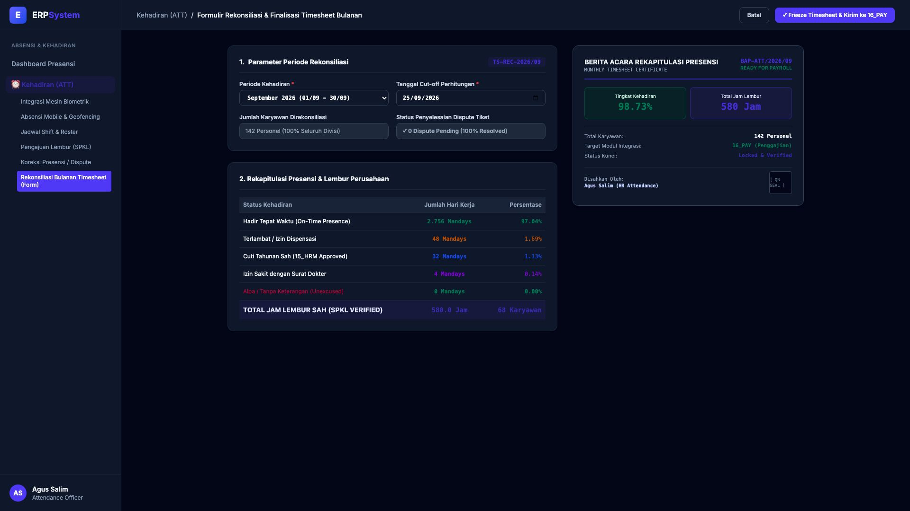

# 🎨 Design UI — Formulir Rekonsiliasi & Finalisasi Timesheet Bulanan (Data Entry Screen)

> Mockup antarmuka **Formulir Rekonsiliasi Timesheet Bulanan & Finalisasi Presensi (Monthly Timesheet Reconciliation Data Entry)**: desain *Split-Screen Form* dengan formulir eksekusi rekonsiliasi presensi di sebelah kiri (Nomor Dokumen `TS-REC-2026/09`, periode September 2026, cut-off 25/09/2026, cakupan 142 Personel, status 0 Dispute pending, rekap: Hadir Tepat Waktu 2.756 Mandays 97.04%, Terlambat Dispensasi 48 Mandays, Cuti Tahunan 32 Mandays, Izin Sakit 4 Mandays, Alpa 0 Mandays, Lembur Sah 580.0 Jam) dan *Live Berita Acara Rekapitulasi Presensi (Official Monthly Timesheet Certificate), Indikator Kehadiran 98.73% & Tombol Integrasi Freeze & Push to Payroll 16_PAY* di sebelah kanan pada modul `ATT` (Kehadiran & Absensi) dalam ERP System.

---

## Light Mode

---

## Dark Mode

---

## 📝 Komponen & Fitur Formulir Input

1. **Panel Kiri — Formulir Parameter Rekonsiliasi & Agregasi Presensi**:
   - Nomor Rekonsiliasi: `TS-REC-2026/09` &bull; Periode: **September 2026**.
   - Cakupan: **142 Karyawan (Semua Divisi & Site Lapangan)**.
   - Status Dispute: *0 Tiket Pending (100% Selesai Direkonsiliasi)*.
   - Rincian Kehadiran:
     - Hadir Tepat Waktu: **2.756 Mandays (97.04%)**
     - Terlambat Dispensasi: **48 Mandays (1.69%)**
     - Cuti Sah (15_HRM): **32 Mandays (1.13%)**
     - Izin Sakit: **4 Mandays (0.14%)**
     - Alpa: **0 Mandays (0.00%)**
     - Total Lembur Sah (SPKL): **580.0 Jam (68 Karyawan)**.

2. **Panel Kanan — Berita Acara Presensi & Push ke Payroll**:
   - Tingkat Kehadiran Perusahaan: **98.73%**.
   - Berita Acara Resmi *BAP-ATT/2026/09*.
   - Sinkronisasi Data Final ke Modul `16_PAY` untuk kalkulasi pemrosesan batch payroll bulanan.
