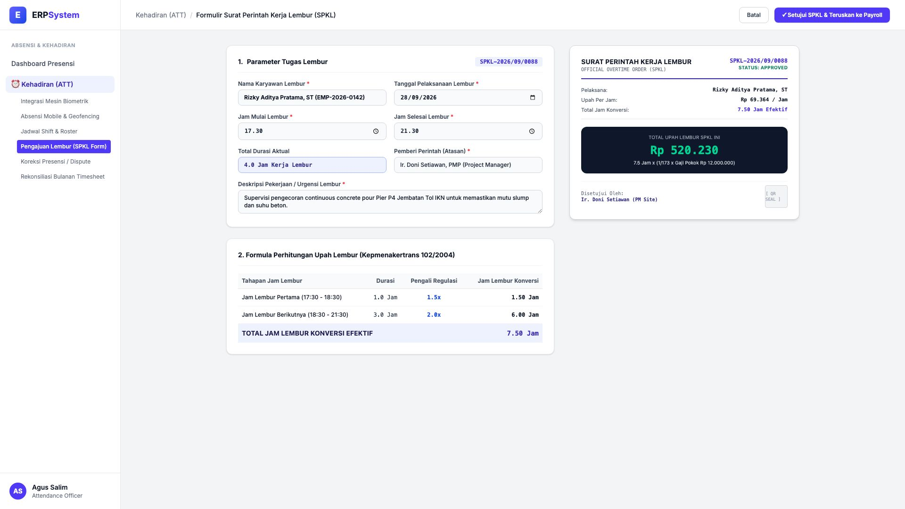
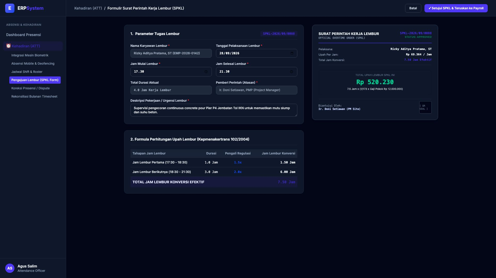

# 🎨 Design UI — Formulir Pengajuan & Perhitungan Upah Lembur (SPKL) (Data Entry Screen)

> Mockup antarmuka **Formulir Pengajuan Surat Perintah Kerja Lembur & Upah Lembur (Overtime Request & Calculation Data Entry)**: desain *Split-Screen Form* dengan formulir input pengajuan lembur di sebelah kiri (Nomor Dokumen `SPKL-2026/09/0088`, pemohon Rizky Aditya Pratama ST `EMP-2026-0142`, tanggal 28/09/2026, jam 17:30 - 21:30 durasi 4.0 Jam lembur, tugas supervisi continuous concrete pour Pier P4 Jembatan Tol IKN, atasan Ir. Doni Setiawan PMP, perhitungan Kepmenakertrans 102/2004: Jam 1 x 1.5 = 1.5 Jam + Jam 2-4 x 2.0 = 6.0 Jam &rarr; Total 7.5 Jam konversi x Rp 69.364/jam) dan *Live Dokumen Surat Perintah Kerja Lembur Resmi (Official Approved SPKL Document) dengan Nominal Upah Lembur Rp 520.230 & Sinkronisasi Payroll 16_PAY* di sebelah kanan pada modul `ATT` (Kehadiran & Absensi) dalam ERP System.

---

## Light Mode

---

## Dark Mode

---

## 📝 Komponen & Fitur Formulir Input

1. **Panel Kiri — Formulir Parameter Lembur & Formula Regulasi**:
   - Nomor SPKL: `SPKL-2026/09/0088` &bull; Tanggal: **28 September 2026**.
   - Pelaksana: `Rizky Aditya Pratama, ST` &bull; Durasi: **4.0 Jam (17:30 - 21:30)**.
   - Atasan Penugasan: *Ir. Doni Setiawan, PMP (Project Manager)*.
   - Formula Upah Lembur (Kepmenakertrans No. 102/2004):
     - Jam Pertama: **1.0 Jam x 1.5 = 1.50 Jam**
     - Jam Berikutnya: **3.0 Jam x 2.0 = 6.00 Jam**
     - **Total Jam Konversi: 7.50 Jam Efektif**.

2. **Panel Kanan — Dokumen SPKL Resmi & Upah Lembur**:
   - Upah Lembur Per Jam: **Rp 69.364 / Jam** *(1/173 x Gaji Pokok Rp 12.000.000)*.
   - **Total Upah Lembur SPKL: Rp 520.230** (Otomatis ditransfer ke modul `16_PAY`).
   - Kode Otentikasi QR Seal Persetujuan Project Manager.
