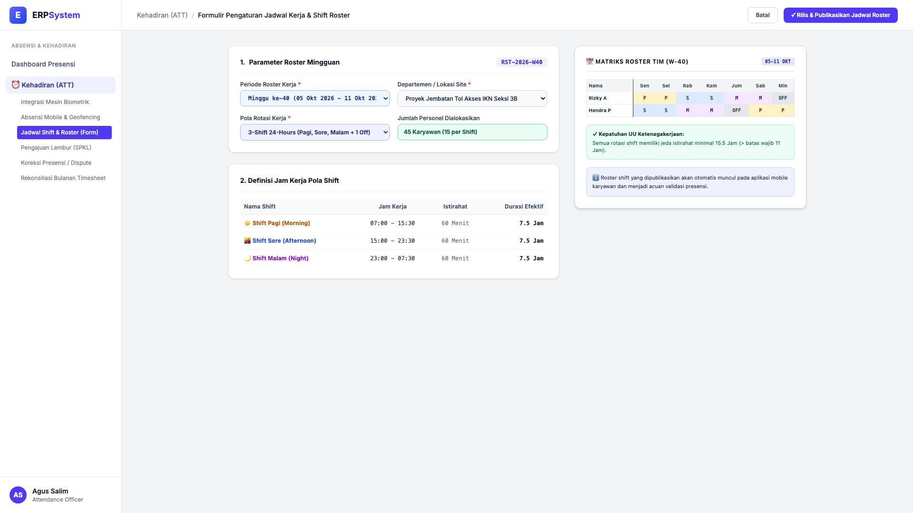
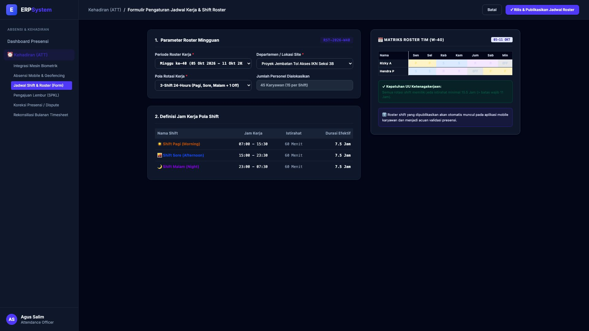

# 🎨 Design UI — Formulir Pengaturan Jadwal Kerja & Shift Roster (Data Entry Screen)

> Mockup antarmuka **Formulir Pengaturan Jadwal Shift & Roster Kerja (Shift Roster Scheduling Data Entry)**: desain *Split-Screen Form* dengan formulir konfigurasi pola shift di sebelah kiri (Kode Roster `RST-2026-W40`, periode Minggu ke-40 05/10 - 11/10/2026, lokasi Proyek Jembatan Tol Akses IKN, pola 3-Shift 24-Hours: Pagi 07:00-15:30, Sore 15:00-23:30, Malam 23:00-07:30, alokasi 45 Personel) dan *Live Matriks Kalender Roster Mingguan Tim & Validasi Kepatuhan Istirahat Minimal 15.5 Jam UU Ketenagakerjaan* di sebelah kanan pada modul `ATT` (Kehadiran & Absensi) dalam ERP System.

---

## Light Mode

---

## Dark Mode

---

## 📝 Komponen & Fitur Formulir Input

1. **Panel Kiri — Formulir Parameter Roster & Definisi Shift**:
   - Kode Roster: `RST-2026-W40` &bull; Periode: **Minggu ke-40 (05 - 11 Oktober 2026)**.
   - Departemen / Lokasi: *Proyek Jembatan Tol Akses IKN Seksi 3B*.
   - Pola Shift:
     - ☀️ Shift Pagi (07:00 - 15:30) &bull; Durasi Efektif 7.5 Jam
     - 🌆 Shift Sore (15:00 - 23:30) &bull; Durasi Efektif 7.5 Jam
     - 🌙 Shift Malam (23:00 - 07:30) &bull; Durasi Efektif 7.5 Jam
   - Total Alokasi: **45 Karyawan (15 Personel / Shift)**.

2. **Panel Kanan — Matriks Roster Tim & Kepatuhan Regulasi**:
   - Tabel Kalender Roster 7 Hari (Senin s/d Minggu).
   - Validasi Otomatis Jeda Istirahat Minimal: **15.5 Jam (&gt; 11 Jam Batas Regulasi)**.
