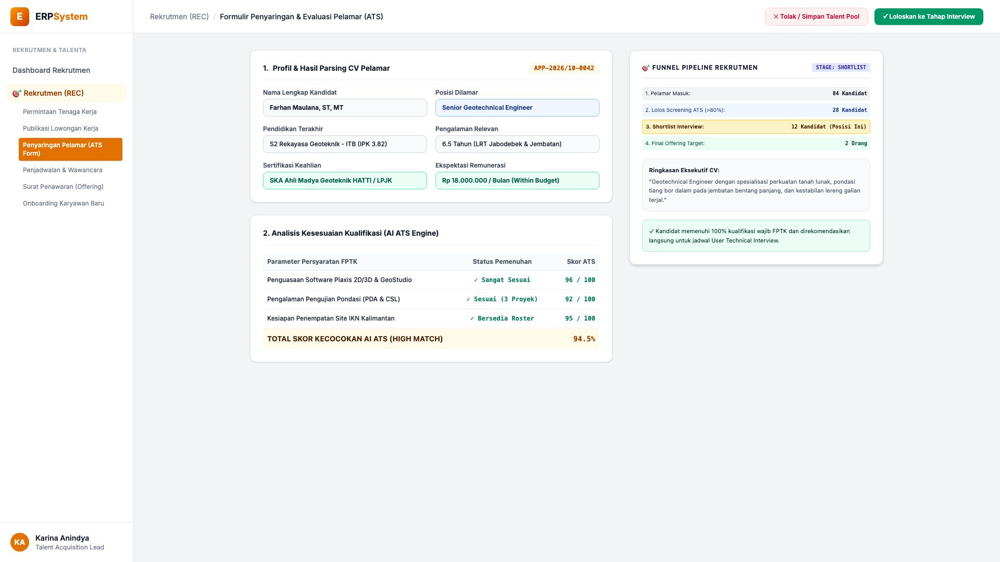
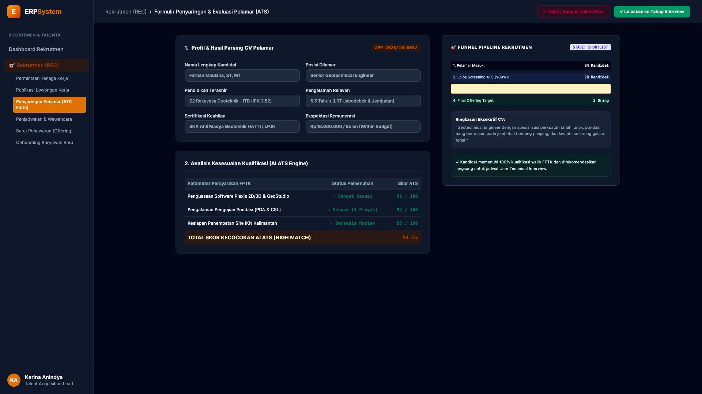

# 🎨 Design UI — Formulir Penyaringan Pelamar (ATS) (Data Entry Screen)

> Mockup antarmuka **Formulir Evaluasi & Penyaringan Pelamar ATS (Applicant Tracking & Resume Screening Data Entry)**: desain *Split-Screen Form* dengan formulir evaluasi kandidat di sebelah kiri (Nomor Aplikasi `APP-2026/10-0042`, pelamar Farhan Maulana ST MT, posisi Senior Geotechnical Engineer, lulusan S2 ITB IPK 3.82, pengalaman 6.5 tahun, sertifikasi Ahli Madya HATTI, ekspektasi Rp 18 Jt/Bln within budget, analisis skor AI ATS: Plaxis 96/100, PDA/CSL 92/100, Penempatan IKN 95/100 &rarr; Total Kesesuaian 94.5% High Match) dan *Live Visualisasi Funnel Pipeline Rekrutmen (84 Masuk &rarr; 28 Lolos ATS &rarr; 12 Shortlist &rarr; 2 Target Offering) serta Ringkasan Resume CV* di sebelah kanan pada modul `REC` (Rekrutmen & Talenta) dalam ERP System.

---

## Light Mode

---

## Dark Mode

---

## 📝 Komponen & Fitur Formulir Input

1. **Panel Kiri — Formulir Parameter Pelamar & Skor Parsing AI**:
   - Nomor Aplikasi: `APP-2026/10-0042` &bull; Posisi: `Senior Geotechnical Engineer`.
   - Kandidat: **Farhan Maulana, ST, MT** (S2 Rekayasa Geoteknik ITB).
   - Pengalaman Kerja: **6.5 Tahun (LRT & Jembatan Bentang Panjang)**.
   - Sertifikasi: *SKA Ahli Madya Geoteknik LPJK / HATTI*.
   - **Skor AI ATS Engine: 94.5% Kualifikasi Sesuai (High Match)**.

2. **Panel Kanan — Pipeline Rekrutmen & Ringkasan Resume**:
   - Visualisasi Pipeline: Dari 84 pelamar, 28 lolos screening, 12 masuk tahap shortlist interview.
   - Ringkasan Eksekutif Pengalaman Kandidat.
   - Tombol Aksi: *Loloskan ke Tahap Interview* atau *Tolak / Simpan ke Talent Pool*.
