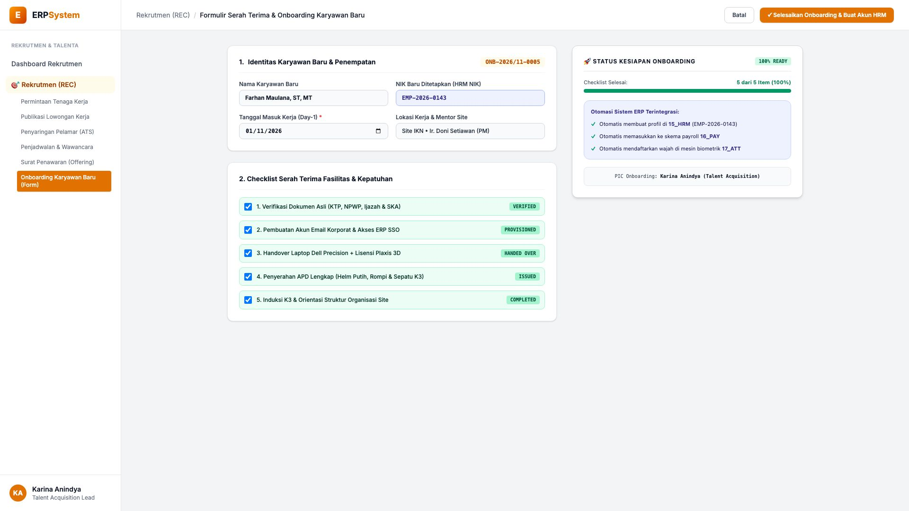
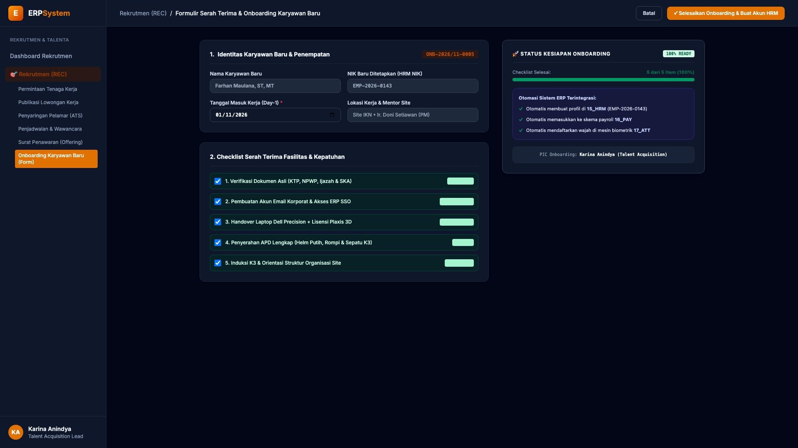

# 🎨 Design UI — Formulir Serah Terima & Onboarding Karyawan Baru (Data Entry Screen)

> Mockup antarmuka **Formulir Serah Terima & Checklist Onboarding Karyawan Baru (Employee Onboarding Checklist Data Entry)**: desain *Split-Screen Form* dengan formulir input verifikasi checklist di sebelah kiri (Nomor Onboarding `ONB-2026/11-0005`, karyawan Farhan Maulana ST MT, penetapan NIK baru `EMP-2026-0143`, tanggal masuk 01/11/2026, mentor Ir. Doni Setiawan, 5 checklist terselesaikan: verifikasi ijazah asli, pembuatan email SSO ERP, handover Dell Workstation & Plaxis 3D, serah terima APD K3, dan induksi safety site) dan *Live Indikator Kesiapan Hari Pertama (100% Ready) serta Otomasi Terintegrasi ke Modul 15_HRM, 16_PAY, dan 17_ATT* di sebelah kanan pada modul `REC` (Rekrutmen & Talenta) dalam ERP System.

---

## Light Mode

---

## Dark Mode

---

## 📝 Komponen & Fitur Formulir Input

1. **Panel Kiri — Formulir Parameter Onboarding & 5 Pilar Checklist**:
   - Nomor Onboarding: `ONB-2026/11-0005` &bull; Tanggal Day-1: **01 November 2026**.
   - Penetapan Identitas: `EMP-2026-0143` (Farhan Maulana, ST, MT).
   - Checklist Verifikasi Onboarding:
     - 1. Dokumen Kependudukan, Ijazah & Sertifikasi SKA: **VERIFIED**
     - 2. Akun Email Korporat & Akses ERP SSO: **PROVISIONED**
     - 3. Laptop Workstation + Lisensi Plaxis 3D: **HANDED OVER**
     - 4. APD Keselamatan Kerja Proyek K3: **ISSUED**
     - 5. Induksi Safety & Orientasi Lapangan: **COMPLETED**.

2. **Panel Kanan — Status Kesiapan & Otomasi Sistem Terintegrasi**:
   - Tingkat Kesiapan Hari Pertama: **100% READY**.
   - Integrasi Otomatis ERP:
     - Auto-create profil master karyawan di modul `15_HRM`.
     - Auto-enrollment rekening & komponen gaji di modul `16_PAY`.
     - Auto-register template biometrik di terminal absensi `17_ATT`.
