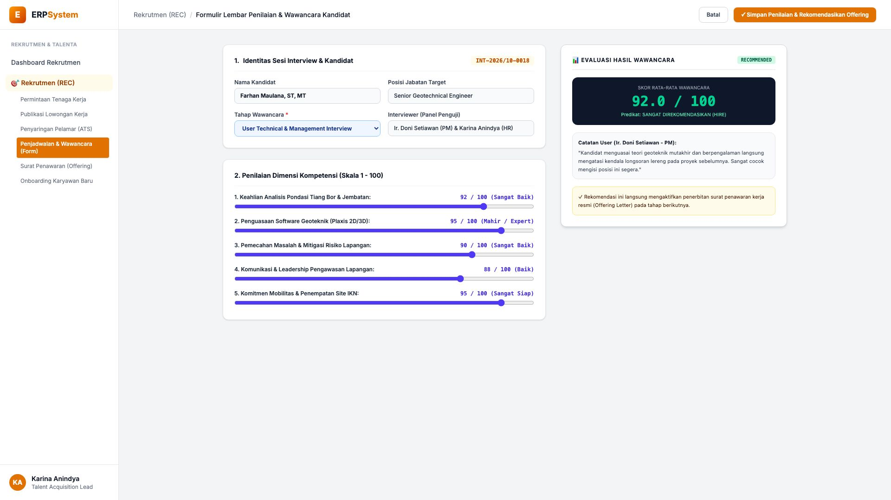
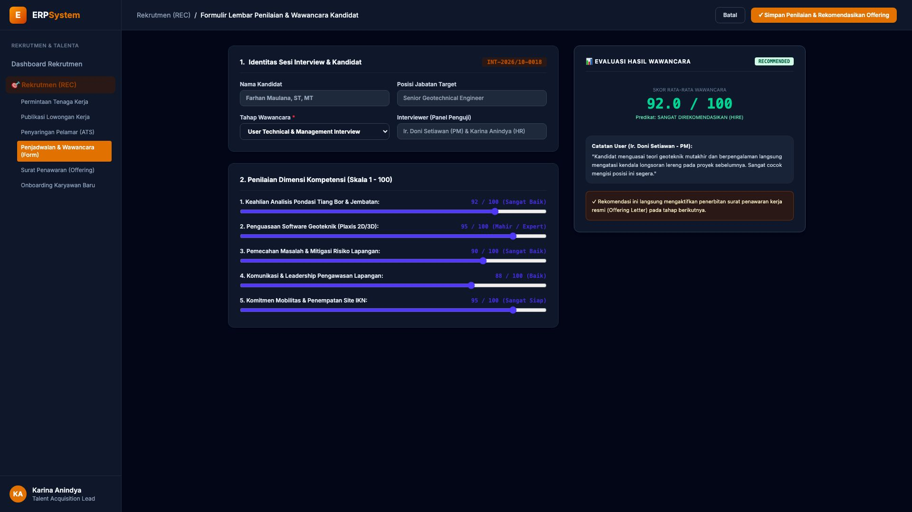

# 🎨 Design UI — Formulir Penilaian & Wawancara Kandidat (Data Entry Screen)

> Mockup antarmuka **Formulir Lembar Penilaian & Wawancara Kandidat (Interview Schedule & Scoring Data Entry)**: desain *Split-Screen Form* dengan formulir input penilaian penguji di sebelah kiri (Nomor Sesi `INT-2026/10-0018`, kandidat Farhan Maulana ST MT, posisi Senior Geotechnical Engineer, penguji Ir. Doni Setiawan PM Site & Karina Anindya HR, penilaian kompetensi: Pondasi Tiang Bor 92, Software Plaxis 95, Problem Solving 90, Komunikasi 88, Mobilitas Site IKN 95 &rarr; Skor Rata-rata 92.0 / 100) dan *Live Kartu Evaluasi Hasil Wawancara Predikat SANGAT DIREKOMENDASIKAN (HIRE) serta Catatan Rekomendasi User PM* di sebelah kanan pada modul `REC` (Rekrutmen & Talenta) dalam ERP System.

---

## Light Mode

---

## Dark Mode

---

## 📝 Komponen & Fitur Formulir Input

1. **Panel Kiri — Formulir Parameter Interview & Matriks Skor Kompetensi**:
   - Nomor Sesi: `INT-2026/10-0018` &bull; Tahap: `User Technical & Management Interview`.
   - Panel Penguji: *Ir. Doni Setiawan (Project Manager) & Karina Anindya (HR)*.
   - Evaluasi Kompetensi:
     - 1. Pondasi Tiang Bor & Jembatan: **92 / 100**
     - 2. Pemodelan Geoteknik Plaxis 2D/3D: **95 / 100**
     - 3. Mitigasi Risiko Longsoran: **90 / 100**
     - 4. Kepemimpinan Lapangan: **88 / 100**
     - 5. Kesiapan Mobilitas Site IKN: **95 / 100**.

2. **Panel Kanan — Skor Rata-Rata & Keputusan Hiring**:
   - **Skor Total: 92.0 / 100 (Predikat: SANGAT DIREKOMENDASIKAN / HIRE)**.
   - Catatan Resmi User PM Lapangan.
   - Otorisasi otomatis menuju pembuatan Surat Penawaran Kerja (*Offering Letter*).
