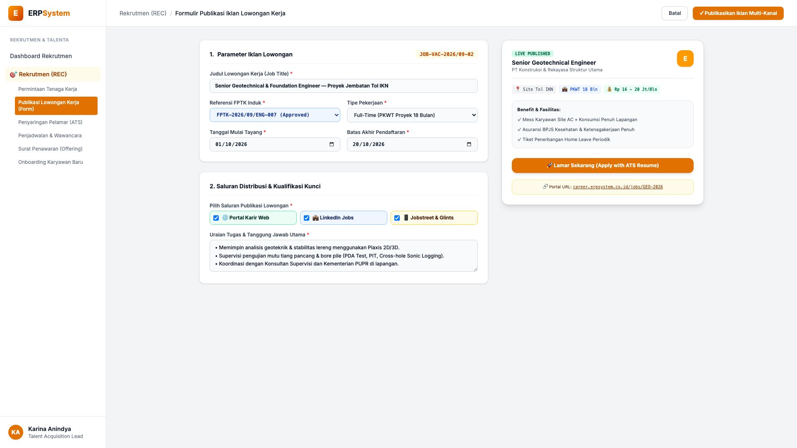
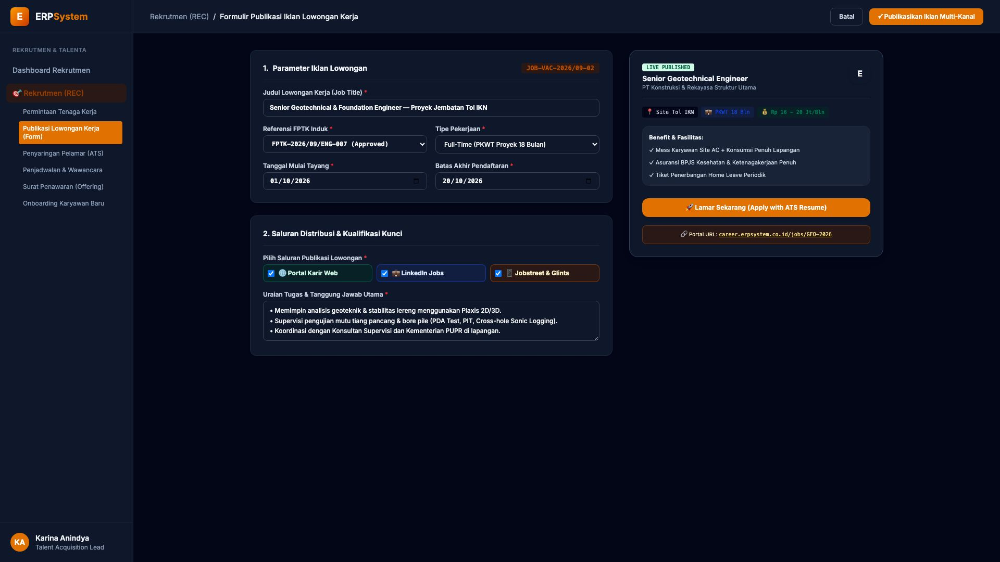

# 🎨 Design UI — Formulir Publikasi Iklan Lowongan Kerja (Data Entry Screen)

> Mockup antarmuka **Formulir Publikasi Iklan Lowongan Kerja Multi-Kanal (Job Posting & Publishing Data Entry)**: desain *Split-Screen Form* dengan formulir penyusunan iklan di sebelah kiri (Kode Iklan `JOB-VAC-2026/09-02`, judul Senior Geotechnical & Foundation Engineer Tol IKN, FPTK Induk `FPTK-2026/09/ENG-007`, status Full-Time PKWT 18 Bulan, periode tayang 01/10/2026 s/d 20/10/2026, saluran: Portal Karir Web, LinkedIn Jobs, Jobstreet & Glints, uraian tugas Plaxis 2D/3D & PDA Test) dan *Live Pratinjau Tampilan Iklan Karir Publik (Public Career Portal Job Card & Apply Button) serta Benefit Badge* di sebelah kanan pada modul `REC` (Rekrutmen & Talenta) dalam ERP System.

---

## Light Mode

---

## Dark Mode

---

## 📝 Komponen & Fitur Formulir Input

1. **Panel Kiri — Formulir Parameter Lowongan & Saluran Distribusi**:
   - Kode Iklan: `JOB-VAC-2026/09-02` &bull; FPTK: `FPTK-2026/09/ENG-007`.
   - Posisi: **Senior Geotechnical & Foundation Engineer**.
   - Saluran Distribusi: *🌐 Portal Karir Web, 💼 LinkedIn Jobs, 📱 Jobstreet & Glints*.
   - Periode Tayang: **01 Oktober 2026 s/d 20 Oktober 2026**.
   - Tanggung Jawab Kunci: *Analisis Geoteknik Plaxis 2D/3D & Supervisi Uji Mutu Pondasi PDA/CSL*.

2. **Panel Kanan — Pratinjau Halaman Karir Publik**:
   - Visualisasi Kartu Lowongan Publik (*Interactive Job Card*).
   - Tagging Informasi: Lokasi Site Tol IKN, Durasi Kontrak 18 Bulan, Kisaran Gaji Rp 16 - Rp 20 Jt/Bln.
   - Tombol Pendaftaran Calon Pelamar (*Apply with Resume*).
