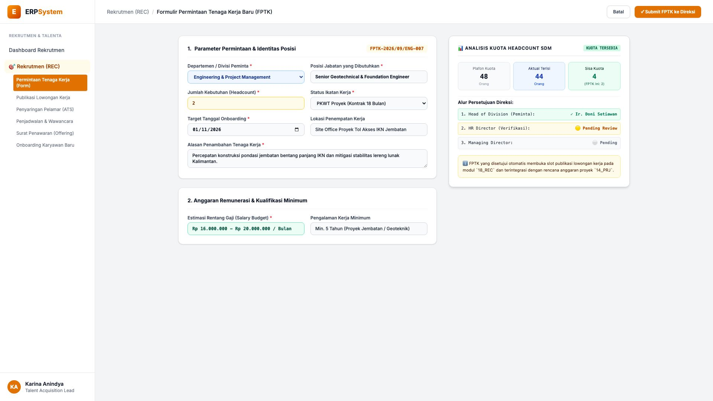
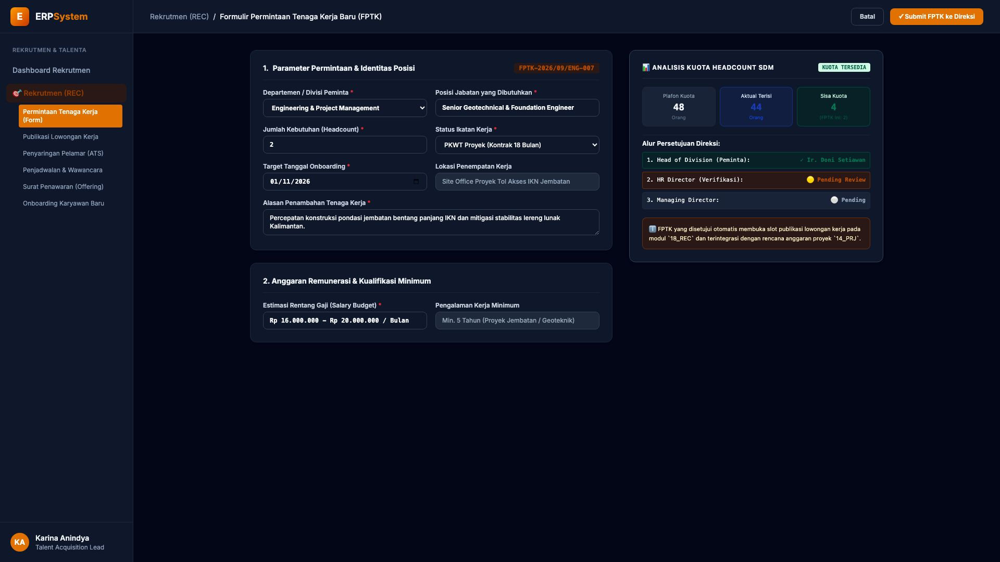

# 🎨 Design UI — Formulir Permintaan Tenaga Kerja (FPTK) (Data Entry Screen)

> Mockup antarmuka **Formulir Permintaan Tenaga Kerja Baru / Manpower Planning (FPTK Request Data Entry)**: desain *Split-Screen Form* dengan formulir input kebutuhan posisi di sebelah kiri (Nomor FPTK `FPTK-2026/09/ENG-007`, divisi Engineering & Proyek, posisi Senior Geotechnical & Foundation Engineer, kuantitas 2 Headcount, status PKWT Proyek 18 Bulan, target onboarding 01/11/2026, alasan percepatan pondasi jembatan Tol IKN, estimasi anggaran gaji Rp 16 - Rp 20 Jt/Bln/Orang) dan *Live Analisis Kuota Headcount SDM (Plafon 48 Orang, Terisi 44 Orang &rarr; Sisa Kuota 4 Orang (FPTK Ini 2 Orang = AMAN)) & Alur Persetujuan Bertingkat Direksi* di sebelah kanan pada modul `REC` (Rekrutmen & Talenta) dalam ERP System.

---

## Light Mode

---

## Dark Mode

---

## 📝 Komponen & Fitur Formulir Input

1. **Panel Kiri — Formulir Parameter FPTK & Kriteria Posisi**:
   - Nomor FPTK: `FPTK-2026/09/ENG-007` &bull; Divisi: `Engineering & Project Management`.
   - Posisi: **Senior Geotechnical & Foundation Engineer**.
   - Kuantitas: **2 Orang (Headcount)** &bull; Status: **PKWT Proyek 18 Bulan**.
   - Target Onboarding: **01 November 2026**.
   - Anggaran Remunerasi: **Rp 16.000.000 s/d Rp 20.000.000 / Bulan**.
   - Pengalaman: *Minimal 5 Tahun Bidang Pondasi Dalam Jembatan*.

2. **Panel Kanan — Analisis Kuota Headcount & Approval Direksi**:
   - Plafon Kuota SDM Divisi: **48 Orang**.
   - Aktual Terisi: **44 Orang**.
   - **Sisa Kuota Tersedia: 4 Orang** (Status FPTK Ini: *Valid & Within Budget*).
   - Approval Flow: *1. Ir. Doni Setiawan (Head of Div) ✓ &rarr; 2. HR Director &rarr; 3. Managing Director*.
