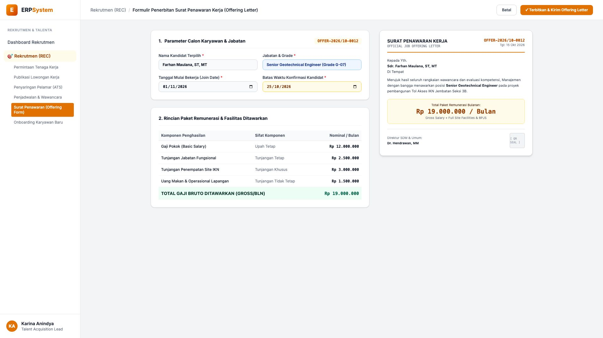
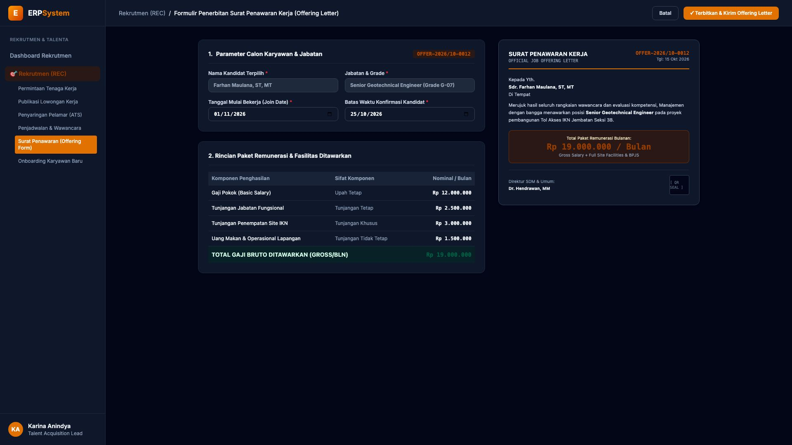

# 🎨 Design UI — Formulir Penerbitan Surat Penawaran Kerja (Offering Letter) (Data Entry Screen)

> Mockup antarmuka **Formulir Penerbitan Surat Penawaran Kerja Resmi (Job Offering Letter Data Entry)**: desain *Split-Screen Form* dengan formulir input paket penawaran kerja di sebelah kiri (Nomor Dokumen `OFFER-2026/10-0012`, kandidat terpilih Farhan Maulana ST MT, posisi Senior Geotechnical Engineer Grade G-07, tanggal mulai kerja 01/11/2026, batas konfirmasi 25/10/2026, rincian: Gaji Pokok Rp 12 Jt, Tunj. Jabatan Rp 2,5 Jt, Tunj. Site IKN Rp 3 Jt, Makan/Transport Rp 1,5 Jt &rarr; Total Gaji Bruto Rp 19.000.000 / Bulan + Mess AC Site & BPJS Penuh) dan *Live Dokumen Surat Penawaran Kerja Resmi (Official Job Offering Letter Document) dengan Kop Surat Perusahaan, Ringkasan Gaji & Segel e-Sign QR PrivyID* di sebelah kanan pada modul `REC` (Rekrutmen & Talenta) dalam ERP System.

---

## Light Mode

---

## Dark Mode

---

## 📝 Komponen & Fitur Formulir Input

1. **Panel Kiri — Formulir Parameter Penawaran & Paket Kompensasi**:
   - Nomor Offering: `OFFER-2026/10-0012` &bull; Posisi: `Senior Geotechnical Engineer`.
   - Kandidat: **Farhan Maulana, ST, MT** &bull; Join Date: **01 November 2026**.
   - Paket Penghasilan:
     - Gaji Pokok: **Rp 12.000.000**
     - Tunjangan Jabatan: **Rp 2.500.000**
     - Tunjangan Khusus Site IKN: **Rp 3.000.000**
     - Uang Makan & Operasional: **Rp 1.500.000**
     - **Total Gaji Bruto: Rp 19.000.000 / Bulan**.

2. **Panel Kanan — Dokumen Offering Letter Resmi**:
   - Pratinjau Surat Resmi Berkop Perusahaan (*Legal Job Offer Certificate*).
   - Penjelasan Fasilitas Mess & Tiket Pesawat Home Leave.
   - Segel Tanda Tangan Elektronik Direktur SDM & Umum.
