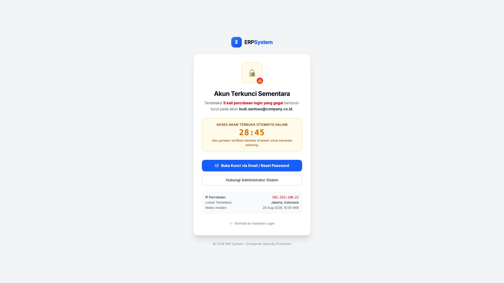
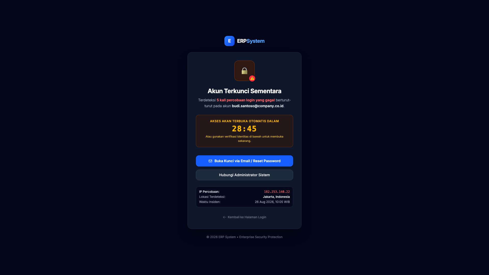

# 🎨 Design UI — Akun Terkunci (Account Lockout)

> Mockup antarmuka peringatan penangguhan akun sementara setelah 5 kali percobaan gagal login pada modul `USR` (User Management) dalam ERP System.

---

## Light Mode

---

## Dark Mode

---

## 🔒 Komponen & Fitur Keamanan

1. **Header Peringatan**: Ikon gembok pengaman dengan lencana darurat ⚠️.
2. **Deskripsi Insiden**: Informasi akun yang terkunci akibat percobaan berulang yang gagal.
3. **Penghitung Waktu Otomatis (*Countdown Timer*)**:
   - Menghitung mundur durasi penangguhan (default: **30 Menit**).
   - Akses otomatis terbuka kembali saat waktu habis.
4. **Opsi Pembukaan Kunci Mandiri**:
   - Tombol utama **"Buka Kunci via Email / Reset Password"** untuk pemulihan cepat melalui verifikasi surat elektronik.
   - Tombol sekunder **"Hubungi Administrator Sistem"** untuk eskalasi manual.
5. **Log Keamanan Kontekstual**:
   - Informasi Alamat IP percobaan, Lokasi terdeteksi (*Geolocation*), dan Waktu tepat insiden terjadi.
