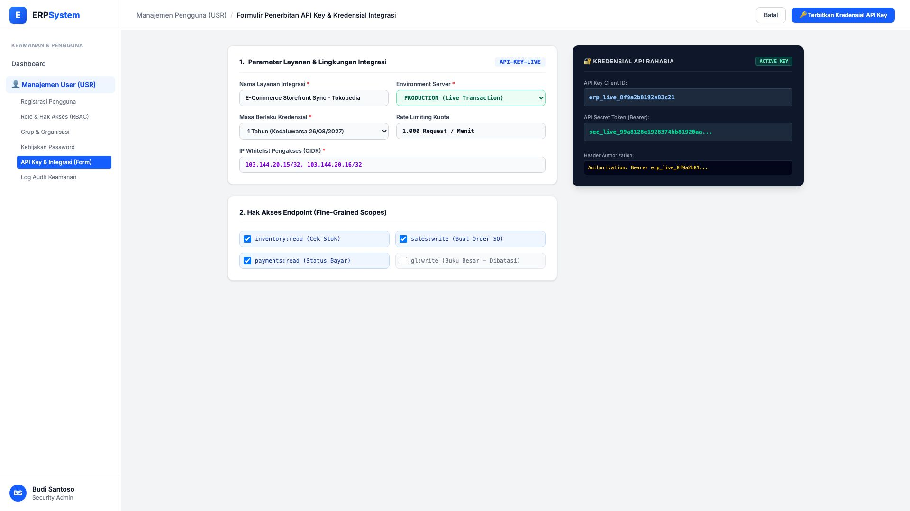

# 🎨 Design UI — Formulir Penerbitan API Key & Kredensial (Data Entry Screen)

> Mockup antarmuka **Formulir Penerbitan API Key & Kredensial Integrasi (API Key & Credential Issuance Data Entry)**: desain *Split-Screen Form* dengan formulir input kredensial API di sebelah kiri (Nama integrasi Tokopedia Sync, environment Production, masa berlaku 1 tahun, rate limit 1.000 req/min, IP whitelist CIDR, fine-grained scopes: inventory:read, sales:write, payments:read) dan *Live Kredensial Rahasia (API Client ID, Bearer Secret Token) & Contoh Header Authorization* di sebelah kanan pada modul `USR` (User Management) dalam ERP System.

---

## Light Mode

---

## Dark Mode

---

## 📝 Komponen & Fitur Formulir Input

1. **Panel Kiri — Formulir Parameter Kredensial & Scopes**:
   - Layanan: `E-Commerce Storefront Sync - Tokopedia` &bull; Lingkungan: **PRODUCTION**.
   - Masa Berlaku: **1 Tahun** &bull; Rate Limit: **1.000 Request/Menit**.
   - IP Whitelist: `103.144.20.15/32, 103.144.20.16/32`.
   - Scopes: `inventory:read` (Stok), `sales:write` (Buat SO), `payments:read` (Status Bayar).

2. **Panel Kanan — Kredensial Rahasia & Header Auth**:
   - API Client ID: `erp_live_8f9a2b8192a83c21`.
   - Bearer Secret: `sec_live_99a8128e1928374bb81920aa...`.
   - Code Sample: `Authorization: Bearer erp_live_8f9a...`.
