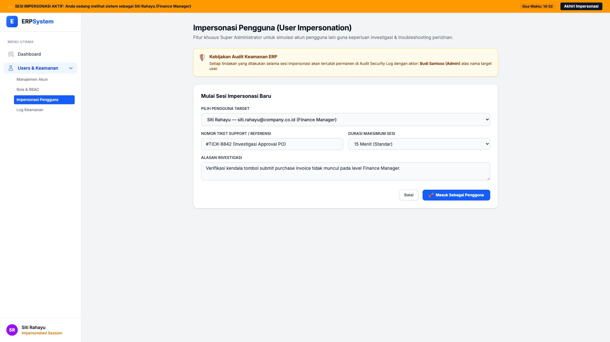
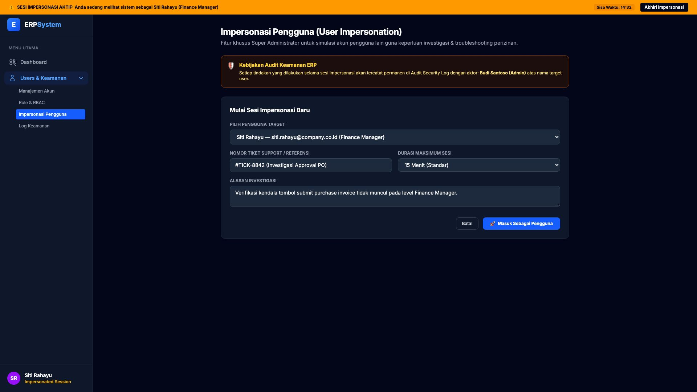

# 🎨 Design UI — Impersonasi Pengguna (User Impersonation)

> Mockup antarmuka **Impersonasi Pengguna (User Impersonation)**: fitur Super Administrator untuk mensimulasikan dan melihat sistem persis seperti yang dialami pengguna target guna keperluan verifikasi izin, investigasi masalah perizinan (*troubleshooting*), dan penelusuran kendala tiket support pada modul `USR` (User Management) dalam ERP System.

---

## Light Mode

---

## Dark Mode

---

## 🕵️‍♂️ Komponen & Fitur Utama

1. **Bilah Peringatan Status Impersonasi (*Top Warning Sticky Banner*)**:
   - Menampilkan notifikasi visual kuning/amber di bagian paling atas sistem selama sesi impersonasi aktif.
   - Info pengguna yang sedang disimulasikan (*"Anda sedang melihat sistem sebagai Siti Rahayu (Finance Manager)"*).
   - Timer hitung mundur sisa waktu sesi aktif (*"Sisa Waktu: 14:32"*).
   - Tombol instan **"Akhiri Impersonasi"** untuk kembali ke sesi Super Admin.

2. **Banner Kepatuhan Audit Keamanan**:
   - Memastikan integritas audit trail bahwa seluruh aksi selama impersonasi tercatat atas nama Super Administrator di `Security Audit Log`.

3. **Formulir Memulai Impersonasi**:
   - **Pilih Pengguna Target**: Dropdown pencarian user berdasarkan nama, email, dan jabatan.
   - **Nomor Tiket Support (Wajib)**: Referensi tiket helpdesk/investigasi (contoh: `#TICK-8842`).
   - **Durasi Maksimum Sesi**: Batas waktu otomatis (*15 Menit*, *30 Menit*, *1 Jam*).
   - **Alasan Investigasi**: Catatan justifikasi pembukaan sesi.
   - Tombol **"🚀 Masuk Sebagai Pengguna"** (*Primary Blue*).
