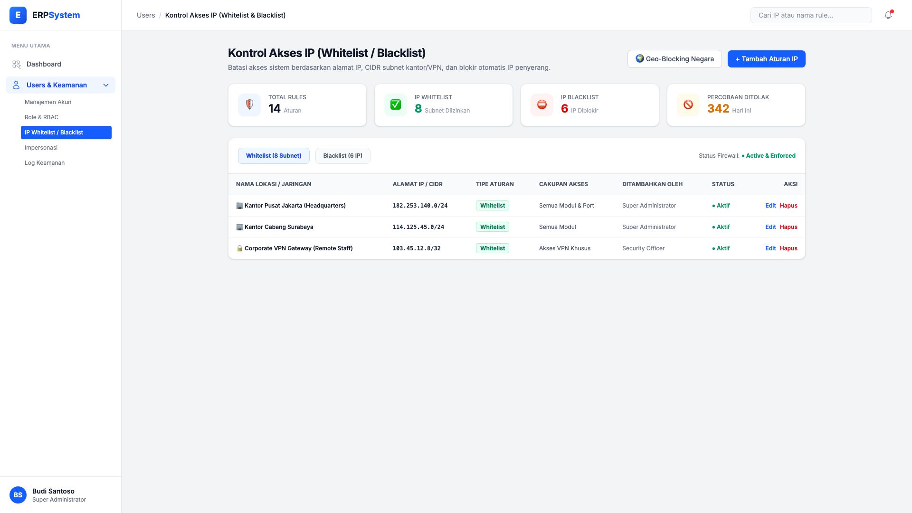
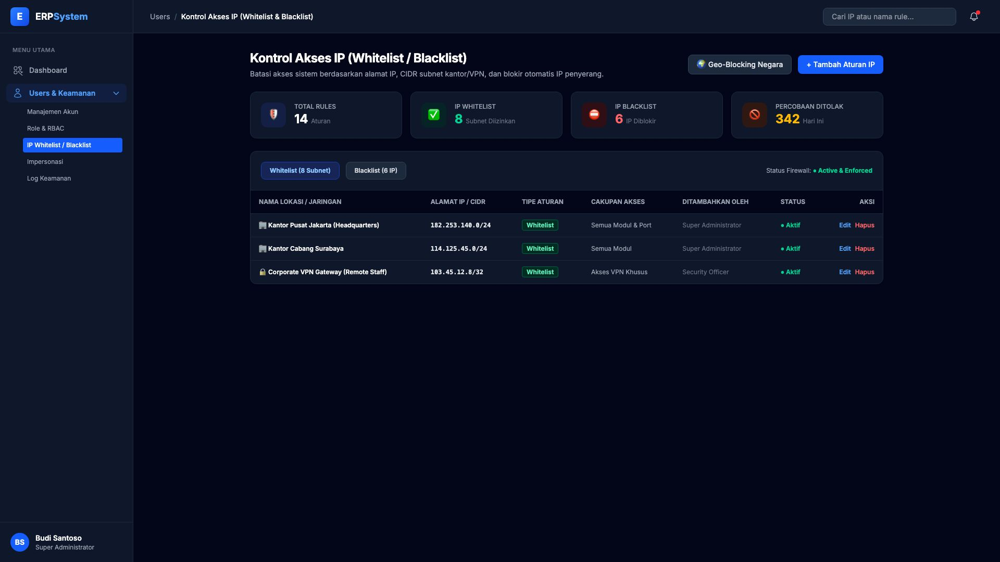

# 🎨 Design UI — Kontrol Akses IP (IP Whitelist / Blacklist)

> Mockup antarmuka **Kontrol Akses IP & Keamanan Firewall ERP (IP Whitelisting & Blacklisting)**: pembatasan akses berdasarkan alamat IP kantor, subnet CIDR cabang, gateway VPN korporat, dan pemblokiran otomatis IP berbahaya pada modul `USR` (User Management) dalam ERP System.

---

## Light Mode

---

## Dark Mode

---

## 🛡️ Komponen & Fitur Utama

1. **Header & Aksi Global**:
   - Tombol **"🌍 Geo-Blocking Negara"**: Konfigurasi pembatasan akses hanya dari wilayah/negara tertentu (misal: Indonesia only).
   - Tombol **"+ Tambah Aturan IP"** (*Primary Blue*): Mendaftarkan subnet CIDR atau IP statis baru.

2. **Metrik Aturan Firewall (Stats Cards)**:
   - **Total Rules**: 14 Aturan aktif
   - **IP Whitelist**: 8 Subnet kantor/VPN diizinkan (🟢 *Active*)
   - **IP Blacklist**: 6 IP penyerang diblokir (⛔ *Blocked*)
   - **Percobaan Ditolak Hari Ini**: 342 Request terblokir (🟡 *Enforced*)

3. **Tab Whitelist & Blacklist**:
   - **Kantor Pusat Jakarta**: `182.253.140.0/24` (Akses semua modul).
   - **Kantor Cabang Surabaya**: `114.125.45.0/24` (Akses operasional cabang).
   - **Corporate VPN Gateway**: `103.45.12.8/32` (Akses staf WFH / remote).
   - Aksi cepat: **Edit** dan **Hapus Aturan**.
