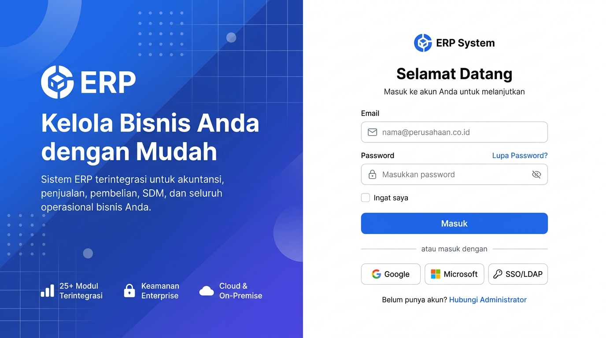
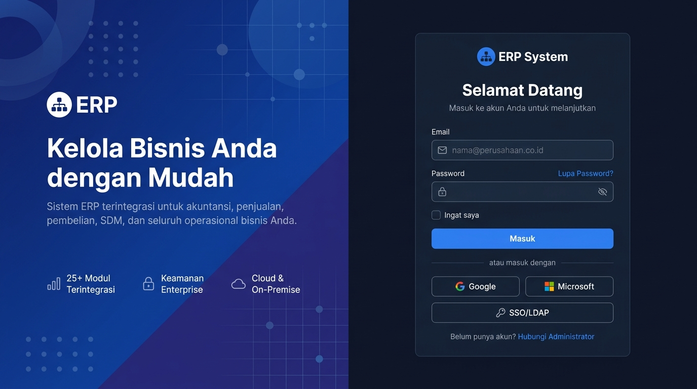

# 🎨 Design UI — Login / Autentikasi

> Design mockup halaman Login untuk modul `USR` (User Management) dalam ERP System.
> Login menggunakan **email** (bukan username) dengan dukungan SSO, OAuth2, dan LDAP/Active Directory.

---

## Light Mode



---

## Dark Mode



---

## Layout

Halaman login menggunakan **split-screen layout**:

| Area | Lebar | Konten |
|------|-------|--------|
| **Kiri** — Branding | ~60% | Gradient biru, logo ERP, headline, subtitle, fitur highlights |
| **Kanan** — Form Login | ~40% | Logo, form email/password, tombol SSO |

---

## Komponen Form Login

### Header
- Logo ERP System (ikon + teks)
- Heading: **"Selamat Datang"**
- Subtitle: "Masuk ke akun Anda untuk melanjutkan"

### Form Fields

| Field | Tipe | Ikon | Placeholder | Keterangan |
|-------|------|------|-------------|------------|
| Email | Email input | ✉️ Envelope | `nama@perusahaan.co.id` | Required, validasi format email |
| Password | Password input | 🔒 Lock | `Masukkan password` | Toggle visibility (eye icon) |

### Opsi Tambahan
- **"Lupa Password?"** — Link biru di sebelah kanan label Password → redirect ke halaman reset
- **"Ingat saya"** — Checkbox untuk remember me (token/cookie)

### Tombol Utama
- **"Masuk"** — Full-width, primary blue, bold text

### Metode Login Alternatif

Divider: `— atau masuk dengan —`

| Metode | Ikon | Tipe Tombol | Keterangan |
|--------|------|-------------|------------|
| **Google** | G logo | Outline/default | OAuth2 — Google Workspace |
| **Microsoft** | MS logo | Outline/default | OAuth2 — Microsoft 365 / Azure AD |
| **SSO/LDAP** | 🔑 Key | Outline/default | Enterprise SSO / LDAP / Active Directory |

### Footer
- Teks: "Belum punya akun?" + link biru **"Hubungi Administrator"**

---

## Branding Panel (Kiri)

| Elemen | Konten |
|--------|--------|
| Logo | Ikon ERP + "ERP" teks besar putih |
| Headline | "Kelola Bisnis Anda dengan Mudah" |
| Subtitle | "Sistem ERP terintegrasi untuk akuntansi, penjualan, pembelian, SDM, dan seluruh operasional bisnis Anda." |
| Fitur 1 | 📊 25+ Modul Terintegrasi |
| Fitur 2 | 🔒 Keamanan Enterprise |
| Fitur 3 | ☁️ Cloud & On-Premise |

---

## Alur Autentikasi

```
┌─────────────────┐
│  Halaman Login   │
│  (Email + Pass)  │
└───────┬─────────┘
        │
        ├── Email + Password ──► Validasi ──► Berhasil ──► 2FA? ──► Dashboard
        │                                         │
        │                                    Gagal ──► Error message
        │                                              (3x gagal → lockout)
        │
        ├── Google OAuth2 ──► Redirect Google ──► Callback ──► Dashboard
        │
        ├── Microsoft OAuth2 ──► Redirect MS ──► Callback ──► Dashboard
        │
        └── SSO/LDAP ──► Form Domain ──► Validasi LDAP ──► Dashboard
```

---

## Halaman Terkait

| Halaman | Trigger | Keterangan |
|---------|---------|------------|
| **Lupa Password** | Klik "Lupa Password?" | Form input email → kirim link reset |
| **Reset Password** | Klik link dari email | Form password baru + konfirmasi |
| **2FA Verification** | Setelah login berhasil (jika 2FA aktif) | Input kode OTP / authenticator |
| **SSO/LDAP Login** | Klik tombol "SSO/LDAP" | Form input domain perusahaan → redirect |
| **Account Locked** | 3x gagal login | Pesan info + "Hubungi Administrator" |

---

## Error States

| Kondisi | Pesan Error |
|---------|-------------|
| Email kosong | "Email wajib diisi" |
| Format email salah | "Format email tidak valid" |
| Password kosong | "Password wajib diisi" |
| Email/password salah | "Email atau password salah" (generic untuk keamanan) |
| Akun nonaktif | "Akun Anda telah dinonaktifkan. Hubungi administrator." |
| Akun terkunci | "Akun terkunci karena terlalu banyak percobaan. Coba lagi dalam 30 menit." |

---

*File design disimpan di folder `ui/`*
