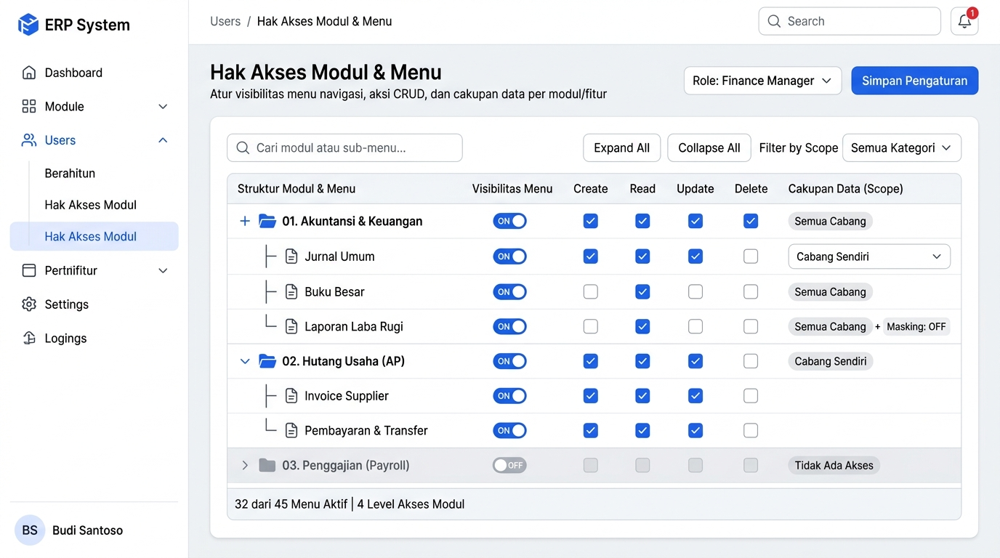
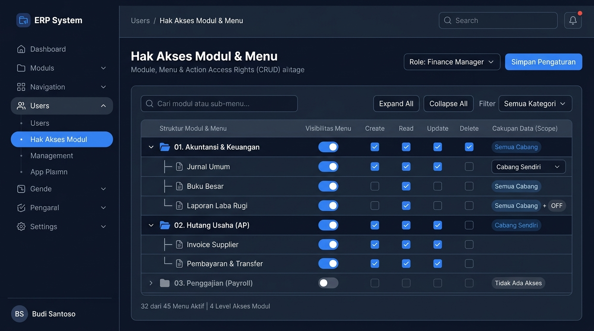

# 🎨 Design UI — Hak Akses Modul, Menu, dan Aksi (CRUD)

> Design mockup antarmuka konfigurasi hak akses berbutir halus (*fine-grained*) pada struktur navigasi hierarkis Modul, Menu/Sub-menu, dan Aksi CRUD + Data Scope untuk modul `USR` (User Management) dalam ERP System.

---

## Light Mode



---

## Dark Mode



---

## Konsep & Struktur Hak Akses Hierarkis

Sistem hak akses ini mengatur **3 lapisan perizinan**:

```
 ┌────────────────────────────────────────────────────────┐
 │ 1. MODUL & MENU VISIBILITY                             │
 │    Apakah modul/menu tampil di sidebar navigasi user?  │
 └───────────────────────────┬────────────────────────────┘
                             │ Jika Visible (ON)
                             ▼
 ┌────────────────────────────────────────────────────────┐
 │ 2. ACTION PERMISSIONS (CRUD)                           │
 │    Create (Tambah), Read (Lihat), Update (Ubah),       │
 │    Delete (Hapus)                                      │
 └───────────────────────────┬────────────────────────────┘
                             │ Jika Izin Diberikan
                             ▼
 ┌────────────────────────────────────────────────────────┐
 │ 3. DATA ACCESS SCOPE & MASKING                         │
 │    - Semua Cabang (Headquarters / Konsolidasi)         │
 │    - Cabang Sendiri (Branch Scope)                     │
 │    - Departemen Sendiri                                │
 │    - Data Pribadi (Own Data Only)                      │
 │    - Data Masking (Sensor data sensitif / rekening)    │
 └────────────────────────────────────────────────────────┘
```

---

## Komponen Halaman

### 1. Page Header
- **Judul**: `Hak Akses Modul & Menu`
- **Subtitle**: "Atur visibilitas menu navigasi, aksi CRUD, dan cakupan data per modul/fitur"
- **Selector Target**: Dropdown pemilihan Role / User spesifik (contoh: `Role: Finance Manager`)
- **Tombol Utama**: `Simpan Pengaturan` *(Primary Blue)*

---

### 2. Toolbar & Pencarian
- **Search Input**: `Cari modul atau sub-menu...` (filter instan pada pohon navigasi)
- **Tombol Navigasi Pohon**: `Expand All` & `Collapse All` (buka/tutup seluruh cabang pohon hierarki)
- **Filter Kategori**: Dropdown filter (Keuangan, Rantai Pasok, Penjualan, SDM, Sistem)

---

### 3. Tabel Hierarki Pohon (Tree-Grid Access Table)

Setiap entri dalam hierarki memiliki kontrol perizinan langsung:

| Struktur Modul & Menu | Visibilitas Menu | Create (C) | Read (R) | Update (U) | Delete (D) | Cakupan Data (Scope) |
|---|:---:|:---:|:---:|:---:|:---:|---|
| **📁 01. Akuntansi & Keuangan** *(Parent)* | 🔵 **ON** | ✅ | ✅ | ✅ | ✅ | `Semua Cabang` |
| ├── **📄 Jurnal Umum** | 🔵 **ON** | ✅ | ✅ | ✅ | ⬜ | `Cabang Sendiri` ▼ |
| ├── **📄 Buku Besar** | 🔵 **ON** | ⬜ | ✅ | ⬜ | ⬜ | `Semua Cabang` |
| └── **📄 Laporan Laba Rugi** | 🔵 **ON** | ⬜ | ✅ | ⬜ | ⬜ | `Semua Cabang` + `Masking: OFF` |
| **📁 02. Hutang Usaha (AP)** *(Parent)* | 🔵 **ON** | ✅ | ✅ | ✅ | ⬜ | `Cabang Sendiri` |
| ├── **📄 Invoice Supplier** | 🔵 **ON** | ✅ | ✅ | ✅ | ⬜ | `Cabang Sendiri` |
| └── **📄 Pembayaran & Transfer** | 🔵 **ON** | ✅ | ✅ | ✅ | ⬜ | `Cabang Sendiri` |
| **📁 03. Penggajian (Payroll)** *(Parent)* | ⚪ **OFF** | ⬜ | ⬜ | ⬜ | ⬜ | *Tidak Ada Akses* |

---

### 4. Detail Cakupan Data (Data Scope)

Dropdown scope memungkinkan pembatasan jangkauan data bahkan ketika user memiliki hak `Read` atau `Update`:

1. **Semua Cabang / Global Scope**:
   - Melihat dan mengolah seluruh transaksi perusahaan across multi-company / cabang.
2. **Cabang Sendiri (Branch Level)**:
   - Terisolasi hanya untuk transaksi yang dibuat di cabang tempat user ditugaskan.
3. **Departemen Sendiri**:
   - Terisolasi untuk dokumen dan pengajuan dalam divisi/departemen yang bersangkutan.
4. **Milik Pribadi (Self-Service / Creator Only)**:
   - Hanya dapat melihat data yang dibuat oleh akun itu sendiri (contoh: *Reimbursement*, *Slip Gaji*, *Cuti*).

---

### 5. Fitur Keamanan Tambahan: Field-Level Masking
Pada menu berisiko tinggi (seperti Laporan Keuangan Rahasia atau Payroll):
- **Masking: ON**: Kolom sensitif seperti nomor rekening bank, tarif gaji, atau margin profit disamarkan dengan tanda bintang (`Rp ***.***`).
- **Masking: OFF**: Menampilkan nilai asli data secara transparan.

---

### 6. Status Bar Bawah
- `32 dari 45 Menu Aktif | 4 Level Akses Modul`
- Menampilkan metrik ringkas persentase akses yang aktif untuk role yang dipilih.

---

*File design disimpan di folder `ui/`*
