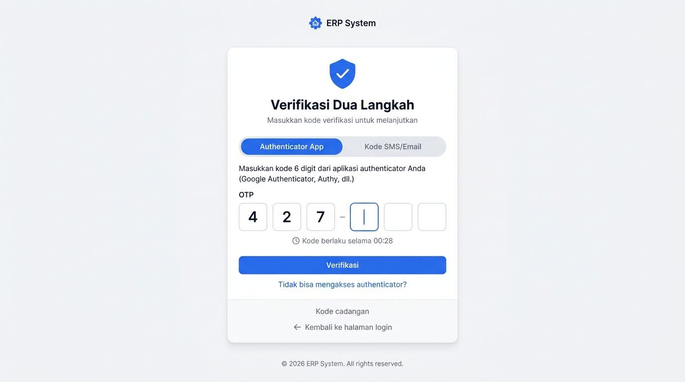
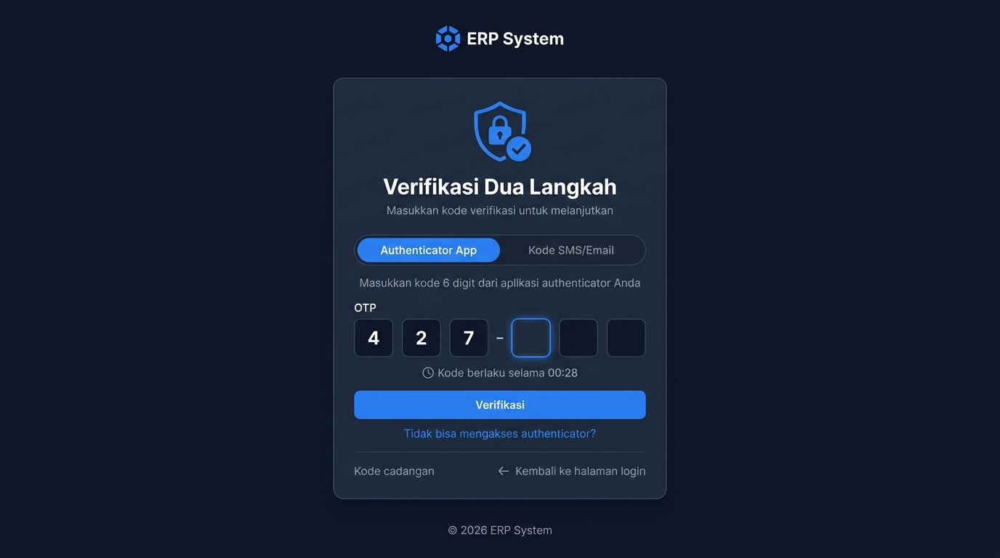

# 🎨 Design UI — Verifikasi 2FA / Multi-Factor Authentication

> Design mockup halaman verifikasi dua langkah (2FA/MFA) untuk modul `USR` (User Management) dalam ERP System.
> Halaman ini muncul setelah login email/password berhasil, jika 2FA aktif pada akun pengguna.

---

## Light Mode



---

## Dark Mode



---

## Layout

Halaman 2FA menggunakan **centered card layout** — card tunggal di tengah halaman, tanpa sidebar.

---

## Komponen Halaman

### Header
| Elemen | Konten |
|--------|--------|
| Logo | Ikon ERP + "ERP System" (centered, di atas card) |
| Ikon | Shield + checkmark (biru, 64px) |
| Judul | **"Verifikasi Dua Langkah"** |
| Subtitle | "Masukkan kode verifikasi untuk melanjutkan" |

### Tab Selector (Pill Toggle)

| Tab | Keterangan |
|-----|-----------|
| **Authenticator App** (default aktif) | Kode dari Google Authenticator, Authy, dll. |
| **Kode SMS/Email** | Kode OTP dikirim via SMS atau email |

---

## Tab 1: Authenticator App

| Komponen | Detail |
|----------|--------|
| Instruksi | "Masukkan kode 6 digit dari aplikasi authenticator Anda (Google Authenticator, Authy, dll.)" |
| OTP Input | 6 kotak input individual (56x56px), separator dash antara digit 3 dan 4 |
| Timer | ⏱ "Kode berlaku selama 00:28" (countdown 30 detik, auto-refresh) |
| Tombol | **"Verifikasi"** — full-width, primary blue |
| Link | "Tidak bisa mengakses authenticator?" → opsi alternatif |

### OTP Input Behavior
- Auto-focus ke kotak berikutnya setelah input digit
- Backspace kembali ke kotak sebelumnya
- Paste 6 digit sekaligus → auto-fill semua kotak
- Kotak aktif: border biru + subtle glow
- Input salah: semua kotak border merah + shake animation

---

## Tab 2: Kode SMS/Email

| Komponen | Detail |
|----------|--------|
| Info | "Kode verifikasi telah dikirim ke **+62 812-****-7890**" (nomor di-mask) |
| OTP Input | 6 kotak input (sama seperti authenticator) |
| Timer | ⏱ "Kirim ulang kode dalam 00:58" |
| Tombol | **"Verifikasi"** — full-width, primary blue |
| Link | "Kirim ulang kode" (aktif setelah countdown habis) |
| Opsi | "Kirim ke email sebagai gantinya" → toggle ke email OTP |

---

## Alur Verifikasi 2FA

```
Login Berhasil (email + password)
        │
        ▼
  ┌─────────────────┐
  │  Cek 2FA Aktif?  │
  └───────┬─────────┘
          │
     Ya   │   Tidak
     │    │    │
     ▼    │    └──► Dashboard (langsung masuk)
  ┌──────────────┐
  │ Halaman 2FA  │
  │ (OTP Input)  │
  └──────┬───────┘
         │
    ┌────┴─────┐
    │          │
 Benar     Salah
    │          │
    ▼          ▼
 Dashboard  Error "Kode salah"
             (3x gagal → lockout)
```

---

## Halaman Setup 2FA (Pertama Kali)

Ketika pengguna mengaktifkan 2FA dari halaman profil:

### Langkah 1: Scan QR Code
- Tampilkan QR code untuk di-scan oleh authenticator app
- Atau tampilkan secret key manual jika tidak bisa scan
- Instruksi: "Scan QR code dengan aplikasi authenticator Anda"

### Langkah 2: Verifikasi
- Input kode 6 digit dari authenticator untuk konfirmasi setup berhasil

### Langkah 3: Simpan Kode Cadangan
- Tampilkan 8 kode cadangan (recovery codes)
- Tombol "Download" / "Copy" kode cadangan
- Warning: "Simpan kode ini di tempat aman. Setiap kode hanya dapat digunakan satu kali."

---

## Error States

| Kondisi | Pesan | Aksi |
|---------|-------|------|
| Kode salah | "Kode verifikasi salah. Silakan coba lagi." | Kotak merah, shake |
| Kode expired | "Kode telah kedaluwarsa. Silakan minta kode baru." | Tombol kirim ulang |
| 3x gagal | "Terlalu banyak percobaan. Akun dikunci 30 menit." | Redirect ke locked page |
| Authenticator hilang | "Tidak bisa mengakses authenticator?" | Opsi: SMS/Email atau kode cadangan |

---

## Footer
- "© 2026 ERP System. All rights reserved."

---

*File design disimpan di folder `ui/`*
