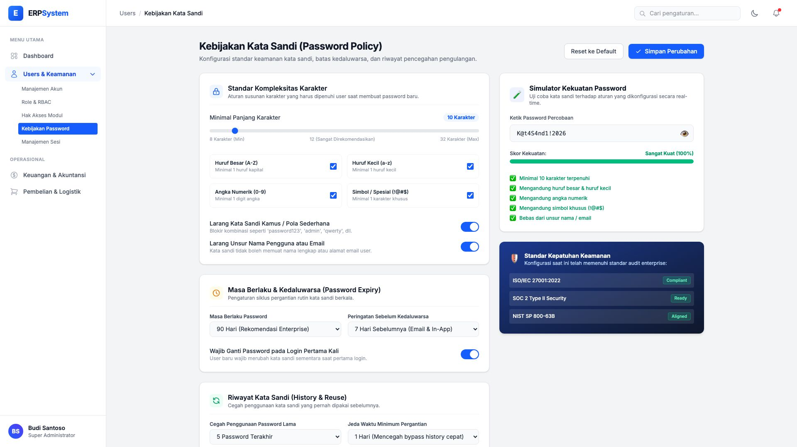
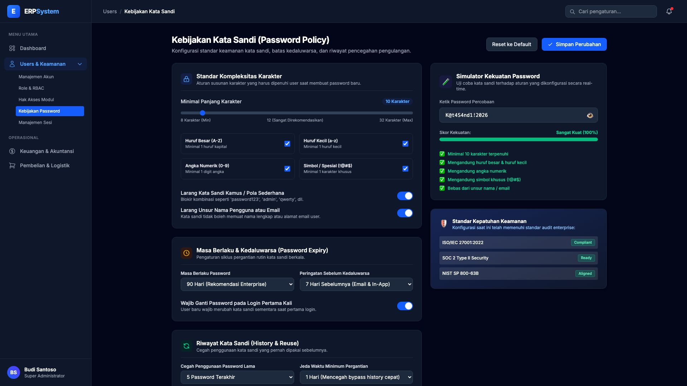
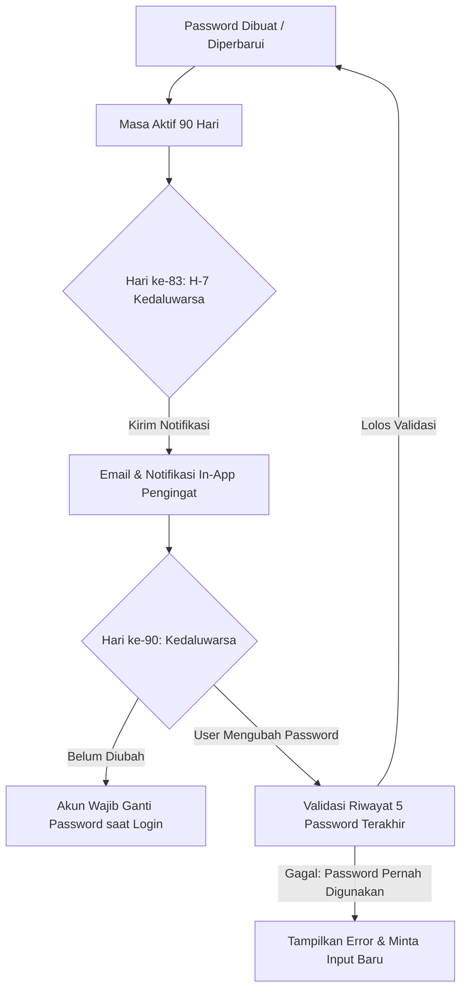

# 🎨 Design UI — Kebijakan Kata Sandi (Password Policy)

> Dokumentasi spesifikasi antarmuka dan visual untuk **Kebijakan Kata Sandi (Password Policy)**: standar kompleksitas, masa kedaluwarsa (*expiry*), riwayat kata sandi (*history & reuse prevention*), serta simulator kekuatan kata sandi real-time pada modul `USR` (User Management) dalam ERP System.

---

## Light Mode

---

## Dark Mode

---

## 🎨 Palet Warna & Spesifikasi Tema

| Komponen | Light Mode | Dark Mode | Fungsi / Makna |
|---|---|---|---|
| **Background Halaman** | `#f3f4f6` (Gray-100) | `#020617` (Slate-950) | Latar belakang dasar aplikasi |
| **Card / Panel** | `#ffffff` (White) | `#0f172a` (Slate-900) | Kontainer pengaturan dan widget |
| **Border / Garis Pemisah** | `#e5e7eb` (Gray-200) | `#1e293b` (Slate-800) | Pembatas form dan kartu |
| **Aksen Utama (Primary)** | `#2563eb` (Blue-600) | `#3b82f6` (Blue-500) | Tombol simpan, toggle ON, slider |
| **Meter Kekuatan - Lemah** | `#ef4444` (Red-500) | `#f87171` (Red-400) | Kurang dari 60% kriteria |
| **Meter Kekuatan - Sedang** | `#f59e0b` (Amber-500) | `#fbbf24` (Amber-400) | 60% - 80% kriteria |
| **Meter Kekuatan - Kuat** | `#16a34a` (Green-600) | `#22c55e` (Green-500) | 100% kriteria terpenuhi |

---

## 📑 Komponen Pengaturan Terperinci

### 1. Panel Standar Kompleksitas (Complexity Requirements)

| Parameter | Tipe Input | Nilai Default | Opsi / Rentang | Keterangan |
|---|---|:---:|:---:|---|
| **Panjang Minimum** | Slider + Number Box | **10 Karakter** | 8 – 32 Karakter | Jumlah karakter minimum yang diizinkan |
| **Huruf Besar (A-Z)** | Switch Toggle | 🔵 **ON** | ON / OFF | Wajib minimal 1 karakter huruf kapital |
| **Huruf Kecil (a-z)** | Switch Toggle | 🔵 **ON** | ON / OFF | Wajib minimal 1 karakter huruf kecil |
| **Angka Numerik (0-9)** | Switch Toggle | 🔵 **ON** | ON / OFF | Wajib minimal 1 digit angka |
| **Karakter Spesial** | Switch Toggle | 🔵 **ON** | ON / OFF | Simbol: `! @ # $ % ^ & * ( ) _ + - = [ ]` |
| **Anti-Pola Umum** | Switch Toggle | 🔵 **ON** | ON / OFF | Menolak kata sandi kamus (misal: *password123*, *admin2026*) |
| **Anti-Kredensial Profil** | Switch Toggle | 🔵 **ON** | ON / OFF | Menolak jika mengandung bagian dari email / nama user |

---

### 2. Panel Masa Berlaku & Kedaluwarsa (Password Expiration)

| Parameter | Pilihan Nilai | Rekomendasi Enterprise |
|---|---|:---:|
| **Periode Kedaluwarsa** | *30 Hari, 60 Hari, 90 Hari, 180 Hari, Tidak Pernah* | **90 Hari** |
| **Peringatan Awal (Notice)** | *3 Hari, 7 Hari, 14 Hari sebelumnya* | **7 Hari** |
| **Force Change on 1st Login** | *ON / OFF* | 🔵 **ON** (User baru wajib ganti password awal) |

---

### 3. Panel Riwayat Kata Sandi (Password History & Reuse)

Mencegah pengguna hanya mengganti 1 karakter atau bolak-balik menggunakan kata sandi yang sama:
- **Jumlah Riwayat Diingat**: `5 Password Terakhir` *(Tersedia opsi: 3, 5, 8, 10)*
- **Jeda Waktu Ganti Password**: `1 Hari` *(Mencegah user mengganti password 5x berturut-turut dalam 1 menit agar bisa memakai password lama kembali)*

---

### 4. Widget Simulator Kekuatan Kata Sandi Real-Time

Widget interaktif di sisi kanan memungkinkan administrator menguji validitas kriteria kebijakan secara instan:
- **Input Field**: Input uji coba dengan tombol intip (`👁 Show/Hide Password`).
- **Dynamic Progress Bar**:
  - `0% - 39%`: Merah *(Sangat Lemah / Very Weak)*
  - `40% - 69%`: Oranye *(Cukup / Fair)*
  - `70% - 89%`: Kuning *(Kuat / Strong)*
  - `90% - 100%`: Hijau *(Sangat Kuat / Very Strong)*
- **Checklist Interaktif**: Ikon berubah otomatis menjadi centang hijau `✅` saat kriteria terpenuhi atau tanda silang abu-abu `⬜` saat belum.

---

## 🔒 Pesan Validasi & Error States

| Skenario | Pesan Kesalahan (*Error Message*) |
|---|---|
| Karakter < 10 | `Kata sandi harus memiliki panjang minimal 10 karakter.` |
| Tanpa Huruf Besar | `Kata sandi wajib mengandung setidaknya satu huruf besar (A-Z).` |
| Tanpa Angka / Simbol | `Kata sandi wajib mengandung kombinasi angka dan karakter khusus (!@#$).` |
| Password Ada di Riwayat | `Kata sandi ini pernah digunakan dalam 5 riwayat terakhir. Gunakan sandi baru.` |
| Mengandung Nama / Email | `Kata sandi tidak boleh mengandung nama atau alamat email Anda.` |
| Ganti Terlalu Cepat | `Anda baru saja mengganti kata sandi. Perubahan berikutnya dapat dilakukan setelah 24 jam.` |

---

*File design disimpan di folder `ui/`*
