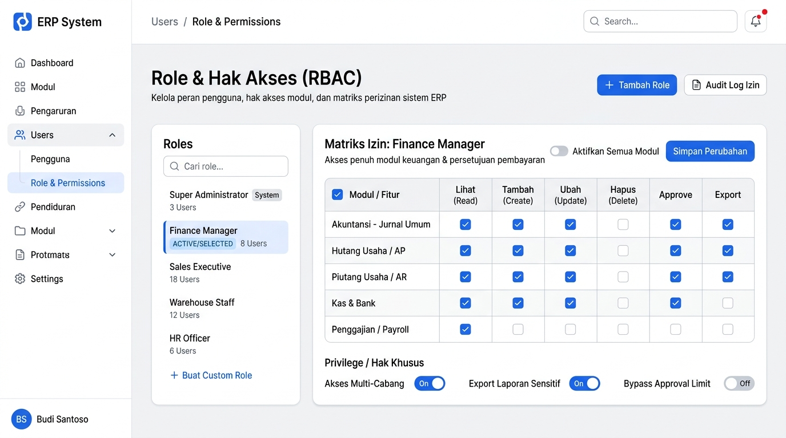
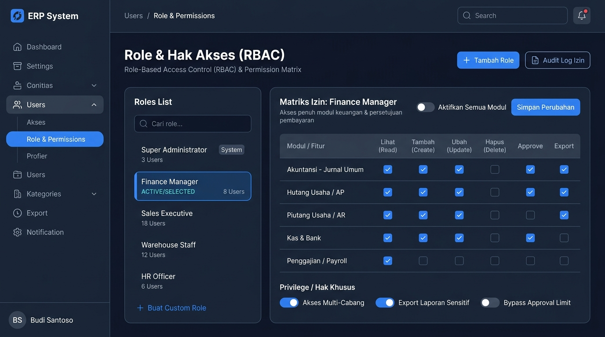

# 🎨 Design UI — Role-Based Access Control (RBAC) & Permission Matrix

> Design mockup antarmuka pengelolaan Role, Permission (Izin Akses per Fitur/Aksi), dan Privilege (Hak Akses Khusus) untuk modul `USR` (User Management) dalam ERP System.

---

## Light Mode



---

## Dark Mode



---

## Konsep & Struktur RBAC

Sistem otorisasi ERP menggunakan model **Hierarki 3-Tingkat**:

```
 ┌────────────────────────────────────────────────────────┐
 │                      ROLES (Peran)                     │
 │  (Contoh: Super Admin, Finance Manager, Sales Staff)   │
 └───────────────────────────┬────────────────────────────┘
                             │ memiliki banyak
                             ▼
 ┌────────────────────────────────────────────────────────┐
 │                   PERMISSIONS (Matriks Izin)           │
 │  (Aksi CRUD + A + E per Modul & Sub-fitur)             │
 └───────────────────────────┬────────────────────────────┘
                             │ + hak khusus
                             ▼
 ┌────────────────────────────────────────────────────────┐
 │               PRIVILEGES (Hak Akses Khusus)            │
 │  (Multi-cabang, Bypass Limit, Export Data Sensitif)   │
 └────────────────────────────────────────────────────────┘
```

---

## Komponen Halaman

### 1. Page Header
- **Judul**: `Role & Hak Akses (RBAC)`
- **Subtitle**: "Kelola peran pengguna, hak akses modul, dan matriks perizinan sistem ERP"
- **Aksi Kanan**:
  - `+ Tambah Role` *(Primary Button — Biru)*
  - `Audit Log Izin` *(Outline Button — Riwayat perubahan izin)*

---

### 2. Panel Kiri — Daftar Role (Roles List)
Panel navigasi vertikal untuk memilih role yang akan dikonfigurasi izinnya:

| Elemen | Fungsi / Keterangan |
|--------|---------------------|
| **Search Box** | Cari role secara instan berdasarkan nama |
| **Super Administrator** | Badge `System` (Role default bawaan sistem, tidak bisa dihapus) — 3 Users |
| **Finance Manager** | Status `Active/Selected` (highlight latar biru lembut & border kiri) — 8 Users |
| **Sales Executive** | 18 Users |
| **Warehouse Staff** | 12 Users |
| **HR Officer** | 6 Users |
| **+ Buat Custom Role** | Shortcut cepat membuka modal pembuatan role kustom baru |

---

### 3. Panel Kanan — Matriks Izin (Permission Matrix)
Menampilkan konfigurasi hak akses terinci untuk role yang sedang dipilih (*Finance Manager*):

#### Header Matriks
- **Nama Role**: `Matriks Izin: Finance Manager`
- **Deskripsi**: "Akses penuh modul keuangan & persetujuan pembayaran"
- **Quick Switch**: Toggle `Aktifkan Semua Modul`
- **Tombol Aksi**: `Simpan Perubahan` *(Primary Button)*

#### Tabel Matriks Izin (CRUD + A + E)
Setiap baris mewakili modul / sub-fitur dengan 6 kolom hak akses:

| Modul / Fitur | Lihat (Read) | Tambah (Create) | Ubah (Update) | Hapus (Delete) | Approve | Export |
|---|:---:|:---:|:---:|:---:|:---:|:---:|
| **Akuntansi — Jurnal Umum** | ✅ | ✅ | ✅ | ⬜ | ✅ | ✅ |
| **Hutang Usaha / AP** | ✅ | ✅ | ✅ | ⬜ | ✅ | ✅ |
| **Piutang Usaha / AR** | ✅ | ✅ | ✅ | ⬜ | ✅ | ✅ |
| **Kas & Bank** | ✅ | ✅ | ✅ | ⬜ | ✅ | ⬜ |
| **Penggajian / Payroll** | ✅ | ⬜ | ⬜ | ⬜ | ⬜ | ⬜ |

> **Keterangan Aksi:**
> - **Read (Lihat)**: Izin membuka dan melihat data modul
> - **Create (Tambah)**: Izin membuat transaksi/data baru
> - **Update (Ubah)**: Izin mengubah data yang belum di-lock
> - **Delete (Hapus)**: Izin menghapus data (dibatasi untuk safety)
> - **Approve (Setujui)**: Izin memvalidasi/menyetujui dokumen/transaksi
> - **Export (Unduh)**: Izin mengekspor data ke Excel/PDF/CSV

---

### 4. Privilege / Hak Akses Khusus
Switch izin khusus di luar aksi data standar:

| Privilege | Status (*Finance Manager*) | Deskripsi |
|-----------|:-------------------------:|-----------|
| **Akses Multi-Cabang** | 🔵 **ON** | Dapat melihat & memproses transaksi lintas cabang/unit bisnis |
| **Export Laporan Sensitif** | 🔵 **ON** | Izin mengunduh laporan keuangan berstatus rahasia/audit |
| **Bypass Approval Limit** | ⚪ **OFF** | Memerlukan eskalasi approval jika nilai di atas limit transaksi |

---

## Modal Tambah / Edit Role

Ketika tombol `+ Tambah Role` diklik, modal form akan muncul:
1. **Nama Role**: Text input (wajib, misal: *Auditor Internal*)
2. **Kategori Modul Utama**: Dropdown (Keuangan, Operasional, Rantai Pasok, SDM, Sistem)
3. **Deskripsi Role**: Textarea menjelaskan tanggung jawab peran
4. **Duplikasi Izin dari Role Ada**: Opsi kloning permission dari role yang sudah dibuat
5. **Level Hierarki**: Angka prioritas level (1-10) untuk approval chain

---

*File design disimpan di folder `ui/`*
