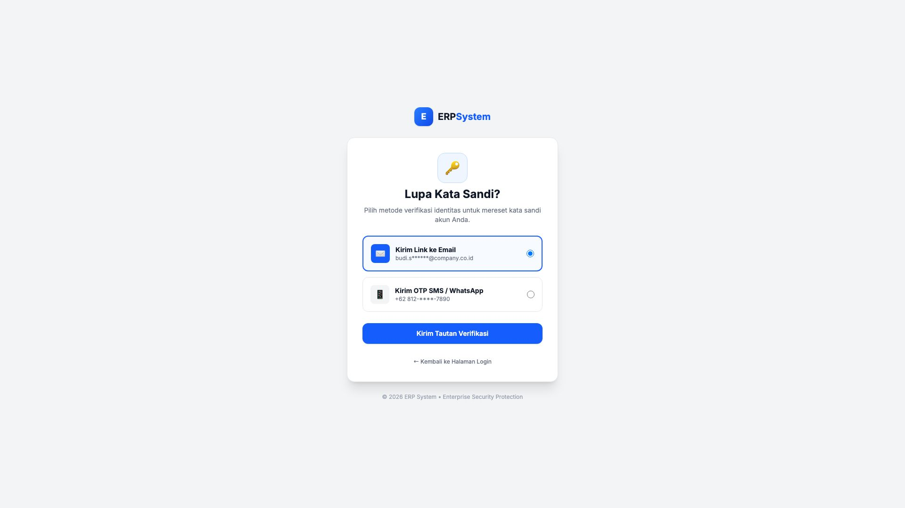
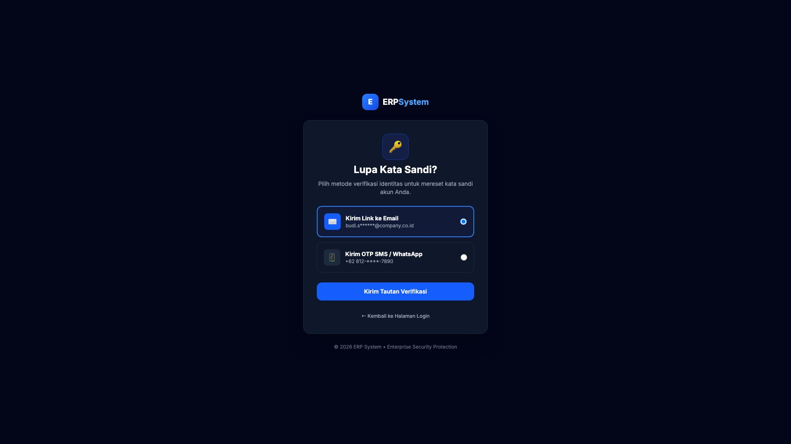

# 🎨 Design UI — Reset & Lupa Kata Sandi (Forgot Password)

> Mockup antarmuka pemulihan akun dan reset kata sandi menggunakan opsi verifikasi **Email** atau **SMS / WhatsApp OTP** pada modul `USR` (User Management) dalam ERP System.

---

## Light Mode

---

## Dark Mode

---

## 🔑 Komponen & Metode Pemulihan

1. **Ikon Kunci Pemulihan**: Ikon kunci biru penanda area pemulihan kata sandi.
2. **Pilihan Saluran Verifikasi (Multi-Channel Recovery)**:
   - **Opsi 1 — Link ke Email**: Mengirim tautan reset aman dengan masa berlaku 15 menit ke email terdaftar (dengan sensor privasi `budi.s******@company.co.id`).
   - **Opsi 2 — OTP SMS / WhatsApp**: Mengirim kode numerik 6-digit ke nomor telepon terdaftar (`+62 812-****-7890`).
3. **Tombol Aksi**:
   - Tombol **"Kirim Tautan Verifikasi"** (*Primary Blue*).
   - Tautan **"← Kembali ke Halaman Login"** untuk navigasi kembali.
