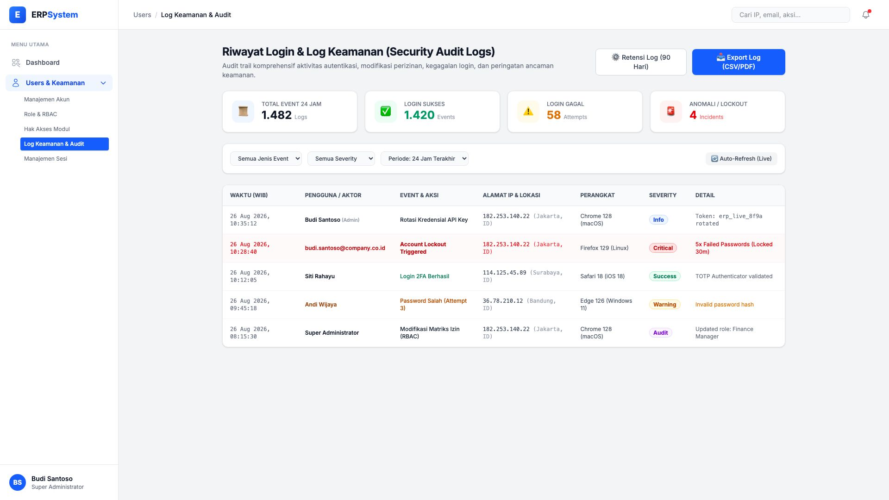
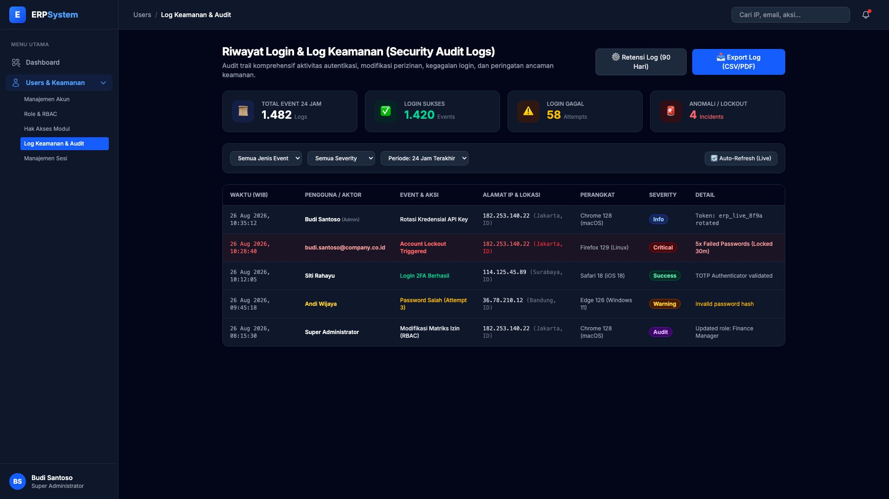

# 🎨 Design UI — Riwayat Login & Log Keamanan (Security Audit Logs)

> Mockup antarmuka **Riwayat Login & Log Keamanan Sistem (Security Audit Logs)**: audit trail lengkap riwayat autentikasi pengguna, kegagalan login, peringatan insiden akun (*account lockout*), perubahan izin peran (*RBAC modifications*), dan rotasi token pada modul `USR` (User Management) dalam ERP System.

---

## Light Mode

---

## Dark Mode

---

## 🛡️ Komponen & Fitur Utama

1. **Header & Aksi Global**:
   - Tombol **"⚙️ Retensi Log (90 Hari)"**: Konfigurasi lama penyimpanan log sebelum diarsipkan ke cold storage.
   - Tombol **"📥 Export Log (CSV/PDF)"** (*Primary Blue*): Mengunduh catatan log audit untuk keperluan compliance & audit eksternal.

2. **Metrik Ringkas Keamanan (Stats Cards)**:
   - **Total Event 24 Jam**: 1.482 Log tercatat
   - **Login Sukses**: 1.420 Events (🟢 *Healthy*)
   - **Login Gagal**: 58 Percobaan (🟡 *Warning*)
   - **Anomali / Lockout**: 4 Insiden terblokir (🔴 *Critical*)

3. **Bilah Filter Multi-Kriteria (Filter Bar)**:
   - Filter Jenis Event: *Login Sukses, Login Gagal, Account Lockout, Ubah Role/Izin, API Token Rotated*.
   - Filter Severity: *Info (Biru), Success (Hijau), Warning (Kuning), Critical (Merah), Audit (Ungu)*.
   - Filter Rentang Waktu: *24 Jam Terakhir, 7 Hari, 30 Hari, Custom Range*.
   - Tombol **"Auto-Refresh (Live)"**: Pembaruan log real-time secara berkala.

4. **Tabel Log Keamanan (Audit Log Table)**:
   - **Waktu Lengkap**: Timestamp presisi per detik (WIB).
   - **Pengguna / Aktor**: Nama lengkap, email, atau penanda sistem/admin.
   - **Event & Aksi**: Deskripsi aksi keamanan yang terjadi.
   - **Alamat IP & Geolocation**: IP publik dan deteksi kota/negara.
   - **Perangkat & Client**: Browser, versi OS, dan platform.
   - **Tingkat Severity**: Klasifikasi tingkat risiko insiden.
   - **Rincian Teknis**: Parameter tambahan (misal: token name, error hash, durasi lock).
