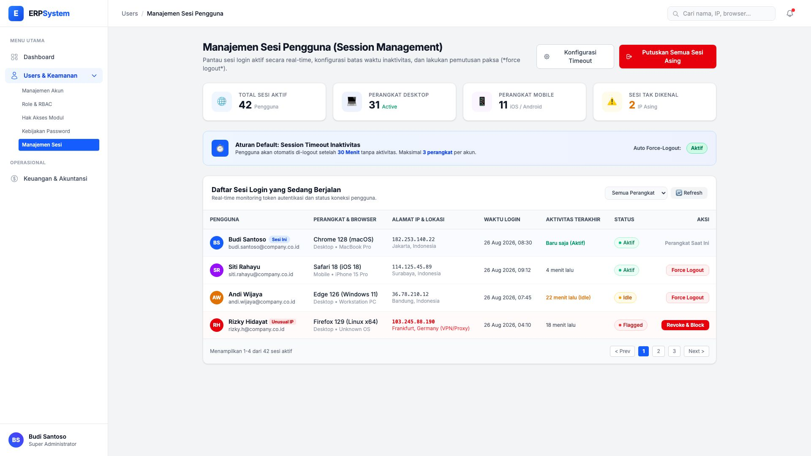
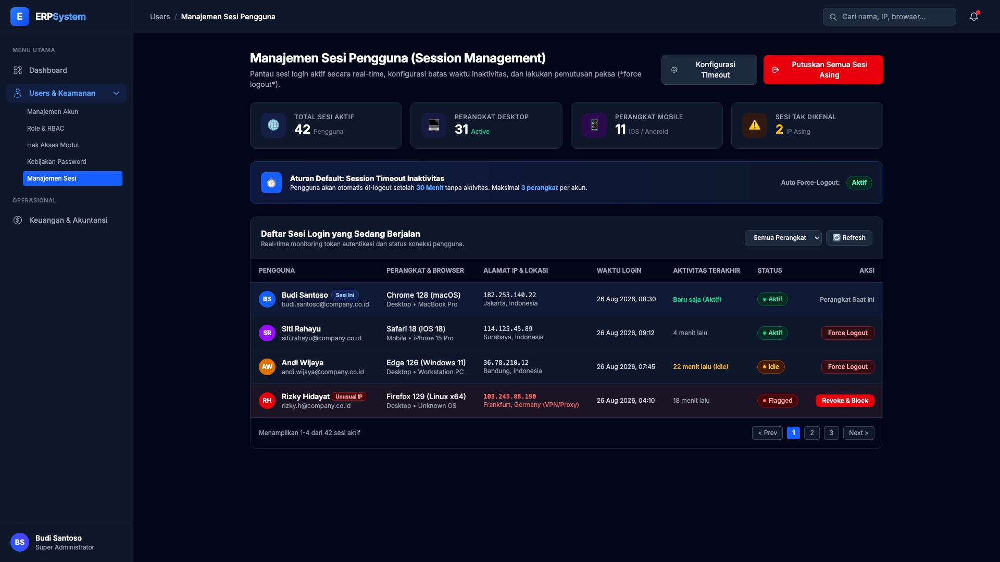

# 🎨 Design UI — Manajemen Sesi (Session Management & Force Logout)

> Design mockup antarmuka **Manajemen Sesi Pengguna (Session Management)**: pemantauan sesi login aktif secara real-time, konfigurasi batas waktu inaktivitas (*idle session timeout*), pembatasan perangkat (*concurrent sessions*), dan aksi pemutusan paksa (*force logout / session revocation*) untuk modul `USR` (User Management) dalam ERP System.

---

## Light Mode



---

## Dark Mode



---

## 🛡️ Konsep & Arsitektur Manajemen Sesi

Sistem keamanan sesi ERP beroperasi dengan mengontrol siklus hidup token autentikasi (*JWT / Redis Session Store*):

```
┌────────────────────────────────────────────────────────┐
│ 1. LOGIN & GENERASI TOKEN SESI                        │
│    Mencatat IP, User-Agent, Device ID, & Timestamp     │
└───────────────────────────┬────────────────────────────┘
                            │
                            ▼
┌────────────────────────────────────────────────────────┐
│ 2. PEMBATASAN SESI BERSAMAAN (CONCURRENT SESSIONS)     │
│    Maksimal 3 perangkat aktif bersamaan per pengguna   │
└───────────────────────────┬────────────────────────────┘
                            │
                            ▼
┌────────────────────────────────────────────────────────┐
│ 3. IDLE TIMEOUT DETECTION (30 Menit)                   │
│    Jika tidak ada request/aktivitas ➔ Auto Logout      │
└───────────────────────────┬────────────────────────────┘
                            │
                            ▼
┌────────────────────────────────────────────────────────┐
│ 4. FORCE LOGOUT & REVOCATION                           │
│    - Manual Force Logout oleh Admin                    │
│    - Otomatis saat ganti password / deteksi anomali    │
│    - Tombol "Putuskan Semua Sesi Asing"                │
└────────────────────────────────────────────────────────┘
```

---

## 📑 Komponen Halaman

### 1. Page Header & Global Actions
- **Judul**: `Manajemen Sesi Pengguna (Session Management)`
- **Subtitle**: "Pantau sesi login aktif secara real-time, konfigurasi batas waktu inaktivitas, dan lakukan pemutusan paksa (*force logout*)."
- **Tombol Aksi**:
  - `Konfigurasi Timeout` *(Default Outline Button)*: Membuka modal pengaturan batas inaktivitas global.
  - `Putuskan Semua Sesi Asing` *(Danger Red Button)*: Mematikan seketika seluruh sesi login di luar perangkat administrator saat ini.

---

### 2. Baris Kartu Metrik Ringkas (Stats Cards)

| Kartu | Ikon | Angka | Keterangan |
|---|:---:|:---:|---|
| **Total Sesi Aktif** | 🌐 | **42** Pengguna | Sesi yang saat ini terautentikasi ke sistem |
| **Perangkat Desktop** | 💻 | **31** Active | Login melalui Browser Windows, macOS, Linux |
| **Perangkat Mobile** | 📱 | **11** iOS/Android | Akses melalui ERP Mobile App / Browser Ponsel |
| **Sesi Tak Dikenal** | ⚠️ | **2** IP Asing | Terdeteksi login dari lokasi/VPN yang tidak biasa |

---

### 3. Banner Kebijakan Timeout Global (Session Timeout Banner)
- **Status Batas Waktu**: Otomatis logout setelah **30 Menit** inaktivitas.
- **Batas Perangkat**: Maksimal **3 Perangkat** per akun pengguna.
- **Status Auto-Revoke**: `Aktif` *(Otomatis membatalkan sesi jika ada pergantian kata sandi)*.

---

### 4. Tabel Daftar Sesi Login Aktif (Active Sessions Table)

| Kolom | Data & Informasi yang Ditampilkan |
|---|---|
| **Pengguna** | Avatar inisial berwarna + Nama Lengkap + Email + Tag khusus `Sesi Ini` untuk admin yang sedang login |
| **Perangkat & Browser** | Nama Browser & Versi (misal: *Chrome 128 (macOS)*, *Safari 18 (iOS 18)*, *Edge 126 (Windows 11)*) |
| **Alamat IP & Lokasi** | IP Address publik + Kota & Negara (misal: *182.253.140.22 - Jakarta, Indonesia*) |
| **Waktu Login** | Tanggal dan jam sesi dimulai |
| **Aktivitas Terakhir** | Durasi sejak interaksi terakhir (misal: *Baru saja*, *4 menit lalu*, *22 menit lalu (Idle)*) |
| **Status Sesi** | Badge status: 🟢 `Aktif`, 🟡 `Idle`, 🔴 `Flagged (Unusual IP)` |
| **Aksi** | Tombol `Force Logout` *(Merah tipis)* atau `Revoke & Block` untuk IP anomali |

---

## ⚠️ Aksi Keamanan & Trigger Force Logout

| Jenis Aksi | Kondisi / Trigger | Dampak |
|---|---|---|
| **Manual Force Logout** | Admin mengklik tombol `Force Logout` pada salah satu baris user | Token sesi langsung di-*blacklist* di Redis/Database, user otomatis di-redirect ke halaman login |
| **Idle Timeout Expiry** | User tidak melakukan klik/navigasi selama 30 menit | Muncul modal peringatan countdown 60 detik sebelum sesi ditutup otomatis |
| **Pergantian Password** | User mengubah kata sandi di menu profil | Seluruh sesi aktif di perangkat lain otomatis di-terminate untuk keamanan |
| **Single-Session Enforcement** | Kebijakan 1 login aktif diaktifkan | Login dari perangkat baru otomatis mendepak (*kick*) login di perangkat lama |

---

*File design disimpan di folder `ui/`*
