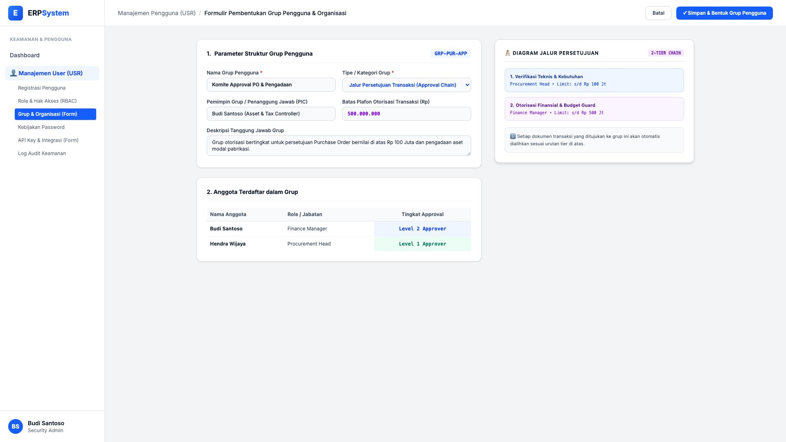

# 🎨 Design UI — Formulir Pembentukan Grup Pengguna & Organisasi (Data Entry Screen)

> Mockup antarmuka **Formulir Pembentukan Grup Pengguna & Jalur Persetujuan (User Group & Organization Data Entry)**: desain *Split-Screen Form* dengan formulir input grup pengguna di sebelah kiri (Nama grup Komite Approval PO, tipe Jalur Persetujuan Approval Chain, PIC Budi Santoso, batas otorisasi transaksi Rp 500.000.000, daftar anggota) dan *Live Diagram Jalur Persetujuan Bertingkat (2-Tier Approval Chain: Procurement Head &rarr; Finance Manager)* di sebelah kanan pada modul `USR` (User Management) dalam ERP System.

---

## Light Mode

---

## Dark Mode

---

## 📝 Komponen & Fitur Formulir Input

1. **Panel Kiri — Formulir Parameter Grup & Otorisasi**:
   - Nama Grup: `Komite Approval PO & Pengadaan` &bull; Kode: `GRP-PUR-APP`.
   - Kategori: **Jalur Persetujuan Transaksi (Approval Chain)**.
   - PIC Grup: *Budi Santoso* &bull; Batas Otorisasi: **Rp 500.000.000**.
   - Anggota: *Hendra Wijaya (Level 1 Approver)* & *Budi Santoso (Level 2 Approver)*.

2. **Panel Kanan — Diagram Approval & Alur Dokumen**:
   - Diagram Alur Otorisasi 2 Tingkat (2-Tier Approval Flow).
   - Level 1: *Procurement Head* (Limit s/d Rp 100 Jt) &rarr; Level 2: *Finance Manager* (Limit s/d Rp 500 Jt).
