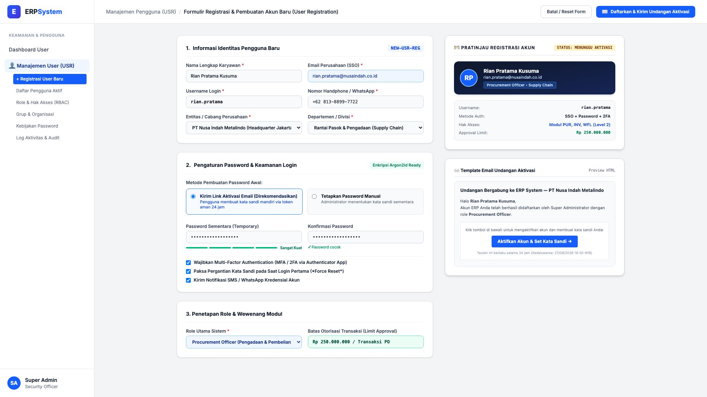
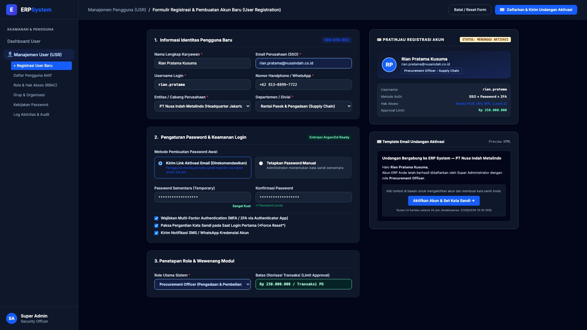

# 🎨 Design UI — Formulir Registrasi & Pembuatan Akun Baru (User Registration & Account Provisioning)

> Mockup antarmuka **Formulir Registrasi & Pembuatan Akun Baru (User Registration & Account Provisioning Data Entry)**: desain *Split-Screen Form* dengan formulir pendaftaran pengguna di sebelah kiri (Nama lengkap, email korporat SSO, username login, nomor handphone/WhatsApp, entitas/cabang perusahaan, departemen/divisi, metode pembuatan password via link email aktivasi 24 jam atau password manual, password strength meter Argon2id, kebijakan 2FA/MFA, force password change, notifikasi kredensial, role utama sistem, dan limit otorisasi) dan *Live Pratinjau Registrasi Akun Digital (Status: Menunggu Aktivasi) & Template Email Undangan Onboarding Interaktif* di sebelah kanan pada modul `USR` (User Management) dalam ERP System.

---

## Light Mode

---

## Dark Mode

---

## 📝 Komponen & Fitur Formulir Registrasi Pengguna

1. **Panel Kiri — Formulir Pendaftaran Akun & Keamanan**:
   - **Informasi Identitas**: Nama Lengkap Karyawan, Email Perusahaan (SSO), Username Unik, No. WhatsApp, Cabang/Entitas, dan Departemen.
   - **Kredensial & Kata Sandi**: Pilihan pembuatan kata sandi mandiri via token link aktivasi email (*Recommended*) atau kata sandi manual sementara dengan indikator kekuatan sandi (*Password Strength Meter*).
   - **Kebijakan Keamanan (Zero-Trust)**: Wajib 2FA TOTP Authenticator, Paksa ganti password pada saat login perdana, dan Notifikasi SMS/WhatsApp kredensial.
   - **Penetapan Role & Limit Otorisasi**: Pemilihan role utama (misal: *Procurement Officer*, *Finance Manager*) dan penetapan plafon batas otorisasi finansial per transaksi.

2. **Panel Kanan — Pratinjau Akun Baru & Template Undangan Onboarding**:
   - **Kartu Identitas Akun**: Pratinjau avatar inisial, username, metode autentikasi yang dipilih, ringkasan hak akses modul, serta badge status `🟡 MENUNGGU AKTIVASI`.
   - **Simulator Template Email Undangan**: Pratinjau tampilan email resmi korporat yang akan dikirimkan secara otomatis ke inbox karyawan baru berisi tombol `[Aktifkan Akun & Set Kata Sandi]` dengan masa kedaluwarsa tautan 24 jam.
