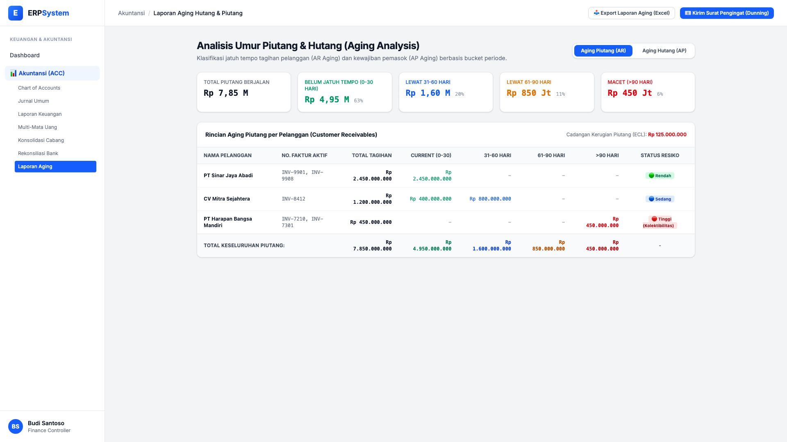
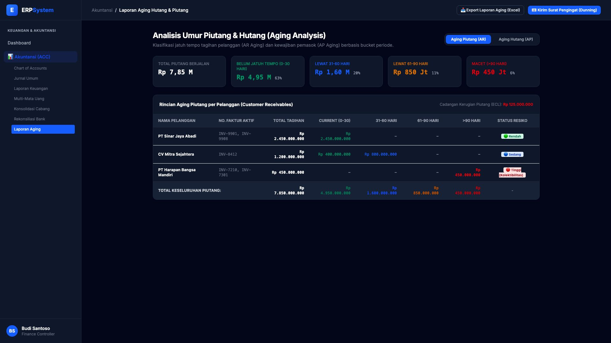

# 🎨 Design UI — Laporan Aging Hutang & Piutang (AR & AP Aging)

> Mockup antarmuka **Laporan Aging Hutang & Piutang (Accounts Receivable & Accounts Payable Aging Analysis)**: analisis jatuh tempo piutang/hutang berdasarkan bucket waktu (*Current 0-30 hari, 31-60 hari, 61-90 hari, >90 hari macet*), skor resiko kredit, dan estimasi cadangan kerugian piutang (*ECL - Expected Credit Loss*) pada modul `ACC` (Akuntansi & Keuangan) dalam ERP System.

---

## Light Mode

---

## Dark Mode

---

## 📊 Komponen & Fitur Utama

1. **Header & Aksi Penagihan (Dunning)**:
   - Tombol **"📧 Kirim Surat Pengingat (Dunning)"** (*Primary Blue*): Mengirim otomatis email/WhatsApp notifikasi tagihan jatuh tempo ke pelanggan.
   - Tombol **"📥 Export Laporan Aging (Excel)"**: Unduh ringkasan buku pembantu piutang/hutang.

2. **Bucket Umur Piutang (Aging Breakdown Cards)**:
   - **Total Piutang Berjalan**: Rp 7,85 Miliar
   - **Belum Jatuh Tempo (0-30 Hari)**: Rp 4,95 Miliar (63% - Sehat)
   - **Lewat 31-60 Hari**: Rp 1,60 Miliar (20% - Perhatian)
   - **Lewat 61-90 Hari**: Rp 850 Juta (11% - Peringatan)
   - **Macet (>90 Hari)**: Rp 450 Juta (6% - Resiko Tinggi)

3. **Tabel Rincian Debitur & Klasifikasi Resiko**:
   - Status Resiko: 🟢 *Rendah (Lancar)*, 🔵 *Sedang (Jatuh Tempo Ringan)*, 🔴 *Tinggi (Kolektibilitas Macet)*.
   - Perhitungan otomatis cadangan kerugian penurunan nilai piutang (ECL): **Rp 125.000.000**.
