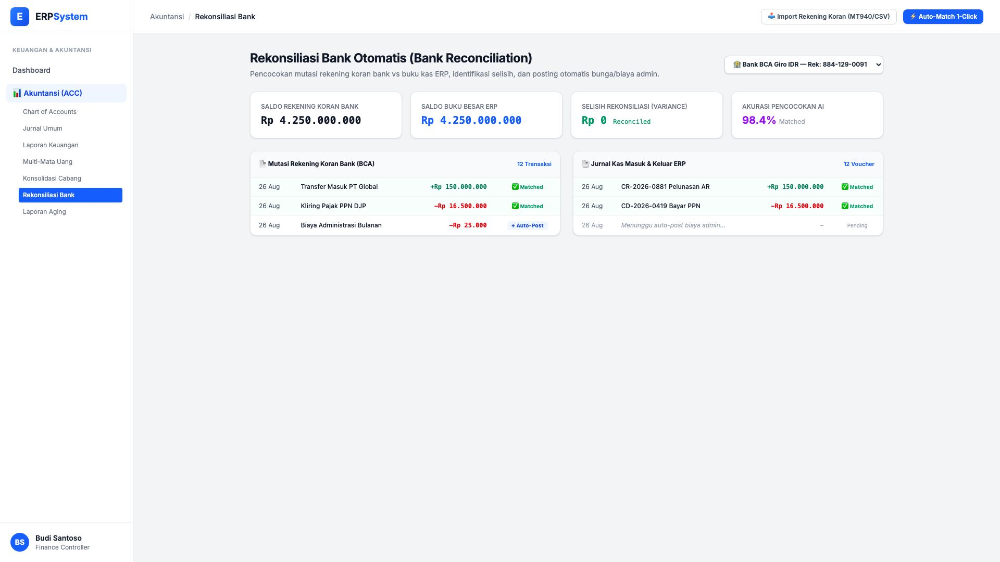
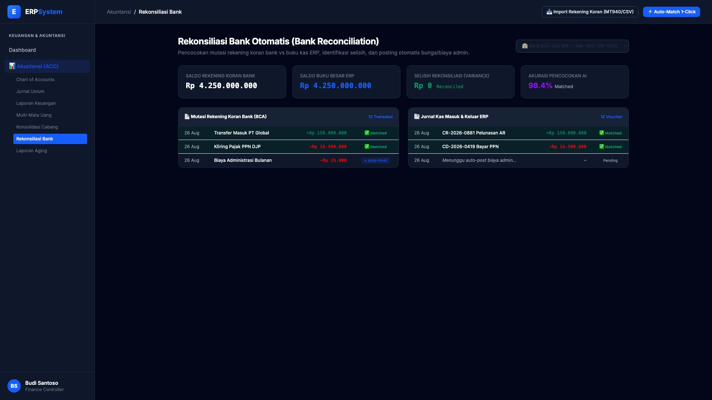

# 🎨 Design UI — Rekonsiliasi Bank (Bank Reconciliation)

> Mockup antarmuka **Rekonsiliasi Bank Otomatis (Bank Reconciliation)**: pencocokan mutasi rekening koran (*Bank Statement MT940 / CSV*) vs pembukuan kas/bank ERP, deteksi selisih (*Variance Detection*), dan auto-posting biaya administrasi & bunga pada modul `ACC` (Akuntansi & Keuangan) dalam ERP System.

---

## Light Mode

---

## Dark Mode

---

## 🏦 Komponen & Fitur Utama

1. **Header & Tindakan Rekonsiliasi**:
   - Pilihan Rekening Bank: `BCA Giro Utama (IDR)` & `Bank Mandiri Operasional (IDR)`.
   - Tombol **"📥 Import Rekening Koran"**: Mendukung format file bank terstandarisasi (MT940, OFX, CSV).
   - Tombol **"⚡ Auto-Match 1-Click"** (*Primary Blue*): Pencocokan pintar berbasis nilai, tanggal, dan nomor referensi.

2. **Ringkasan Rekonsiliasi (Stats Cards)**:
   - **Saldo Rekening Koran Bank**: Rp 4.250.000.000
   - **Saldo Buku Besar ERP**: Rp 4.250.000.000
   - **Selisih Rekonsiliasi (Variance)**: Rp 0 (🟢 *Reconciled*)
   - **Akurasi Pencocokan Otomatis**: 98.4% Matched

3. **Tampilan Komparasi Berdampingan (Split View)**:
   - **Sisi Kiri (Rekening Koran)**: Baris mutasi rekening koran fisik dari bank.
   - **Sisi Kanan (Buku Besar ERP)**: Baris voucher penerimaan & pengeluaran kas.
   - Fitur **Auto-Post**: Tombol 1-klik untuk otomatis membuat jurnal biaya admin bank atau pendapatan bunga bank yang belum tercatat di ERP.
