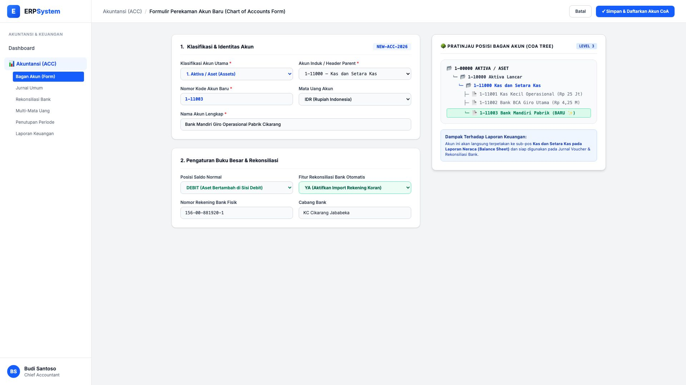

# 🎨 Design UI — Formulir Perekaman Akun Bagan Akun / CoA (Data Entry Screen)

> Mockup antarmuka **Formulir Perekaman Master Akun Baru (Chart of Accounts / CoA Data Entry)**: desain *Split-Screen Form* dengan formulir input registrasi akun di sebelah kiri (Klasifikasi utama Aktiva/Kewajiban/Ekuitas/Pendapatan/Beban, Akun Induk Header, Kode Akun 1-11003, Nama Rekening Bank Mandiri Pabrik, Posisi Saldo Normal Debit, Fitur Rekonsiliasi Otomatis) dan *Live Pratinjau Posisi Hierarki Bagan Akun (CoA Tree View) & Dampak Laporan Keuangan Neraca* di sebelah kanan pada modul `ACC` (Akuntansi & Keuangan) dalam ERP System.

---

## Light Mode

---

## Dark Mode

---

## 📝 Komponen & Fitur Formulir Input

1. **Panel Kiri — Formulir Master Akun CoA**:
   - Nomor Kode Akun: `1-11003`.
   - Klasifikasi: *1. Aktiva / Aset (Assets)* &bull; Induk: `1-11000 Kas dan Setara Kas`.
   - Nama Akun: *Bank Mandiri Giro Operasional Pabrik Cikarang*.
   - Saldo Normal: **DEBIT** &bull; Rekonsiliasi Bank: **YA (Auto-Match Active)**.

2. **Panel Kanan — Live CoA Tree & Dampak Neraca**:
   - Pratinjau Pohon Hierarki: Menampilkan letak hierarki akun baru `1-11003` di bawah `1-11000 Kas dan Setara Kas`.
   - Terintegrasi otomatis dengan Laporan Neraca (*Balance Sheet*), Jurnal Voucher, dan Rekonsiliasi Bank.
