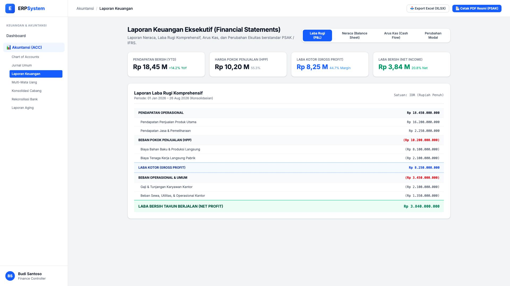
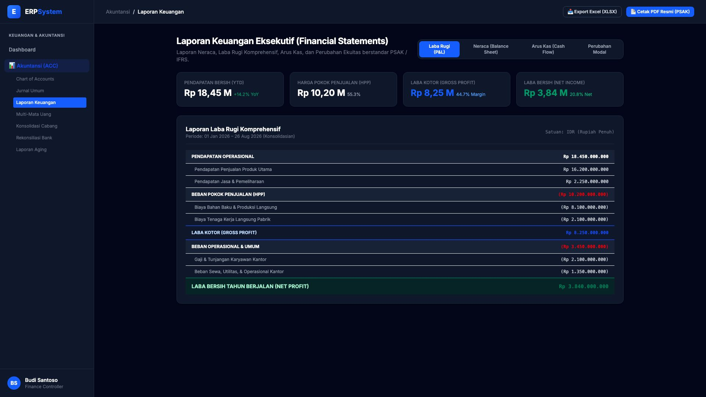

# 🎨 Design UI — Laporan Keuangan (Financial Statements)

> Mockup antarmuka **Laporan Keuangan Eksekutif (Financial Statements)**: Laba Rugi Komprehensif (*Income Statement / P&L*), Neraca (*Balance Sheet*), Laporan Arus Kas (*Cash Flow*), dan Perubahan Ekuitas berstandar PSAK & IFRS pada modul `ACC` (Akuntansi & Keuangan) dalam ERP System.

---

## Light Mode

---

## Dark Mode

---

## 📈 Komponen & Fitur Utama

1. **Header & Aksi Ekspor Resmi**:
   - Tombol **"📥 Export Excel (XLSX)"**: Unduh format spreadsheet dengan formula buku besar aktif.
   - Tombol **"📄 Cetak PDF Resmi (PSAK)"** (*Primary Blue*): Cetak laporan keuangan formal bertandatangan direksi.

2. **Metrik Finansial Utama (Executive KPIs)**:
   - **Pendapatan Bersih (YTD)**: Rp 18,45 Miliar (+14.2% YoY)
   - **Beban Pokok Penjualan (HPP)**: Rp 10,20 Miliar (55.3% dari omset)
   - **Laba Kotor (Gross Profit)**: Rp 8,25 Miliar (Margin 44.7%)
   - **Laba Bersih (Net Profit)**: Rp 3,84 Miliar (Net Margin 20.8%)

3. **Navigasi Multi-Laporan Tab**:
   - `Laba Rugi (P&L)`
   - `Neraca (Balance Sheet)`
   - `Arus Kas (Cash Flow)`
   - `Perubahan Modal`

4. **Struktur Format Laba Rugi Berjenjang**:
   - Pendapatan Operasional Produk & Jasa
   - Biaya Bahan Baku & Tenaga Kerja Pabrik
   - Beban Operasional, Gaji Kantor, Sewa, & Utilitas
   - Laba Bersih Tahun Berjalan.
