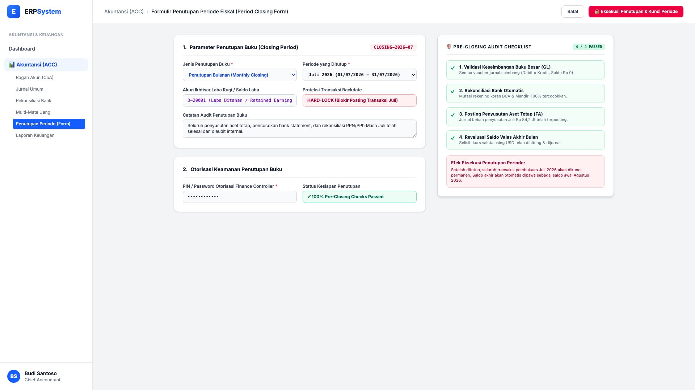

# 🎨 Design UI — Formulir Penutupan Periode Fiskal (Data Entry Screen)

> Mockup antarmuka **Formulir Eksekusi Penutupan Periode Fiskal (Fiscal Period Closing Data Entry)**: desain *Split-Screen Form* dengan formulir input penutupan di sebelah kiri (Jenis penutupan bulanan/tahunan, periode Juli 2026, akun penampung laba ditahan, hard-lock proteksi backdate, otorisasi PIN keamanan) dan *Live Pre-Closing Audit Health Checklist (Validasi GL Balance, Rekonsiliasi Bank, Depresiasi FA, Revaluasi Valas)* di sebelah kanan pada modul `ACC` (Akuntansi & Keuangan) dalam ERP System.

---

## Light Mode

---

## Dark Mode

---

## 📝 Komponen & Fitur Formulir Input

1. **Panel Kiri — Formulir Penutupan Buku (Closing Period)**:
   - Jenis: *Penutupan Bulanan (Monthly Closing) — Periode Juli 2026*.
   - Akun Penampung Laba: `3-20001 (Laba Ditahan / Retained Earnings)`.
   - Proteksi Backdate: 🔒 **HARD-LOCK** (Blokir total perubahan dan posting jurnal pada periode tertutup).
   - Otorisasi Keamanan: PIN Controller / Finance Director.

2. **Panel Kanan — Pre-Closing Audit Checklist (4/4 Passed)**:
   - ✓ Validasi Keseimbangan Buku Besar GL (Debit = Kredit, Saldo Rp 0).
   - ✓ Rekonsiliasi Bank 100% Cocok (BCA & Mandiri).
   - ✓ Posting Jurnal Penyusutan Aset Tetap (FA).
   - ✓ Revaluasi Saldo Valas Akhir Bulan Selesai.
