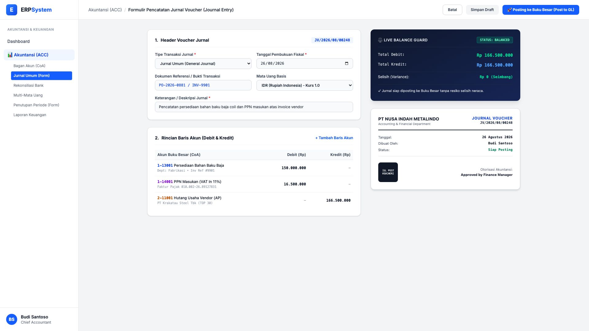

# 🎨 Design UI — Formulir Pencatatan Jurnal Voucher (Data Entry Screen)

> Mockup antarmuka **Formulir Jurnal Voucher & Jurnal Umum (Journal Entry Data Entry)**: desain *Split-Screen Form* dengan formulir input entri akuntansi di sebelah kiri (Header voucher JV, tanggal fiskal, referensi PO/Invoice, mata uang IDR/USD, rincian baris multi-line Debit/Kredit) dan *Live Balance Guard (Validasi Seimbang Debit = Kredit, Selisih Rp 0) & Pratinjau Lembar Voucher Akuntansi* di sebelah kanan pada modul `ACC` (Akuntansi & Keuangan) dalam ERP System.

---

## Light Mode

---

## Dark Mode

---

## 📝 Komponen & Fitur Formulir Input

1. **Panel Kiri — Formulir Perekaman Jurnal Voucher**:
   - Nomor Voucher Otomatis: `JV/2026/08/00248`.
   - Tipe: *Jurnal Umum / Jurnal Penyesuaian*.
   - Dokumen Referensi: `PO-2026-0881 / INV-9901`.
   - Multi-Line Entries:
     - `1-13001 Persediaan Bahan Baku Baja` &rarr; Debit Rp 150.000.000
     - `1-14001 PPN Masukan (11%)` &rarr; Debit Rp 16.500.000
     - `2-11001 Hutang Usaha Vendor (AP)` &rarr; Kredit Rp 166.500.000

2. **Panel Kanan — Live Balance Guard & Voucher Preview**:
   - Total Debit: **Rp 166.500.000** &bull; Total Kredit: **Rp 166.500.000** &bull; Status: 🟢 **STATUS: BALANCED (Selisih Rp 0)**.
   - Live Voucher Slip resmi siap diposting ke Buku Besar (*Post to General Ledger*).
