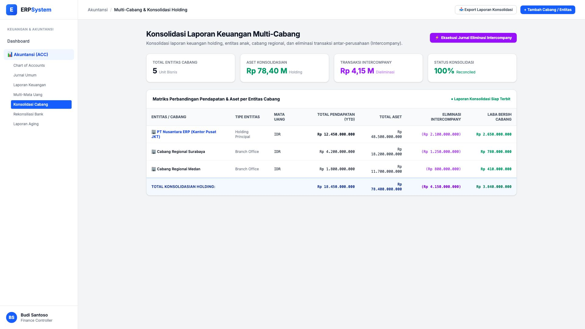
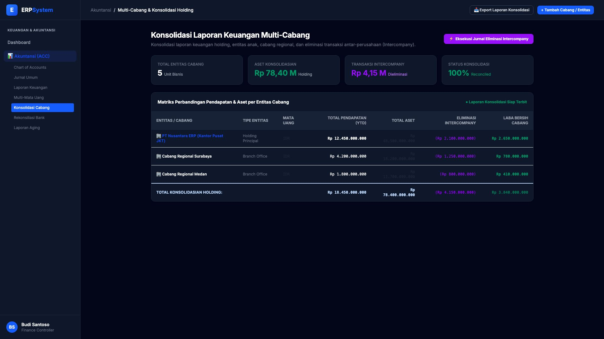

# 🎨 Design UI — Multi-Cabang & Konsolidasi (Multi-Company)

> Mockup antarmuka **Konsolidasi Laporan Keuangan Multi-Cabang & Multi-Entitas**: konsolidasi laporan holding, cabang regional, eliminasi transaksi antar-perusahaan (*Intercompany Eliminations*), dan rekonsiliasi saldo grup pada modul `ACC` (Akuntansi & Keuangan) dalam ERP System.

---

## Light Mode

---

## Dark Mode

---

## 🏢 Komponen & Fitur Utama

1. **Header & Aksi Konsolidasi**:
   - Tombol **"⚡ Eksekusi Jurnal Eliminasi Intercompany"**: Mengeliminasi otomatis piutang/hutang dan pendapatan/beban antar cabang/anak perusahaan.
   - Tombol **"📥 Export Laporan Konsolidasi"**: Mengunduh laporan keuangan holding terintegrasi.

2. **Metrik Konsolidasi Holding (Stats Cards)**:
   - **Total Entitas Cabang**: 5 Unit Bisnis / Regional
   - **Aset Konsolidasian**: Rp 78,40 Miliar
   - **Transaksi Intercompany Dieliminasi**: Rp 4,15 Miliar
   - **Status Rekonsiliasi**: 🟢 100% Reconciled

3. **Matriks Kinerja per Cabang**:
   - **Pusat Jakarta (Holding)**: Pendapatan Rp 12,45 M | Aset Rp 48,50 M
   - **Cabang Surabaya**: Pendapatan Rp 4,20 M | Aset Rp 18,20 M
   - **Cabang Medan**: Pendapatan Rp 1,80 M | Aset Rp 11,70 M
   - **Eliminasi & Total Konsolidasian**: Rp 18,45 Miliar Laba Bersih Konsolidasian Rp 3,84 Miliar.
