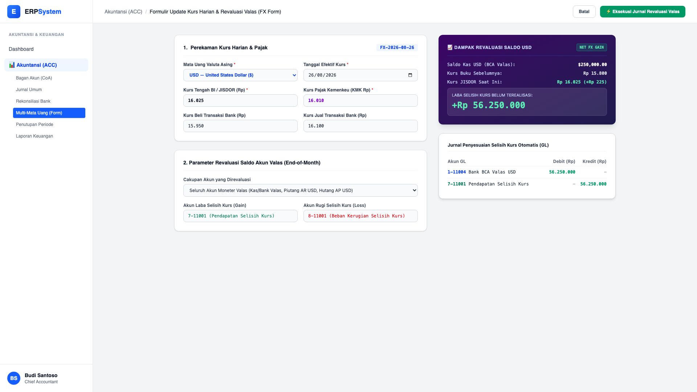

# 🎨 Design UI — Formulir Update Kurs & Revaluasi Valas (Data Entry Screen)

> Mockup antarmuka **Formulir Perekaman Kurs Harian & Revaluasi Saldo Valas (Multi-Currency & FX Revaluation Data Entry)**: desain *Split-Screen Form* dengan formulir input kurs valuta asing di sebelah kiri (Pilihan valas USD/SGD/EUR, tanggal kurs, Kurs Tengah BI JISDOR Rp 16.025, Kurs Pajak KMK Rp 16.010, Kurs Beli/Jual Bank, parameter akun laba/rugi selisih kurs) dan *Live Pratinjau Dampak Revaluasi Saldo USD (Net FX Gain +Rp 56.250.000) & Jurnal Penyesuaian Selisih Kurs Otomatis* di sebelah kanan pada modul `ACC` (Akuntansi & Keuangan) dalam ERP System.

---

## Light Mode

---

## Dark Mode

---

## 📝 Komponen & Fitur Formulir Input

1. **Panel Kiri — Formulir Perekaman Kurs & Parameter Revaluasi**:
   - Mata Uang: `USD — United States Dollar ($)`.
   - Tanggal Efektif: `2026-08-26`.
   - Kurs Tengah BI / JISDOR: **Rp 16.025** &bull; Kurs Pajak KMK: **Rp 16.010**.
   - Kurs Transaksi Bank: Beli Rp 15.950 &bull; Jual Rp 16.100.
   - Pemetaan Akun: `7-11001 (Pendapatan Selisih Kurs)` & `8-11001 (Beban Kerugian Selisih Kurs)`.

2. **Panel Kanan — Dampak Revaluasi & Jurnal Otomatis**:
   - Simulasi Saldo Valas: $250,000.00 pada Bank BCA Valas USD direvaluasi dari Rp 15.800 &rarr; Rp 16.025 (+Rp 225/USD).
   - Laba Selisih Kurs Belum Terealisasi: **+Rp 56.250.000 (Net FX Gain)**.
   - Jurnal Otomatis: Debit `1-11004 Bank BCA Valas USD` (Rp 56.250.000) vs Kredit `7-11001 Pendapatan Selisih Kurs` (Rp 56.250.000).
