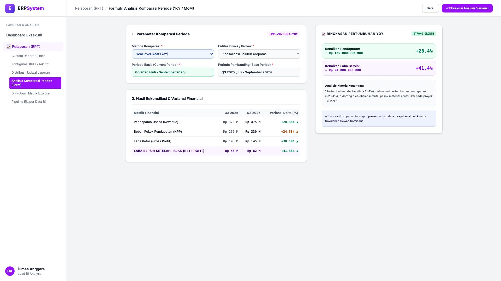
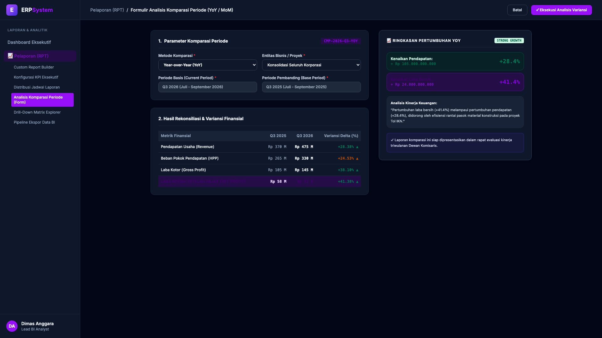

# 🎨 Design UI — Formulir Analisis Komparasi Periode (Data Entry Screen)

> Mockup antarmuka **Formulir Analisis Komparasi Kinerja Periode YoY / MoM (Comparative Period Analysis Data Entry)**: desain *Split-Screen Form* dengan formulir input konfigurasi komparasi periode di sebelah kiri (Nomor Analisis `CMP-2026-Q3-YOY`, metode Year-over-Year YoY, periode basis Q3 2026 Juli-Sept 2026 vs periode pembanding Q3 2025, tabel komparasi 4 metrik: Pendapatan Usaha Rp 370 M &rarr; Rp 475 M (+28.38%), HPP Rp 265 M &rarr; Rp 330 M (+24.53%), Gross Profit Rp 105 M &rarr; Rp 145 M (+38.10%), Laba Bersih Net Profit Rp 58 M &rarr; Rp 82 M (+41.38%)) dan *Live Kartu Ringkasan Pertumbuhan YoY (Kenaikan Pendapatan +Rp 105 M & Kenaikan Laba Bersih +Rp 24 M) serta Catatan Analisis Finansial* di sebelah kanan pada modul `RPT` (Laporan & Analitik) dalam ERP System.

---

## Light Mode

---

## Dark Mode

---

## 📝 Komponen & Fitur Formulir Input

1. **Panel Kiri — Formulir Parameter Periode & Tabel Variansi Delta**:
   - Kode Analisis: `CMP-2026-Q3-YOY` &bull; Metode: `Year-over-Year (YoY)`.
   - Periode Basis: **Q3 2026** vs Periode Pembanding: **Q3 2025**.
   - Variansi Kinerja:
     - Pendapatan (Revenue): **+28.38% (Naik Rp 105 Miliar)**
     - Beban Pokok (HPP): **+24.53% (Efisiensi Biaya)**
     - Laba Kotor (Gross Profit): **+38.10% (Naik Rp 40 Miliar)**
     - **Laba Bersih (Net Profit): +41.38% (Naik Rp 24 Miliar)**.

2. **Panel Kanan — Ringkasan Pertumbuhan & Catatan Kinerja**:
   - Status Kinerja: **STRONG GROWTH (+41.4% Laba Bersih)**.
   - Narasi Evaluasi Analis Finansial untuk Rapat Direksi & Dewan Komisaris.
