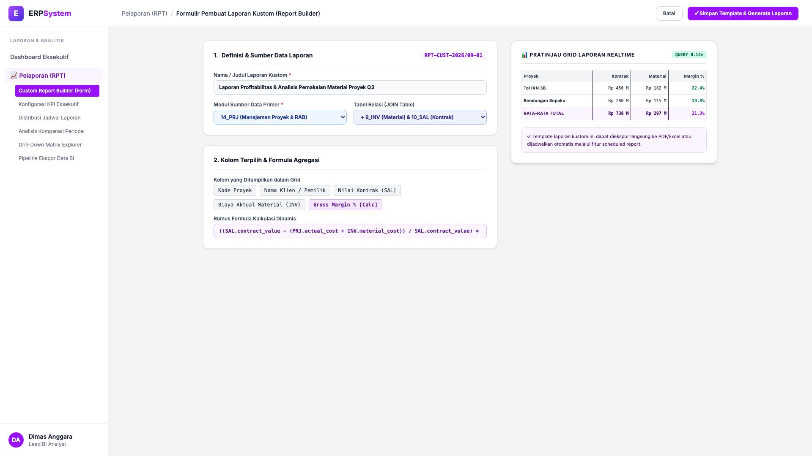
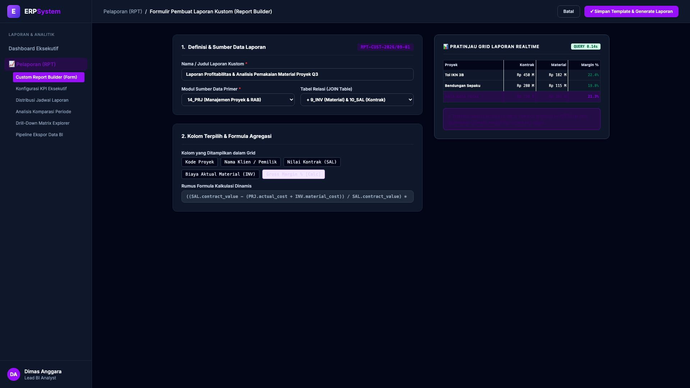

# 🎨 Design UI — Formulir Pembuat Laporan Kustom (Custom Report Builder) (Data Entry Screen)

> Mockup antarmuka **Formulir Pembuat Laporan Kustom Dinamis (Custom Report Builder Data Entry)**: desain *Split-Screen Form* dengan formulir konfigurasi sumber data di sebelah kiri (Nomor Template `RPT-CUST-2026/09-01`, judul Laporan Profitabilitas & Analisis Pemakaian Material Proyek Q3, model primer `14_PRJ` JOIN `9_INV` & `10_SAL`, kolom terpilih: Kode Proyek, Klien, Nilai Kontrak, Biaya Material, Formula Kalkulasi Gross Margin % `((SAL.contract - Costs) / SAL.contract) * 100`) dan *Live Pratinjau Grid Laporan Realtime (Tol IKN Rp 450 M Margin 22.4%, Bendungan Sepaku Rp 280 M Margin 19.8% &rarr; Rata-rata 21.3%) & Indikator Kecepatan Query 0.14s* di sebelah kanan pada modul `RPT` (Laporan & Analitik) dalam ERP System.

---

## Light Mode

---

## Dark Mode

---

## 📝 Komponen & Fitur Formulir Input

1. **Panel Kiri — Formulir Definisi Sumber Data & Formula Kalkulasi**:
   - Kode Template: `RPT-CUST-2026/09-01` &bull; Modul: `14_PRJ` + `9_INV` + `10_SAL`.
   - Nama Laporan: **Laporan Profitabilitas & Analisis Pemakaian Material Proyek**.
   - Formula Dinamis: `((SAL.contract_value - (PRJ.actual_cost + INV.material_cost)) / SAL.contract_value) * 100`.
   - Fleksibilitas Kolom & Filter Periode Q3 2026.

2. **Panel Kanan — Grid Laporan Dinamis & Analisis Profitabilitas**:
   - Grid Preview Interaktif dengan agregasi otomatis.
   - Benchmark Margin Profit Proyek Tol IKN (22.4%) & Bendungan Sepaku (19.8%).
   - Kecepatan Eksekusi Query Cache Database: **0.14 Detik**.
