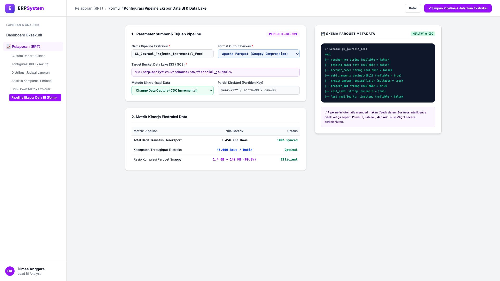
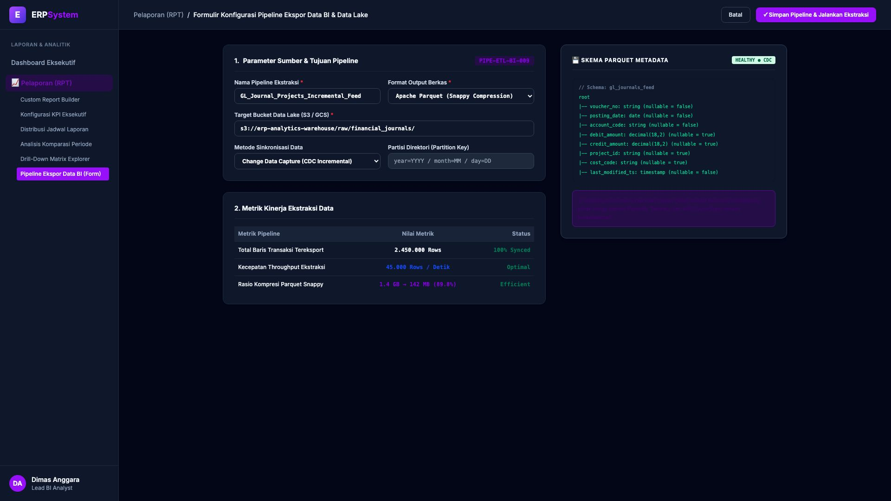

# 🎨 Design UI — Formulir Pipeline Ekspor Data BI & Data Lake (Data Entry Screen)

> Mockup antarmuka **Formulir Konfigurasi Pipeline Ekspor Big Data BI (Data Export Pipeline & ETL Feed Data Entry)**: desain *Split-Screen Form* dengan formulir konfigurasi pipeline di sebelah kiri (Nomor Pipeline `PIPE-ETL-BI-009`, nama feed `GL_Journal_Projects_Incremental_Feed`, format Apache Parquet Snappy Compression, target bucket AWS S3 `s3://erp-analytics-warehouse/raw/financial_journals/`, metode CDC Incremental Sync, volume 2.450.000 rows, throughput 45.000 rows/detik, kompresi 1.4 GB &rarr; 142 MB 89.8%) dan *Live Pratinjau Skema Metadata Parquet (Column Types, Nullable Flags, Partition Key: year/month/day) & Status Worker CDC Healthy* di sebelah kanan pada modul `RPT` (Laporan & Analitik) dalam ERP System.

---

## Light Mode

---

## Dark Mode

---

## 📝 Komponen & Fitur Formulir Input

1. **Panel Kiri — Formulir Parameter Pipeline ETL & Metrik Throughput**:
   - Kode Pipeline: `PIPE-ETL-BI-009` &bull; Target: `AWS S3 Data Lake`.
   - Format Berkas: **Apache Parquet (Snappy Compression)**.
   - Metode Sinkronisasi: **Change Data Capture (CDC Incremental Sync)**.
   - Throughput Ekstraksi: **45.000 Baris / Detik**.
   - Efisiensi Ukuran: Dari 1.4 GB terkompresi menjadi **142 MB (89.8% Storage Saving)**.

2. **Panel Kanan — Skema Metadata & Integrasi BI Eksternal**:
   - Definisi Skema Tabel Raw Data (*Schema tree representation*).
   - Feed Otomatis ke Business Intelligence Tools: *PowerBI, Tableau, AWS QuickSight*.
