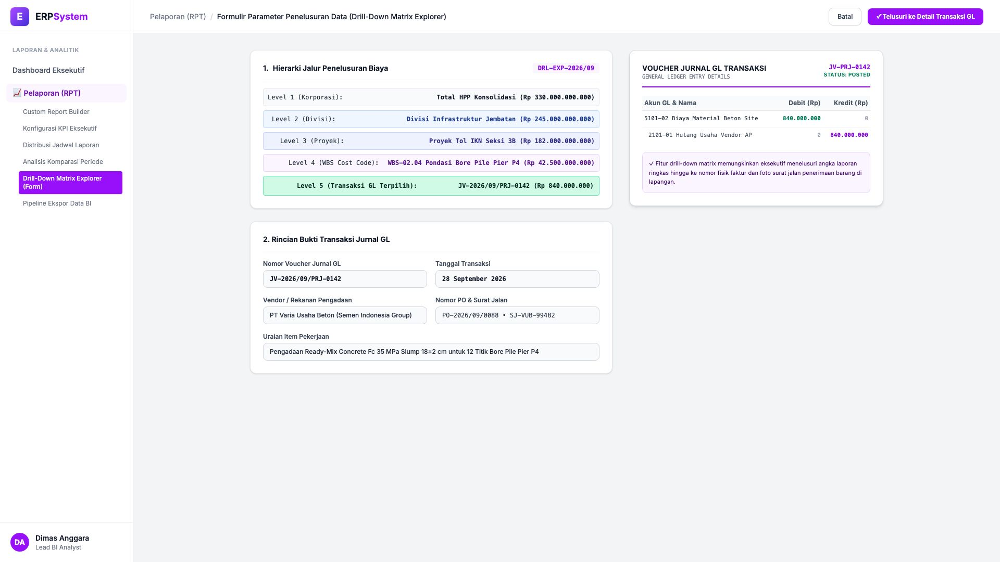
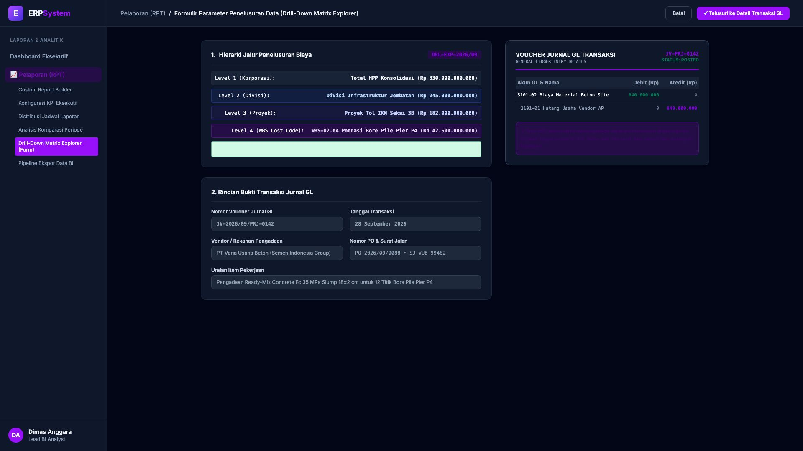

# 🎨 Design UI — Formulir Parameter Penelusuran Data (Drill-Down Matrix Explorer) (Data Entry Screen)

> Mockup antarmuka **Formulir Parameter Penelusuran Drill-Down Matriks Biaya (Drill-Down Matrix Explorer Data Entry)**: desain *Split-Screen Form* dengan formulir input navigasi hierarki biaya di sebelah kiri (Nomor Explorer `DRL-EXP-2026/09`, 5 Level Hierarki: Level 1 HPP Konsolidasi Rp 330 M &rarr; Level 2 Divisi Jembatan Rp 245 M &rarr; Level 3 Proyek Tol IKN Seksi 3B Rp 182 M &rarr; Level 4 WBS Pondasi Bore Pile Pier P4 Rp 42.5 M &rarr; Level 5 Transaksi Terpilih `JV-2026/09/PRJ-0142` senilai Rp 840.000.000 pengadaan Ready-Mix Concrete dari PT Varia Usaha Beton) dan *Live Voucher Jurnal GL Transaksi (Dr Biaya Material Beton Site Rp 840 Jt vs Cr Hutang Usaha Vendor AP Rp 840 Jt)* di sebelah kanan pada modul `RPT` (Laporan & Analitik) dalam ERP System.

---

## Light Mode

---

## Dark Mode

---

## 📝 Komponen & Fitur Formulir Input

1. **Panel Kiri — Formulir Parameter Hierarki Drill-Down**:
   - Kode Penelusuran: `DRL-EXP-2026/09`.
   - 5 Jalur Multi-Level Hierarki:
     - Level 1: Korporasi Konsolidasi (Rp 330 Miliar)
     - Level 2: Divisi Infrastruktur Jembatan (Rp 245 Miliar)
     - Level 3: Proyek Tol IKN Seksi 3B (Rp 182 Miliar)
     - Level 4: WBS-02.04 Pondasi Bore Pile P4 (Rp 42.5 Miliar)
     - **Level 5: Jurnal Transaksi GL `JV-PRJ-0142` (Rp 840.000.000)**.

2. **Panel Kanan — Voucher Jurnal GL Terkait**:
   - Akun Debit: `5101-02 Biaya Material Beton Site` **Rp 840.000.000**.
   - Akun Kredit: `2101-01 Hutang Usaha Vendor AP` **Rp 840.000.000**.
   - Referensi PO & Surat Jalan (*SJ-VUB-99482*).
