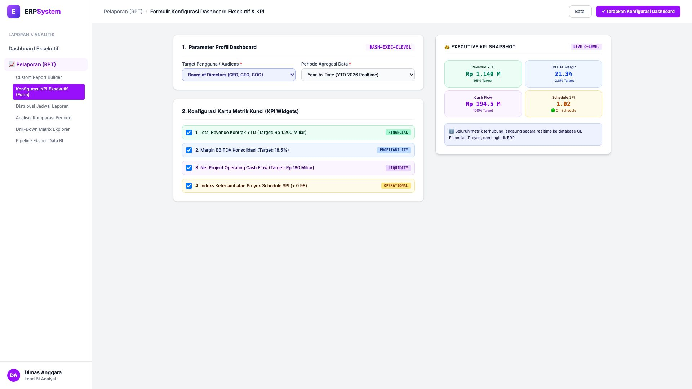
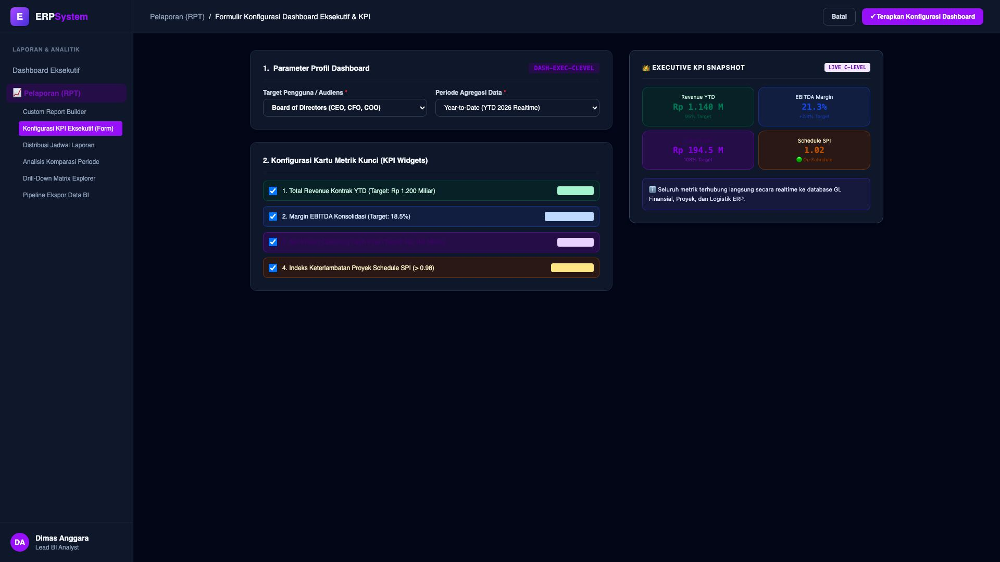

# 🎨 Design UI — Formulir Konfigurasi Dashboard Eksekutif & KPI (Data Entry Screen)

> Mockup antarmuka **Formulir Konfigurasi Dashboard Eksekutif C-Level (Executive KPI Dashboard Config Data Entry)**: desain *Split-Screen Form* dengan formulir konfigurasi profil & metrik di sebelah kiri (Kode Dashboard `DASH-EXEC-CLEVEL`, target BoD Direksi CEO/CFO, periode YTD 2026 Realtime, 4 pilihan widget KPI: Revenue Kontrak Target Rp 1.2 Triliun, EBITDA Margin Target 18.5%, Net Operating Cash Flow Target Rp 180 Miliar, dan Schedule Performance Index SPI &gt; 0.98) dan *Live Kartu Snapshot Dashboard Eksekutif (Revenue Rp 1.140 M 95%, EBITDA 21.3%, Cash Flow Rp 194.5 M, SPI 1.02 On Schedule)* di sebelah kanan pada modul `RPT` (Laporan & Analitik) dalam ERP System.

---

## Light Mode

---

## Dark Mode

---

## 📝 Komponen & Fitur Formulir Input

1. **Panel Kiri — Formulir Profil Dashboard & Pilihan Widget Metrik**:
   - Kode Profil: `DASH-EXEC-CLEVEL` &bull; Target: `Board of Directors (CEO, CFO, COO)`.
   - Agregasi Waktu: **Year-to-Date (YTD 2026 Realtime)**.
   - Pilihan Metrik Kunci:
     - 1. Financial Revenue YTD
     - 2. EBITDA Profitability Margin
     - 3. Project Operating Liquidity / Cash Flow
     - 4. Schedule Performance Index (SPI Kepatuhan Waktu Proyek).

2. **Panel Kanan — Visualisasi Dashboard Eksekutif**:
   - Snapshot 4 Kartu KPI Interaktif.
   - Realisasi Revenue Rp 1.140 M (95% Target).
   - Margin EBITDA Unggul di 21.3% (+2.8% Target).
   - Cash Flow Likuid Rp 194.5 M (108% Target).
