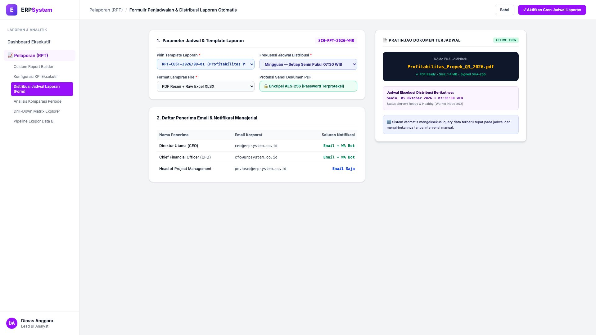
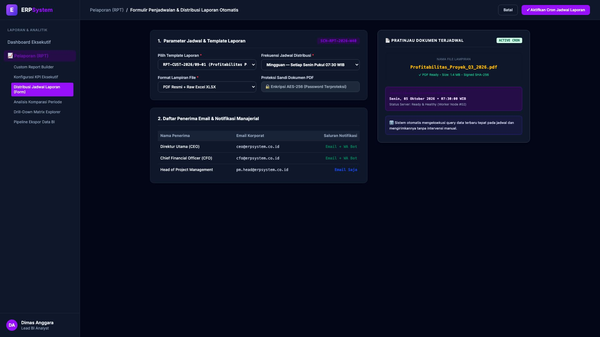

# 🎨 Design UI — Formulir Penjadwalan & Distribusi Laporan (Data Entry Screen)

> Mockup antarmuka **Formulir Penjadwalan & Distribusi Laporan Otomatis (Scheduled Report Distribution Data Entry)**: desain *Split-Screen Form* dengan formulir konfigurasi cron jadwal di sebelah kiri (Nomor Jadwal `SCH-RPT-2026-W40`, template laporan Profitabilitas Proyek Q3 `RPT-CUST-2026/09-01`, frekuensi mingguan setiap Senin 07:30 WIB, format lampiran PDF Resmi + Raw Excel XLSX, enkripsi sandi AES-256, penerima: CEO, CFO, Head of Project via Email & WhatsApp Bot) dan *Live Pratinjau Dokumen Lampiran PDF Resmi Terenkripsi & Waktu Eksekusi Cron Berikutnya (Senin 05/10/2026 07:30:00 WIB)* di sebelah kanan pada modul `RPT` (Laporan & Analitik) dalam ERP System.

---

## Light Mode

---

## Dark Mode

---

## 📝 Komponen & Fitur Formulir Input

1. **Panel Kiri — Formulir Parameter Cron & Distribusi Saluran**:
   - Kode Jadwal: `SCH-RPT-2026-W40` &bull; Template: `RPT-CUST-2026/09-01`.
   - Frekuensi Distribusi: **Setiap Senin Pukul 07:30:00 WIB**.
   - Format Berkas: **PDF Resmi Terproteksi Password + Excel Data Mentah**.
   - Daftar Penerima: *Direktur Utama, CFO, Head of PM*.
   - Saluran Pengiriman: *Email SMTP Korporat + WA Bot Gateway*.

2. **Panel Kanan — Dokumen Terjadwal & Status Worker Cron**:
   - Snapshot Berkas Dokumen PDF (*Profitabilitas_Proyek_Q3_2026.pdf*).
   - Indikator Eksekusi Cron Berikutnya: **Senin, 05 Okt 2026 07:30 WIB**.
   - Status Worker: *Ready & Healthy (Worker Node #02)*.
