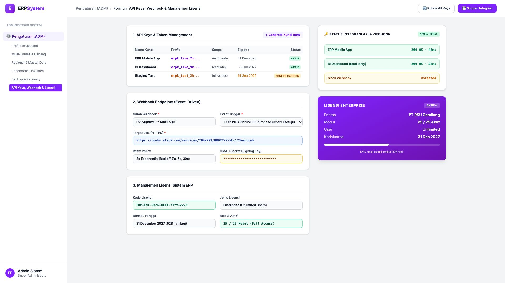
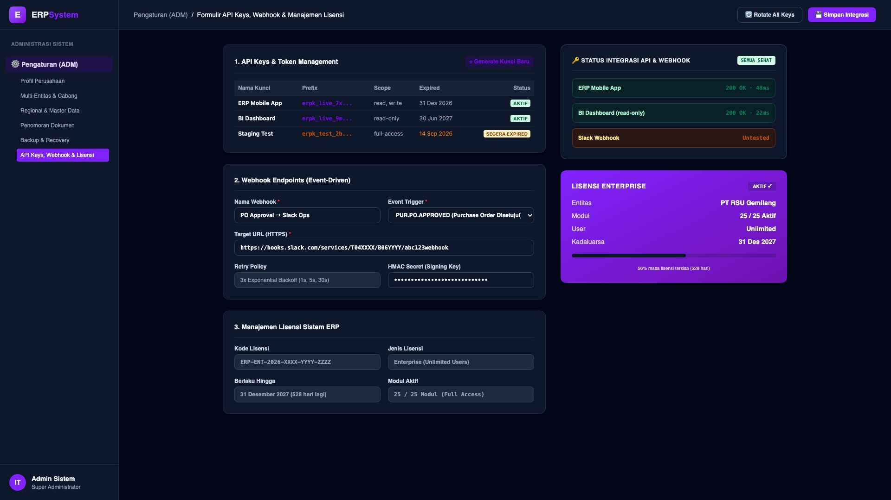

# 🎨 Design UI — Formulir API Keys, Webhook & Manajemen Lisensi (Data Entry Screen)

> Mockup antarmuka **Formulir Konfigurasi API Keys, Webhook Endpoints & Manajemen Lisensi (API & License Integration Manager Data Entry)**: desain *Split-Screen Form* dengan formulir konfigurasi integrasi di sebelah kiri (3 API Keys: `erpk_live_7x...` ERP Mobile App read/write aktif, `erpk_live_9m...` BI Dashboard read-only aktif, `erpk_test_2b...` Staging Test full-access segera expired; Webhook `PO Approval → Slack Ops` target URL `hooks.slack.com` event trigger `PUR.PO.APPROVED` retry 3x exponential backoff HMAC signing key; Lisensi Enterprise `ERP-ENT-2026-XXXX-YYYY-ZZZZ` Unlimited Users 25/25 modul berlaku hingga 31 Des 2027) dan *Live Kartu Status Integrasi API (200 OK 48ms & 22ms) & Kartu Visual Lisensi Enterprise (56% masa tersisa 528 hari)* di sebelah kanan pada modul `ADM` (Administrasi & Pengaturan) dalam ERP System.

---

## Light Mode

---

## Dark Mode

---

## 📝 Komponen & Fitur Formulir Input

1. **Panel Kiri — Formulir API Keys, Webhook & Lisensi**:
   - API Key Management: **3 Active Keys** (Live Mobile, BI Dashboard, Staging Test).
   - Webhook: **PO Approval → Slack Ops** &bull; Event: `PUR.PO.APPROVED`.
   - HMAC Signing: **SHA-256 Secret Key untuk Validasi Payload**.
   - Lisensi: **Enterprise (Unlimited Users, 25/25 Modul, Valid s/d Des 2027)**.

2. **Panel Kanan — Status Integrasi & Kartu Lisensi**:
   - Health Check: **ERP Mobile 200 OK (48ms)** &bull; **BI Dashboard 200 OK (22ms)**.
   - Kartu Lisensi Visual: *56% Masa Aktif Tersisa (528 Hari)*.
