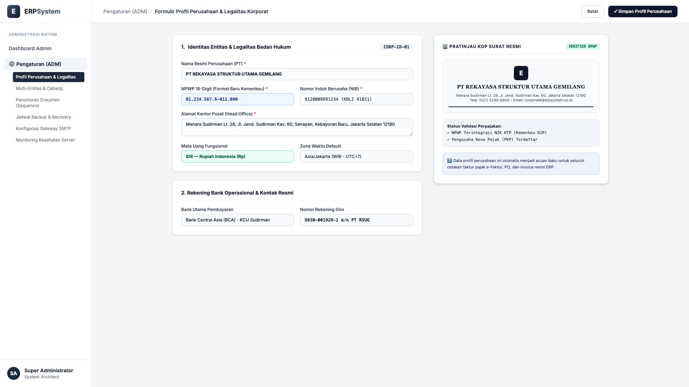
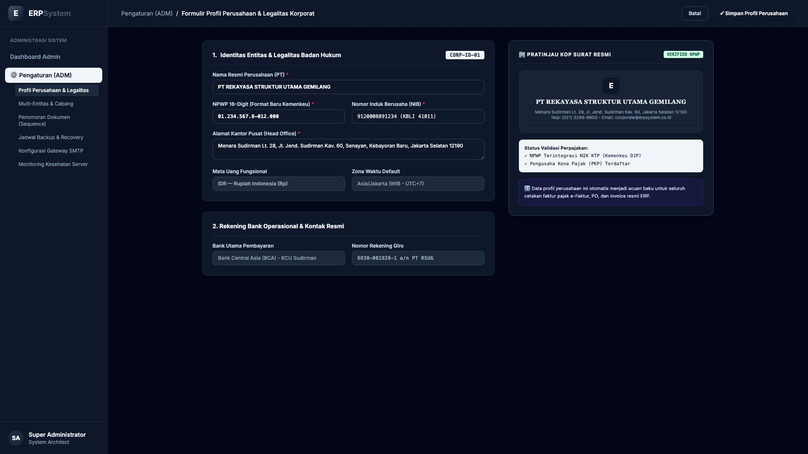

# 🎨 Design UI — Formulir Profil Perusahaan & Legalitas (Data Entry Screen)

> Mockup antarmuka **Formulir Profil Perusahaan & Konfigurasi Legalitas (Company Profile & Legal Entity Data Entry)**: desain *Split-Screen Form* dengan formulir konfigurasi identitas badan usaha di sebelah kiri (Kode Entitas `CORP-ID-01`, nama PT Rekayasa Struktur Utama Gemilang, NPWP 16-Digit `01.234.567.8-012.000`, NIB `9120008891234`, alamat Menara Sudirman Lt. 28 Jakarta Selatan, mata uang IDR, zona waktu Asia/Jakarta, rekening BCA Giro `8830-001928-1`) dan *Live Pratinjau KOP Surat Resmi Perusahaan, Badge Status PKP & NPWP DJP Terintegrasi* di sebelah kanan pada modul `ADM` (Administrasi & Pengaturan) dalam ERP System.

---

## Light Mode

---

## Dark Mode

---

## 📝 Komponen & Fitur Formulir Input

1. **Panel Kiri — Formulir Parameter Badan Hukum & Perpajakan**:
   - Kode Entitas: `CORP-ID-01` &bull; Badan Usaha: `Perseroan Terbatas (PT)`.
   - Nama Resmi: **PT Rekayasa Struktur Utama Gemilang**.
   - NPWP 16-Digit: **01.234.567.8-012.000** &bull; NIB: **9120008891234**.
   - Mata Uang Fungsional: **IDR (Rupiah Indonesia)**.
   - Rekening Bank Utama: **BCA KCU Sudirman (8830-001928-1)**.

2. **Panel Kanan — Pratinjau KOP Surat Resmi & Legalitas**:
   - Header Dokumen Resmi Perusahaan (*Official Corporate Letterhead*).
   - Validasi Status Perpajakan: *Terkoneksi Kemenkeu DJP & Status PKP Aktif*.
