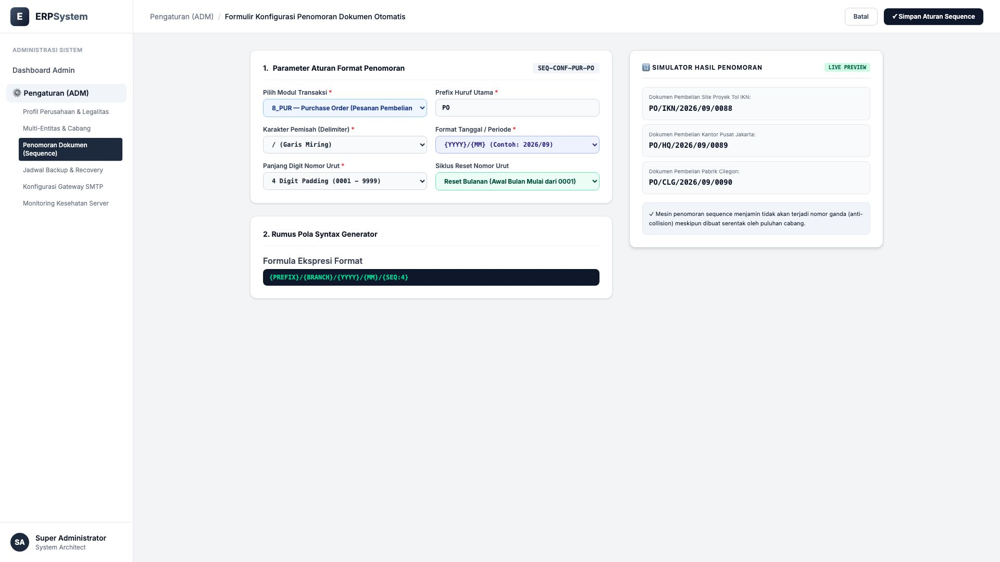
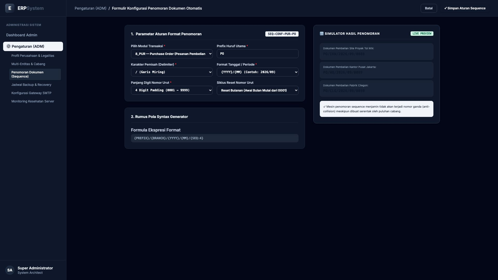

# 🎨 Design UI — Formulir Penomoran Dokumen Otomatis (Data Entry Screen)

> Mockup antarmuka **Formulir Konfigurasi Penomoran Dokumen Otomatis (Document Numbering Sequence Data Entry)**: desain *Split-Screen Form* dengan formulir konfigurasi pola penomoran di sebelah kiri (Kode Skema `SEQ-CONF-PUR-PO`, modul `8_PUR` Purchase Order, prefix huruf `PO`, pemisah `/`, variabel `{YYYY}/{MM}`, padding urut 4 digit `0001`, reset bulanan, formula ekspresi `{PREFIX}/{BRANCH}/{YYYY}/{MM}/{SEQ:4}`) dan *Live Simulator Generator Hasil Penomoran Dokumen (`PO/IKN/2026/09/0088`, `PO/HQ/2026/09/0089`, `PO/CLG/2026/09/0090`) & Fitur Anti-Collision Multi-Cabang* di sebelah kanan pada modul `ADM` (Administrasi & Pengaturan) dalam ERP System.

---

## Light Mode

---

## Dark Mode

---

## 📝 Komponen & Fitur Formulir Input

1. **Panel Kiri — Formulir Definisi Pola Sequence & Delimiter**:
   - Kode Skema: `SEQ-CONF-PUR-PO` &bull; Modul Target: `8_PUR (Purchase Order)`.
   - Prefix Huruf: **PO** &bull; Delimiter: **/** &bull; Format Periode: **{YYYY}/{MM}**.
   - Digit Urut: **4 Digit (0001 - 9999)** &bull; Reset Cycle: **Awal Bulan**.
   - Formula Dinamis: `{PREFIX}/{BRANCH}/{YYYY}/{MM}/{SEQ:4}`.

2. **Panel Kanan — Simulator Output Penomoran Dokumen**:
   - Pratinjau Nomor Proyek IKN: **PO/IKN/2026/09/0088**.
   - Pratinjau Nomor Kantor Pusat: **PO/HQ/2026/09/0089**.
   - Pratinjau Nomor Pabrik Cilegon: **PO/CLG/2026/09/0090**.
