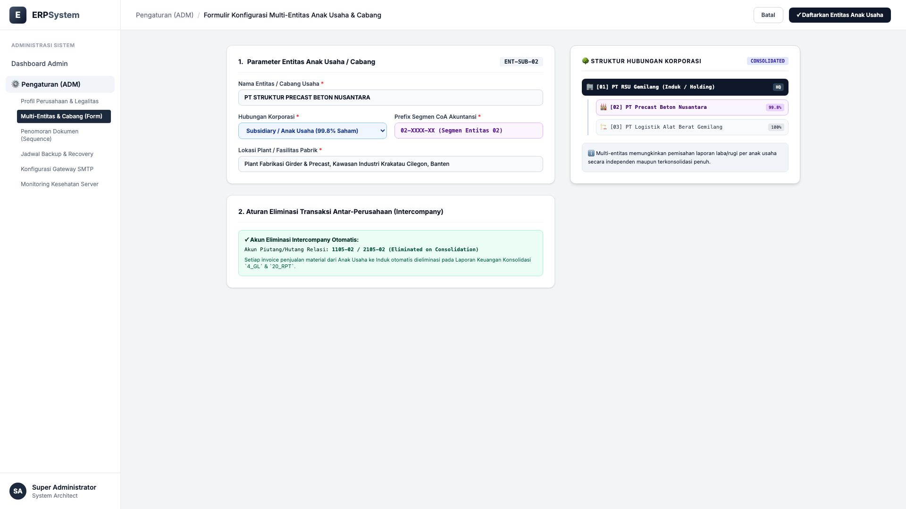
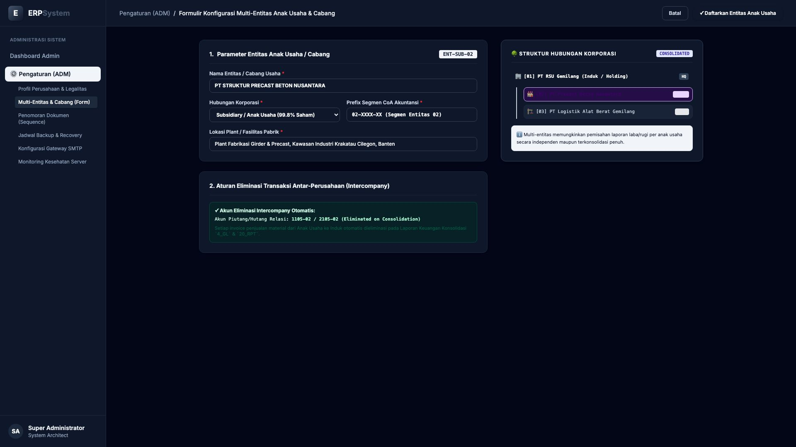

# 🎨 Design UI — Formulir Multi-Entitas Anak Usaha & Cabang (Data Entry Screen)

> Mockup antarmuka **Formulir Konfigurasi Multi-Entitas Anak Usaha & Cabang (Multi-Company & Branch Setup Data Entry)**: desain *Split-Screen Form* dengan formulir pendaftaran entitas anak usaha di sebelah kiri (Kode Entitas `ENT-SUB-02`, nama PT Struktur Precast Beton Nusantara, hubungan Subsidiary 99.8% saham, prefix segmen CoA `02-XXXX-XX`, lokasi Plant Fabrikasi Cilegon Banten, aturan eliminasi intercompany otomatis pada akun `1105-02 / 2105-02`) dan *Live Pratinjau Struktur Hubungan Pohon Korporasi (Holding PT RSU Gemilang 01 &rarr; Anak Usaha Precast 02 & Logistik Alat Berat 03)* di sebelah kanan pada modul `ADM` (Administrasi & Pengaturan) dalam ERP System.

---

## Light Mode

---

## Dark Mode

---

## 📝 Komponen & Fitur Formulir Input

1. **Panel Kiri — Formulir Parameter Entitas & Segmen CoA**:
   - Kode Entitas: `ENT-SUB-02` &bull; Tipe: `Subsidiary (Anak Usaha 99.8%)`.
   - Nama Entitas: **PT Struktur Precast Beton Nusantara**.
   - Prefix Akun CoA: **02-XXXX-XX (Segmen Entitas 02)**.
   - Lokasi Fasilitas: *Plant Fabrikasi Girder & Precast Krakatau Cilegon*.
   - Aturan Eliminasi: *Otomatis mengeliminasi piutang/hutang intercompany pada konsolidasi GL*.

2. **Panel Kanan — Pohon Struktur Korporasi (Holding Hierarchy Tree)**:
   - Visualisasi Struktur Grup Usaha Multi-Company.
   - Pemisahan Buku Finansial (*Independent P&L vs Consolidated Balance Sheet*).
