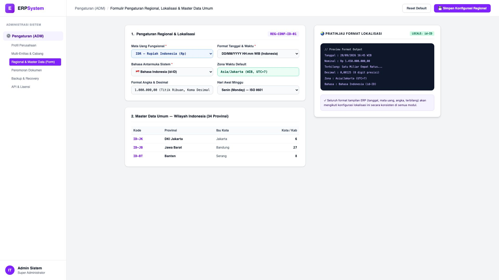
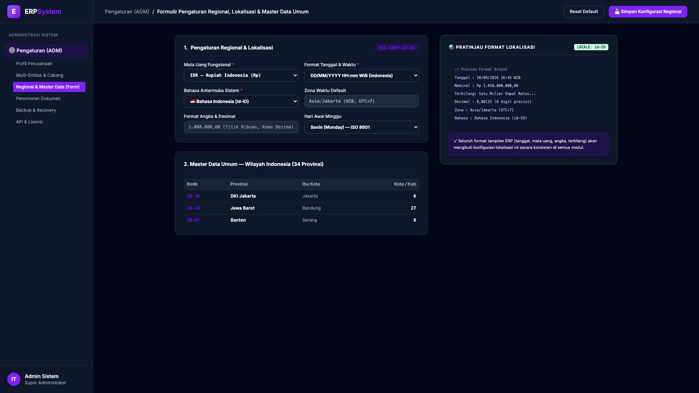

# 🎨 Design UI — Formulir Pengaturan Regional & Master Data Umum (Data Entry Screen)

> Mockup antarmuka **Formulir Pengaturan Regional, Lokalisasi & Master Data Umum (Regional Localization & Master Data Configuration Data Entry)**: desain *Split-Screen Form* dengan formulir konfigurasi lokalisasi di sebelah kiri (Nomor Konfigurasi `REG-CONF-ID-01`, mata uang fungsional IDR Rupiah Indonesia, format tanggal DD/MM/YYYY HH:mm WIB, bahasa antarmuka Bahasa Indonesia id-ID, zona waktu Asia/Jakarta UTC+7, format angka titik ribuan koma desimal `1.000.000,00`, hari awal Senin ISO 8601, master data 34 provinsi Indonesia dengan kode ISO `ID-JK` DKI Jakarta, `ID-JB` Jawa Barat, `ID-BT` Banten) dan *Live Pratinjau Format Output Lokalisasi (Tanggal, Nominal Rupiah, Terbilang, Desimal, Zona Waktu)* di sebelah kanan pada modul `ADM` (Administrasi & Pengaturan) dalam ERP System.

---

## Light Mode

---

## Dark Mode

---

## 📝 Komponen & Fitur Formulir Input

1. **Panel Kiri — Formulir Lokalisasi & Master Wilayah**:
   - Kode Konfigurasi: `REG-CONF-ID-01`.
   - Mata Uang: **IDR — Rupiah Indonesia (Rp)**.
   - Format Tanggal: **DD/MM/YYYY HH:mm WIB (Indonesia)**.
   - Bahasa Antarmuka: **Bahasa Indonesia (id-ID)**.
   - Master Data: *34 Provinsi Indonesia (ISO 3166-2:ID)*.

2. **Panel Kanan — Pratinjau Output Format Lokalisasi**:
   - Contoh Output: *Rp 1.450.000.000,00 &bull; 28/09/2026 16:45 WIB*.
   - Konsistensi Format di Seluruh Modul ERP.
