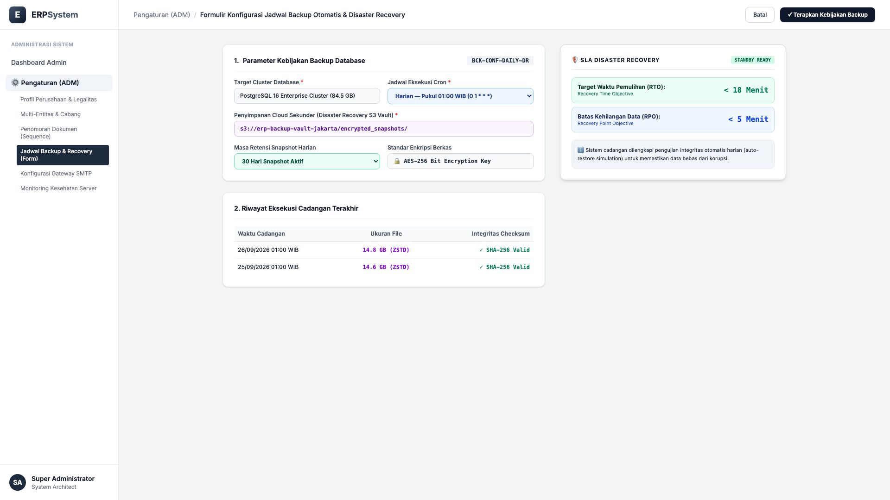
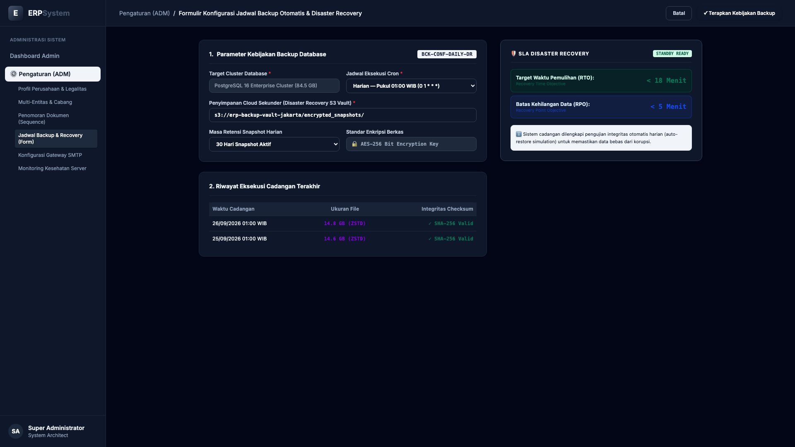

# 🎨 Design UI — Formulir Jadwal Backup & Disaster Recovery (Data Entry Screen)

> Mockup antarmuka **Formulir Konfigurasi Jadwal Backup Otomatis & Disaster Recovery (System Backup & DR Data Entry)**: desain *Split-Screen Form* dengan formulir kebijakan cadangan database di sebelah kiri (Nomor Konfigurasi `BCK-CONF-DAILY-DR`, target PostgreSQL 16 Enterprise Cluster 84.5 GB, jadwal harian jam 01:00 WIB cron `0 1 * * *`, target S3 Vault Jakarta `s3://erp-backup-vault-jakarta/encrypted_snapshots/`, retensi 30 hari aktif, enkripsi AES-256 bit, riwayat eksekusi 14.8 GB ZSTD SHA-256 Valid) dan *Live Kartu SLA Disaster Recovery (Target Waktu Pemulihan RTO &lt; 18 Menit & Batas Kehilangan Data RPO &lt; 5 Menit)* di sebelah kanan pada modul `ADM` (Administrasi & Pengaturan) dalam ERP System.

---

## Light Mode

---

## Dark Mode

---

## 📝 Komponen & Fitur Formulir Input

1. **Panel Kiri — Formulir Parameter Cadangan & Enkripsi**:
   - Kode Kebijakan: `BCK-CONF-DAILY-DR` &bull; Target: `PostgreSQL Cluster (84.5 GB)`.
   - Jadwal Cron: **Setiap Hari Pukul 01:00 WIB**.
   - Cloud S3 Vault: **s3://erp-backup-vault-jakarta/encrypted_snapshots/**.
   - Enkripsi: **AES-256 Bit Encryption Key** &bull; Kompresi: **Zstandard (ZSTD)**.
   - Retensi Cadangan: **30 Hari Snapshot Aktif + 365 Hari Cold Storage Archive**.

2. **Panel Kanan — Metrik SLA Pemulihan Bencana (Disaster Recovery)**:
   - Target RTO (Recovery Time Objective): **&lt; 18 Menit**.
   - Target RPO (Recovery Point Objective): **&lt; 5 Menit**.
   - Simulasi Pemulihan Otomatis Harian: *Valid & Zero Data Corruption*.
