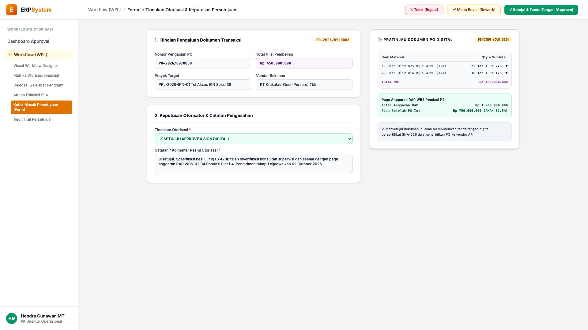
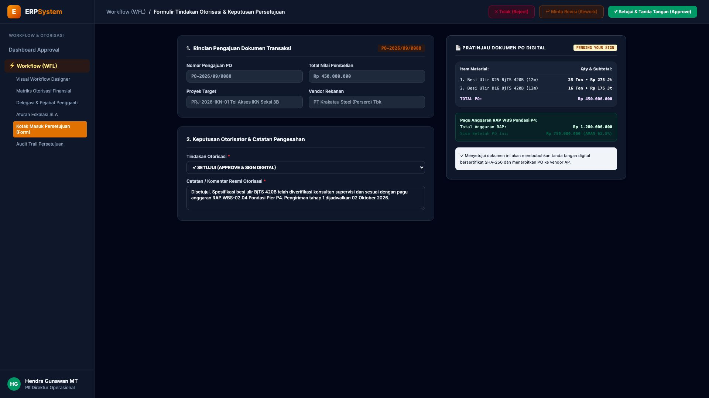

# 🎨 Design UI — Formulir Tindakan Otorisasi Persetujuan (Data Entry Screen)

> Mockup antarmuka **Formulir Tindakan Otorisasi & Keputusan Persetujuan Transaksi (Approval Action Data Entry)**: desain *Split-Screen Form* dengan formulir keputusan otorisator di sebelah kiri (Nomor Dokumen `PO-2026/09/0088` Pengadaan Besi Ulir Proyek Tol IKN Rp 450.000.000 dari PT Krakatau Steel Tbk, pilihan tindakan: Setujui & Sign Digital / Minta Revisi Rework / Tolak Reject, catatan otorisasi: "Disetujui. Spesifikasi besi ulir BjTS 420B telah diverifikasi konsultan supervisi dan sesuai pagu anggaran RAP WBS-02.04 Pondasi Pier P4. Pengiriman tahap 1 dijadwalkan 02 Okt 2026") dan *Live Pratinjau Dokumen PO Digital (Besi D25 25 Ton Rp 275 Jt + D16 16 Ton Rp 175 Jt) & Status Pagu Anggaran RAP (Sisa Rp 750 Jt AMAN 62.5%)* di sebelah kanan pada modul `WFL` (Workflow & Approval Matrix Engine) dalam ERP System.

---

## Light Mode

---

## Dark Mode

---

## 📝 Komponen & Fitur Formulir Input

1. **Panel Kiri — Formulir Keputusan Approval & Catatan Resmi**:
   - Kode Dokumen: `PO-2026/09/0088` &bull; Nilai: **Rp 450.000.000**.
   - Vendor Rekanan: **PT Krakatau Steel (Persero) Tbk**.
   - Keputusan Otorisator: **SETUJUI (APPROVE & SIGN DIGITAL)**.
   - Catatan Pengesahan: *Verifikasi kesesuaian spesifikasi & jadwal delivery*.

2. **Panel Kanan — Rincian Item PO & Pagu Anggaran RAP**:
   - Breakdown Item: *Besi Ulir D25 (25 Ton) & D16 (16 Ton)*.
   - Pagu Anggaran WBS Pondasi: **Rp 1.200.000.000**.
   - Sisa Anggaran Tersedia: **Rp 750.000.000 (Status Sehat & Terkendali)**.
