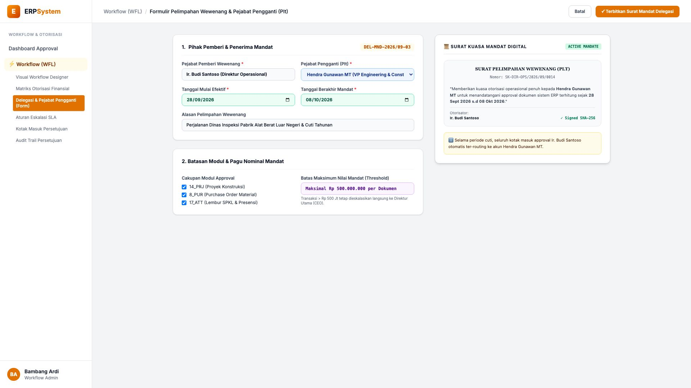
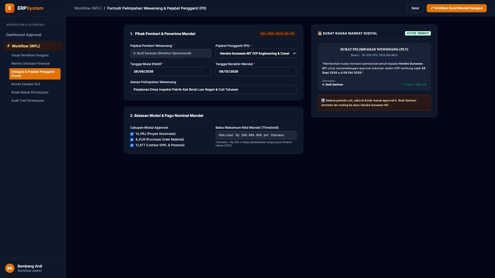

# 🎨 Design UI — Formulir Pelimpahan Wewenang & Pejabat Pengganti (Plt) (Data Entry Screen)

> Mockup antarmuka **Formulir Pelimpahan Wewenang & Penunjukan Pejabat Pengganti Plt (Delegation & Substitution Data Entry)**: desain *Split-Screen Form* dengan formulir mandat wewenang di sebelah kiri (Nomor Mandat `DEL-MND-2026/09-03`, pemberi wewenang Ir. Budi Santoso Direktur Operasional, pejabat pengganti Hendra Gunawan MT VP Engineering, periode 28 Sept s.d 08 Okt 2026 cuti dinas LN, cakupan modul `14_PRJ`, `8_PUR`, `17_ATT`, batas pagu mandat &le; Rp 500.000.000) dan *Live Pratinjau Surat Kuasa Mandat Digital SK Direksi & Status Routing Otomatis Akun Plt Aktif* di sebelah kanan pada modul `WFL` (Workflow & Approval Matrix Engine) dalam ERP System.

---

## Light Mode

---

## Dark Mode

---

## 📝 Komponen & Fitur Formulir Input

1. **Panel Kiri — Formulir Pihak Mandat & Batas Pagu**:
   - Kode Mandat: `DEL-MND-2026/09-03`.
   - Pemberi Kuasa: **Ir. Budi Santoso (Direktur Operasional)**.
   - Penerima Kuasa (Plt): **Hendra Gunawan MT (VP Engineering)**.
   - Periode Aktif: **28 September 2026 s.d 08 Oktober 2026**.
   - Pagu Mandat: *Maksimal Rp 500.000.000 per transaksi*.

2. **Panel Kanan — Surat Keputusan Mandat Digital**:
   - Tampilan SK Pelimpahan Wewenang (*SK-DIR-OPS/2026/09/0014*).
   - Pengalihan Otomatis Seluruh Kotak Masuk Approval ke Plt.
